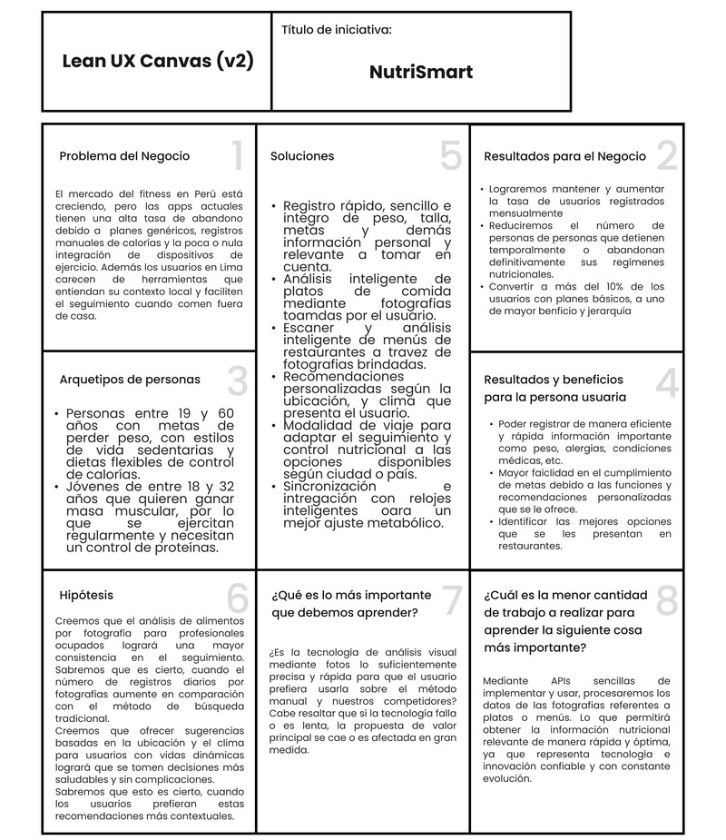

# CAPÍTULO I: INTRODUCCIÓN

## 1.1. Startup Profile

El Startup Profile funciona como una radiografía integral que expone el ADN corporativo y el horizonte estratégico del emprendimiento. En este apartado se sintetiza el propósito transformador de la organización, permitiendo que inversores y aliados comprendan no solo la naturaleza de la empresa, sino también la filosofía, los valores rectores y el impulso vital que motivaron su lanzamiento al ecosistema empresarial.

Esta sección desglosa el contexto de origen y la ineficiencia específica que la firma busca resolver mediante un enfoque de escalabilidad e innovación. Se pone especial énfasis en la ventaja competitiva que la distingue de sus pares y en su hoja de ruta hacia el crecimiento sostenido; de este modo, se traza una visión que busca trascender la rentabilidad inmediata para consolidar un impacto disruptivo y duradero en su sector.

### 1.1.1. Descripción del Startup

Somos **DevTeam**, un startup integrado por estudiantes de la facultad de Ingeniería de la Universidad Peruana de Ciencias Aplicadas. Buscamos revolucionar la forma en la que las personas lidian con metas personales referentes al ejercicio y dietas, esto a través de plataformas web orientadas a brindar fácil, seguro e intuitivo uso para nuestros usuarios objetivos. Nos diferenciamos de otras propuestas en nuestros enfoques e innovaciones relacionadas con tecnologías emergentes y de uso diario, como puede ser integraciones con relojes inteligentes, análisis de fotos, recomendaciones personalizadas, entre otros más. Todo a fin de ofrecer un producto eficiente y que cumpla de manera satisfactoria con las necesidades de los usuarios.

### 1.1.2. Perfiles de integrantes del equipo

| Integrantes | Descripción |
| :--- | :--- |
| | |
| | | 
| | |
|  | **Nombres y Apellidos:** Brandon Wilder Soto Palacios  **Código:** U202315640  **Carrera:** Ingeniería de Software  Soy estudiante de la carrera de Ingeniería de Software en la Universidad Peruana de Ciencias Aplicadas. Tengo intereses en la tecnología y su constante evolución. Tengo conocimientos de programación en lenguajes como C++, Python, JavaScript, HTML y CSS. Soy un poco reservado, pero con muchas de ganas de aprender nuevas cosas. |
| | |

## 1.1. Solution Profile

**NutriSmart** es una plataforma web SaaS que tiene como objetivo facilitar a los usuarios a alcanzar y cumplir sus metas físicas, como pérdida de peso o ganancia muscular, de manera óptima y adecuada para cada persona que lo requiera. Lo logramos gracias a características claves como el seguimiento nutricional inteligente, recomendaciones personalizadas basadas en el contexto real del usuario(ubicación, clima, etc.), análisis visual de alimentos por fotografías y escaneo de menús contextual al perfil del usuario. 

### 1.2.1. Antecedentes y problemática

| **5W/2H**     | **Pregunta** |**Descripción**|
| :--- | :---: | :--- |
| **Who?** | ¿Quién es afectado por el problema? | Toda persona que requiera una ayuda con su seguimiento nutricional ya que presenta una meta física de perder peso o ganar masa muscular. Esta segmentación llega a abarcar desde jóvenes de 18 años hasta adultos de 32 años si hablamos de ganancia muscular, y desde los 19 a 60 años para los de pérdida de peso. |
| **What?** | ¿Cuál es el problema? | El problema identificado a resolver es la falta de ayuda práctica, personalizada y/o amigable que se presentan las personas con metas físicas personales que involucran dietas estrictas y ejercicio. |
| **When?** | ¿Cuándo sucede el problema? | El problema sucede habitualmente cuando las personas deciden empezar dietas y seguir un control de calorías. Además, posteriormente en momentos cuando no poseen ayuda o soporte sobre la comida que degustarán, y que podría afectar su meta física propuesta. |
| **Where?** | ¿Dónde surge el problema? | Sucede usualmente cuando las personas están en su hogar, su trabajo, su centro de estudios, un gimnasio, un parque o en un restaurante. Lugares donde es necesario continuar con el seguimiento nutricional que tienen, ya que representan parte de su vida diaria y entrenamiento. |
| **Why?** | ¿Por qué sucede el problema? | El problema sucede porque las personas no tienen la ayuda necesaria con su control de calorías o la dieta en determinados momentos de su vida. Ya sea porque no hay otra persona dispuesta a brindarle la ayuda necesaria o porque las aplicaciones presentes en el mercado no satisfacen o cumplen con las funciones que necesitan, sumado a esto se presenta los altos costos obligatorios que requieren algunas de estas opciones para usarlos, ya sea en membresías, subscripciones o en comprar aparatos tecnológicos necesarios y dependientes en el funcionamiento de la aplicación. |
| **How?** | ¿Cómo sucede el problema? | El problema sucede inicialmente cuando las personas deciden realizar un cambio radical en su vida y salud, se plantean un objetivo en mente a lograr, como reducir su peso o ganar masa muscular. Entonces es cuando necesitan adecuar a su rutina diaria, un control calórico, pero no es sencillo por que se presentan dudas sobre que alimentos o comidas son adecuadas a su ritmo establecido, y empeoran si están en un restaurant, frente a un menú del que desconocen el contenido calórico de cada platillo. Sumado a esto, están presentes variables como ubicación, clima e historial del usuario, lo que genera aún más cambios en las recomendaciones que debería seguir cada persona. |
| **How Much?** | ¿Cuánto afecta este problema ? | Con el marcado aumento de la tendencia en la población a desarrollar mejores hábitos de salud y alimenticios. Según datos recolectados por estudios de mercado cerca del 49% peruanos tiende a seguir algún tipo de restricción alimenticia o dieta, siendo las más comunes las bajas grasas y bajas en azúcar. Lo que muestra como un gran porcentaje de la población urbana tiene intenciones activas de controlar su consumo, aunque no a un nivel de supervisión extrema o profesional. Además, investigaciones académicas elaboradas por la UPC señalas que en Perú existen aproximadamente 3,87 millones de usuarios mensuales de aplicaciones relacionadas con el fitness y la nutrición. Cifra que, comparada con el primer porcentaje, representa una minoría del total, reflejando el poco impacto generalizado que llega a tener las aplicaciones existentes en sus potenciales usuarios. |

### 1.2.2. Lean UX Process

#### 1.2.2.1. Lean UX Problem Statements

Lograr metas físicas como la ganancia muscular o pérdida de peso requiere un seguimiento nutricional riguroso que suele ser tedioso y propenso a errores manuales, lo que causa frustración o incluso abandono. ¿Cómo podemos facilitar que las personas registren su ingesta diaria de forma automática y precisa sin que esto represente una carga de tiempo?

A pesar de que existen múltiples aplicaciones de fitness, la mayoría ofrece planes genéricos que ignoran factores externos críticos como la ubicación actual del usuario o el clima, los cuales influyen directamente en sus opciones alimenticias y niveles de energía. ¿De qué manera podríamos ofrecer recomendaciones nutricionales que se adapten en tiempo real al contexto geográfico y ambiental del usuario?

Notamos que uno de los mayores desafíos ocurre cuando el usuario come fuera de casa; analizar los ingredientes de un plato en un restaurante o interpretar un menú físico puede ser confuso y llevar a decisiones poco saludables. ¿Existe alguna forma de utilizar el análisis visual y el escaneo inteligente para que el usuario sepa instantáneamente si una opción del menú se ajusta a sus macros y objetivos personales?

En ocasiones, la falta de integración entre las herramientas de salud (como relojes inteligentes) y las plataformas de dieta genera una fragmentación de la información, dificultando una visión clara del progreso real. ¿Cómo podríamos centralizar el uso de tecnologías emergentes en una plataforma web intuitiva que asegure que el esfuerzo del usuario se traduzca de manera satisfactoria en resultados físicos tangibles?

#### 1.2.2.2. Lean UX Assumptions

**Business Assumptions:**
 Creemos que nuestros clientes tienen la necesidad de automatizar el seguimiento de su dieta y ejercicio, ya que el registro manual tradicional genera una alta tasa de abandono.
Estas necesidades se pueden resolver con: Una plataforma SaaS que integre análisis de fotos, datos contextuales (clima/ubicación) y sincronización con wearables.
Nuestros clientes iniciales son: jóvenes y adultos con metas de composición corporal (pérdida de grasa o ganancia de músculo) que poseen un smartphone y en lo posible tecnologías como relojes inteligentes u otro artefacto complementario al ejercicio.
El valor principal que el cliente obtiene es: Un sistema de acompañamiento nutricional que se adapta a su realidad diaria sin exigirle una inversión de tiempo excesiva.

 **Business Outcomes Assumptions:**
- Lograremos mantener y aumentar la tasa de usuarios registrados mensualmente, validando que el valor de las recomendaciones personalizadas y funciones adaptativas generan y motivan el interés de las personas.
- Reduciremos el número de personas que una vez iniciado dietas y/o control calórico en sus vidas diarias, piensan en detener o abandonar estos regímenes nutricionales. 
- Conseguiremos un porcentaje mayor a 10% de usuarios que, iniciando en los planes más bajos, cambian a planes de mayor beneficio.

 **User Assumptions:**
 Nuestros usuarios son representados por personas con metas físicas personales y un estilo de vida dinámico que puede comprender comer fuera de casa o en entornos corporativo y/o universitarios.

¿Dónde encaja nuestro producto en su vida? En los momentos de toma de decisión alimentaria, es decir antes de elegir que comerán ya sea en su casa, trabajo, un restaurant e incluso durante el registro de actividad física diaria.

¿Qué problemas tiene que resolver nuestro producto? La dificultad de calcular macros en restaurantes. Sumado a esto, a falta de motivación para anotar cada alimento ingerido. Y finalmente, la desconexión entre el plan de dieta y las condiciones externas, como puede ser no saber qué comer cuando el clima cambia o si se encuentra en una zona o ciudad desconocida.

¿Qué características son importantes? El análisis visual de alimentos a partir de fotografías tomadas por el usuario, la precisión de las recomendaciones basadas en la ubicación, la facilidad de integración con dispositivos móviles y tecnologías complementarias.

 **User Outcomes Assumptions:**
 Reducción del tiempo de registro de información ya que el usuario dedicará pocos minutos en ingresar y corroborar la información pertinente que se solicite, como el peso, talla, meta, alergias, condición física y médica, entre otras. 
El cumplimiento de metas, los usuarios activos reportarán sus progresos diarios, además de que con las características y funciones personalizadas se fomenta la continuación de su meta física en el tiempo determinado.
El usuario aprenderá a identificar las mejores opciones en menús de restaurantes mediante el uso constante del escáner y análisis inteligente, facilitando su elección y sin provocar problemas futuros en su meta propuesta.

#### 1.2.2.3. Lean UX Hypothesis Statements

**Creemos que** implementar un sistema de análisis de alimentos por fotografía para usuarios que consideran tedioso el registro manual de calorías logrará aumentar la consistencia del seguimiento nutricional y reducir el abandono de la app.
**Sabremos que** esto es cierto,
 **Cuando** veamos que el número de registros diarios promedio por usuario activo aumente notoriamente en comparación con el método de búsqueda de texto tradicional.

**Creemos que** ofrecer sugerencias de comidas basadas en la ubicación y el clima para usuarios con estilos de vida dinámicos logrará que los usuarios tomen decisiones más saludables de manera espontánea y sin complicaciones.
**Sabremos que** esto es cierto,
 **Cuando** veamos que aumenta el número de los usuarios que aceptan y registran una de las recomendaciones sugeridas por el sistema contextual en lugar de buscar una opción por su cuenta.

**Creemos que** la funcionalidad de escaneo de menús físicos en restaurantes para personas con metas estrictas, como la ganancia de músculo o pérdida de peso, logrará reducir la ansiedad y la incertidumbre al comer fuera. 
**Sabremos que** esto es cierto, 
 **Cuando** veamos que la funcionalidad se utiliza regularmente por cada usuario objetivo durante la semana, 

**Creemos que** sincronizar los datos de actividad física de relojes inteligentes para realizar ajustes metabólicos en tiempo real para los usuarios entusiastas del fitness logrará una mayor precisión en el cálculo del déficit o superávit calórico diario. 
**Sabremos que** esto es cierto,
 **Cuando** veamos una mejora sustancial en el progreso y cumplimiento de los objetivos físicos mensuales reportados por el usuario.

#### 1.2.2.4. Lean UX Canvas

## 1.3. Segmentos Objetivo

Los segmentos objetivos son importantes para poder dimensionar a los futuros usuarios de nuestro producto, por lo que previa investigación y análisis se detectó 2 segmentos que se presentan a continuación:

| Segmento Objetivo | Características Demográficas | Información estadística de sustento |
| :--- | :---: | :--- |
| **Segmento objetivo 1: Pérdida de peso** | Género: Variable  Edad: Jóvenes y adultos de entre 19 a 60 años  Ubicación: Áreas urbanas del Perú  Estilo de Vida: Sedentario o moderadamente activo  Motivaciones: Salud preventiva, mejora de la autoestima, mayor energía para el día a día y cumplir con estándares estéticos personales. Tecnología: Uso de smartphones, smartwatch e internet. | Según la Encuesta Demográfica y de Salud Familiar (ENDES 2024), el 63.1% de los peruanos mayores de 15 años tiene exceso de peso (36.9% sobrepeso y 26.2% obesidad). Este número se dispara en el rango de 40 a 59 años, donde más del 70% presenta esta condición. Además, Solo el 11% de los peruanos consume las porciones de frutas y verduras recomendadas por la OMS. Esto indica que el problema no es solo la cantidad de calorías, sino la calidad nutricional. |
| **Segmento objetivo 2: Ganancia de masa muscular** | Género: Variable  Edad: Jóvenes de entre 18 a 32 años  Ubicación: Zonas urbanas, cerca de gimnasios, universidades y empresas.  Estilo de Vida: Activo y enfocado al rendimiento. El entrenamiento es una parte no negociable de su día.  Motivaciones: Hipertrofia o estética muscular, mejora del rendimiento deportivo y validación social dentro de comunidades fitness. Tecnología: Uso frecuente de smartphones, smartwatchs, internet, aplicaciones de control calórico y entrenamiento. | Según informes de EuroMonitor, el mercado de gimnasios y salud en Perú ha mantenido un crecimiento sostenido postpandemia. Se estima que, en Lima, aproximadamente el 25% de los jóvenes entre 18 y 30 años realiza actividad física intensa al menos 3 veces por semana. Además, según el INEI, el grupo de 18 a 24 años es el que tiene mayor acceso a internet y smartphones. Asimismo, estudios de la UPC (2023) indican que este rango de edad es el principal consumidor de apps de suscripción (SaaS) relacionadas con el rendimiento deportivo en el país.|
