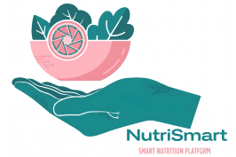
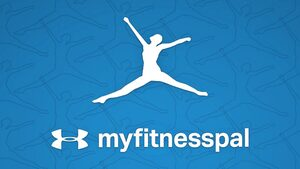
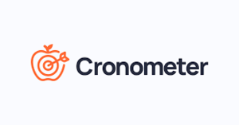
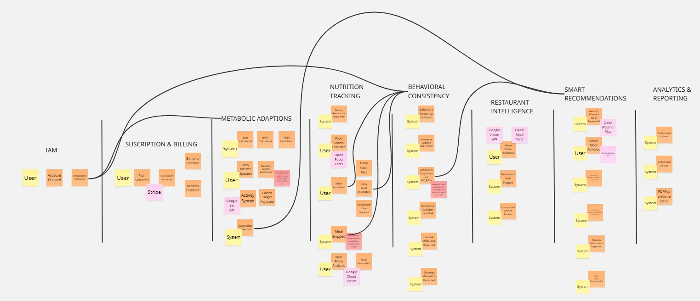

# CAPÍTULO II: REQUIREMENTS ELICITATION & ANALYSIS

## 2.1. Competidores
El ecosistema de aplicaciones de bienestar en Perú se encuentra en un punto de inflexión, donde la saturación de herramientas globales choca con la creciente demanda de una experiencia más automatizada y adaptada a la realidad local. Si bien existen gigantes tecnológicos que han dominado el conteo de calorías por años, el usuario peruano se enfrenta constantemente a la fricción de bases de datos ajenas a nuestra gastronomía o interfaces que exigen un registro manual exhaustivo. En este escenario, **NutriSmart** no solo compite en funcionalidad, sino que busca resolver las brechas de personalización contextual y eficiencia que los líderes actuales han dejado desatendidas.

A continuación, se describen los tres competidores más relevantes:

- **MyFitnessPal:**
Es considerada la plataforma líder a nivel mundial en el seguimiento de nutrición y actividad física, destacando principalmente por poseer la base de datos de alimentos más extensa del mercado. Su enfoque es mayoritariamente cuantitativo y comunitario, permitiendo a los usuarios registrar calorías y macronutrientes de forma manual. Aunque es una herramienta poderosa, su interfaz puede resultar abrumadora para quienes buscan una experiencia minimalista o altamente automatizada mediante inteligencia artificial.
- **Fitia**
De origen peruano, esta aplicación ha ganado una tracción significativa en Latinoamérica al enfocarse en la generación de planes de alimentación automatizados que se ajustan a los objetivos específicos del usuario. A diferencia de las apps de conteo puro, Fitia propone qué comer basándose en la disponibilidad de ingredientes locales y recetas regionales. Se posiciona como un asistente nutricional directo que simplifica la planificación, siendo el competidor más cercano en cuanto a relevancia geográfica.
- **Cronometer**
Se distingue en el mercado por su rigor científico y la precisión extrema en el seguimiento no solo de calorías, sino de micronutrientes (vitaminas y minerales). Es la herramienta predilecta para usuarios con un perfil analítico avanzado, biohackers o atletas de alto rendimiento que requieren una integración profunda con biometría y dispositivos de salud. Su ventaja competitiva reside en la veracidad de su información nutricional, la cual es verificada por expertos, priorizando la exactitud sobre la rapidez del registro.

### 2.1.1. Análisis competitivo

<table border="2" cellspacing="0" cellpadding="5">
  <tr>
    <th colspan="7">Análisis Competitivo</th>
  </tr>
  <tr>
    <td colspan="2" rowspan="1">¿Por qué llevar a cabo este análisis?</td>
    <td colspan="5">Identificar características, funciones y estrategias similares y diferentes entre nuestro producto y 3 competidores clave.</td>
  </tr>
  <tr>
    <td colspan="3"></td>
    <td style="text-align: center;">
      NutriSmart 
      
    </td>
    <td style="text-align: center;">
      MyFitnessPal 
      
    </td>
    <td style="text-align: center;">
      Fitia 
      
    </td>
    <td style="text-align: center;">
      Cronometer 
      
    </td>
  </tr>
  <tr>
    <td rowspan="2">Perfil</td>
    <td colspan="2">Overview</td>
    <td>Plataforma SaaS con IA para registro visual y contexto real.</td>
    <td>Líder mundial basado en una base de datos masiva generada por usuarios.</td>
    <td>App enfocada en planes de alimentación con sabor local.</td>
    <td>Herramienta de alta precisión centrada en micronutrientes.</td>
  </tr>
  <tr>
    <td colspan="2">Ventaja competitiva ¿Qué valor ofrece a los clientes?</td>
    <td>Registro por fotos y recomendaciones según clima/ubicación.</td>
    <td>Base de datos de alimentos insuperable y comunidad global.</td>
    <td>Automatización de menús adaptados a la gastronomía local.</td>
    <td>Exactitud de datos verificada y seguimiento de salud profundo.</td>
  </tr>
  <tr>
    <td rowspan="2">Perfil de Marketing</td>
    <td colspan="2">Mercado objetivo</td>
    <td>Jóvenes y adultos peruanos (18-60 años).</td>
    <td>Público general global interesado en pérdida de peso.</td>
    <td>Población hispanohablante que busca planes de comida fáciles.</td>
    <td>Atletas, biohackers y personas con necesidades clínicas.</td>
  </tr>
  <tr>
    <td colspan="2">Estrategias de marketing</td>
    <td>Marketing a través de redes sociales y recomendación de usuarios.</td>
    <td>Alianzas con marcas deportivas y SEO de alto volumen.</td>
    <td>Marketing de contenidos y testimonios de transformación real.</td>
    <td>Podcasts de salud y foros de nutrición científica.</td>
  </tr>
  <tr>
    <td rowspan="3">Perfil de Producto</td>
    <td colspan="2">Productos & Servicios</td>
    <td>SaaS Web, escáner de menús e integración con wearables.</td>
    <td>App móvil, registro de ejercicio y recetas premium.</td>
    <td>App móvil, generador de listas de compras y recetas.</td>
    <td>App móvil y versión Pro para profesionales de la salud.</td>
  </tr>
  <tr>
    <td colspan="2">Precios & Costos</td>
    <td>Freemium (Suscripción mensual/anual proyectada).</td>
    <td>Freemium ($19.99/mes o $79.99/año aprox).</td>
    <td>Freemium (Suscripción premium accesible en soles).</td>
    <td>Freemium ($8.99/mes subscripcion Gold aprox).</td>
  </tr>
  <tr>
    <td colspan="2">Canales de distribución (Web y/o Móvil)</td>
    <td>Plataforma Web y App Móvil </td>
    <td>Móvil (iOS/Android) y Web.</td>
    <td>Principalmente Móvil (iOS/Android).</td>
    <td>Móvil y Web.</td>
  </tr>
  <tr>
    <td rowspan="5">Análisis SWOT</td>
  </tr>
  <tr>
    <td colspan="2">Fortalezas</td>
    <td>Innovación tecnológica (IA) y relevancia contextual local.</td>
    <td>Reconocimiento de marca y red social integrada.</td>
    <td>Curaduría de alimentos locales y facilidad de uso.</td>
    <td>Calidad de la información y detalle en micronutrientes.</td>
  </tr>
  <tr>
    <td colspan="2">Debilidades</td>
    <td>Marca nueva en fase de introducción.</td>
    <td>Muchos datos erróneos subidos por usuarios.</td>
    <td>Menor enfoque en el seguimiento de micronutrientes.</td>
    <td>Interfaz menos amigable para usuarios principiantes.</td>
  </tr>
  <tr>
    <td colspan="2">Oportunidades</td>
    <td>Crecimiento exponencial debido a innovaciones tecnológicas orientadas al usuario.</td>
    <td>Expansión a servicios de salud corporativos.</td>
    <td>Crecimiento en otros mercados de Latinoamérica.</td>
    <td>Crecimiento en el nicho de nutrición para longevidad.</td>
  </tr>
  <tr>
    <td colspan="2">Amenazas</td>
    <td>Copia de funciones por parte de competidores grandes.</td>
    <td>Surgimiento de nuevas apps gratuitas con IA básica.</td>
    <td>Apps de delivery integrando sus propios planes de salud.</td>
    <td>Cambios en las políticas de privacidad de datos médicos.</td>
  </tr>
</table>

### 2.1.2. Estrategias y tácticas frente a competidores

Diferenciación en el análisis de fotografías: Nosotros innovaríamos frente a nuestros competidores en los análisis de platos mediante fotos, ya que integraríamos IA para la rápida detección de alimentos, obtención de datos y además, generar estimaciones más acordes en base a la información obtenida, que resultara en recomendaciones más adecuadas para el usuario. Asimismo, se considera el escaneo y análisis de menú, un punto fuerte nuestro frente a la competencia, ya que recomendaría el platillo más acorde con el seguimiento nutricional del usuario, facilitando la elección.

Modelo freemium: Nuestro producto se adaptaría más a la realidad del sector y la economía de los usuarios, ofreciendo planes más accesibles y con las funciones de personalización básicas necesarias para un buen régimen nutricional. Además de ofrecer increíbles ventajas a través de funcionalidades en subscripciones de mayor rango.

Estrategia de Retención: Diferenciándonos de nuestros rivales en el mercado, NutriSmart ofrecería un ajuste dinámico contextual, lo que significa que las recomendaciones que se ofrecen hacia el usuario dependerán en gran medida de su contexto. Según el clima, ubicación o historial lo que se recomiende variará, ya que normalmente solo se realizan desde aspectos generales y sin profundizar en la conveniencia del usuario. Por lo que nosotros no solo mejoramos en este aspecto, sino cambiamos las reglas del juego, buscando el beneficio del consumidor.

Marketing y promoción: Es necesario comprender que debido a ser un producto nuevo y en crecimiento, se nos dificultará en un inicio rivalizar contra los competidores ya establecidos. Sin embargo, mediante estrategias de publicidad y marketing digital aumentaremos la visibilidad del producto, considerando también la publicidad indirecta gracias a recomendaciones de los usuarios y la expansión en círculos locales o comunidades que nos beneficiará en el crecimiento.

## 2.2. Entrevistas

### 2.2.1. Diseño de entrevistas

Las entrevistas fueron diseñadas con preguntas diferenciadas según cada segmento objetivo, organizadas en bloques temáticos que permiten recopilar información sobre el perfil del usuario, sus hábitos actuales y la validación de las funcionalidades propuestas.

|Enlace del video|
|---|
|https://upcedupe-my.sharepoint.com/:v:/g/personal/u202411669_upc_edu_pe/IQAaTWbVFrGSQJbryk1mXrvuAaOFuJ0aZVDyTHY-va1m7t0?nav=eyJyZWZlcnJhbEluZm8iOnsicmVmZXJyYWxBcHAiOiJPbmVEcml2ZUZvckJ1c2luZXNzIiwicmVmZXJyYWxBcHBQbGF0Zm9ybSI6IldlYiIsInJlZmVycmFsTW9kZSI6InZpZXciLCJyZWZlcnJhbFZpZXciOiJNeUZpbGVzTGlua0NvcHkifX0&e=SjFO2r|

##### Segmento 1 — Pérdida de Peso (Adultos de 25 a 60 años)

**Bloque 1: Perfil y biografía**

1. ¿Cuál es su nombre, edad y a qué se dedica?
2. ¿Cómo describiría su rutina diaria en cuanto a movimiento físico? ¿Diría que es una persona que pasa mucho tiempo sentada, o que se mueve bastante durante el día?

**Bloque 2: Control calórico y conocimiento nutricional**

3. ¿Tiene alguna meta física actualmente, como bajar de peso o mejorar su alimentación? ¿Qué es lo que más le cuesta lograr?
4. Cuando come fuera de casa, en un restaurante, en la calle o en el trabajo, ¿sabe con certeza cuánto está comiendo en términos de calorías, o simplemente calcula una cifra aproximada?

**Bloque 3: Validación de funciones**

5. Si una aplicación pudiera analizar la foto de su plato o del menú de un restaurante y decirle automáticamente qué tan saludable es esa comida para usted, ¿la usaría? ¿Por qué?
6. ¿Le parecería útil que la aplicación le sugiera qué comer según el clima del día, por ejemplo, algo más ligero cuando hace mucho calor, o algo más sustancioso cuando hace frío?

##### Segmento 2 — Ganancia de Masa Muscular (Jóvenes de 18 a 32 años)

**Bloque 1: Perfil y biografía**

1. ¿Cuál es tu nombre, edad y a qué te dedicas?
2. ¿Con qué frecuencia entrenas a la semana y hace cuánto tiempo llevas haciéndolo?
3. ¿Qué dispositivos usas normalmente? ¿Tienes smartwatch, reloj deportivo o algún accesorio que te mida los pasos o el ejercicio?

**Bloque 2: Macros, adaptabilidad y contexto**

4. ¿Llevas algún control de lo que comes, especialmente de cuánta proteína consumes al día? ¿Qué es lo que más te incomoda de las aplicaciones que has probado para registrar tu comida?
5. Cuando viajas o tu rutina cambia por algún motivo, trabajo, viaje, eventos, ¿cómo afecta eso tu alimentación y tu entrenamiento?

**Bloque 3: Validación de funciones**

6. Si estuvieras de viaje en una ciudad que no conoces y una aplicación te sugiriera automáticamente platos típicos de esa zona que encajan con tu dieta, ¿lo usarías? ¿Qué te parecería eso?
7. Si tu reloj o tu celular midiera automáticamente cuánto te moviste en el día y la aplicación ajustara sola cuánto deberías comer ese día según eso, ¿qué valor le darías a esa función?

### 2.2.2. Registro de entrevistas

#### Segmento 1: Personas que buscan perder peso

**Entrevista 1: Evelyn Del Aguila Díaz**

- **Nombre y Apellidos:** Evelyn Del Aguila
- **Edad:** 54 años
- **Ocupación:** Docente universitaria de idiomas
- **Tiempo:** 0:01 - 3:48

Evelyn describe su rutina diaria como permanentemente activa debido a su labor docente, la cual le exige estar en constante movimiento entre clases y actividades con sus alumnos. Su motivación para buscar un mejor control alimenticio nace de preocupaciones de salud, específicamente por el aumento de peso relacionado con la edad y niveles elevados de azúcar, por lo cual cuenta actualmente con asesoría de un nutricionista. Al comer fuera de casa, no conoce el valor calórico exacto, pero aplica una estrategia de control basada en evitar la repetición de carbohidratos y equilibrar las proteínas y verduras. Ella califica como una "idea magnífica" la posibilidad de usar una aplicación que analice sus platos mediante fotografías, ya que le permitiría contar con una herramienta de apoyo precisa para el control riguroso de su ingesta diaria. Asimismo, aprueba totalmente la función de sugerencias según el clima como un complemento útil para su alimentación.

**Entrevista 2: Jorge Del Aguila**

- **Nombre y Apellidos:** Jorge Del Aguila
- **Edad:** 49 años
- **Ocupación:** Administrador de empresas y jefe de garantías y taller
- **Tiempo**: 3:49 - 8:09

Jorge es un profesional cuya jornada laboral transcurre mayoritariamente en una oficina, permaneciendo sentado aproximadamente el 90% de su tiempo, mientras que el resto lo dedica a la coordinación en taller. A pesar de este sedentarismo laboral, mantiene una rutina de ejercicio nocturno de lunes a viernes con el objetivo de combatir su sobrepeso actual mediante un déficit calórico. En cuanto a su alimentación, suele consumir menús diarios calculando las porciones de manera visual o "al ojo", sin tener certeza sobre el valor calórico real de sus platos. Se muestra muy interesado en utilizar una herramienta tecnológica que analice su metabolismo y las fotos de su comida, asegurando que, de ser efectiva, la recomendaría a su círculo cercano. Respecto a las sugerencias por clima, aunque vive en una zona predominantemente cálida, considera que podrían ser útiles en momentos específicos de lluvia para elegir alimentos como café o sándwiches.

**Entrevista 3: Daniela Larisa Ramírez**

- **Nombre y Apellidos:** Larisa Ramírez
- **Edad:** 19 años
- **Ocupación:** Estudiante de Administración y Marketing
- **Tiempo**: 8:08 - 12:08

Daniela mantiene una rutina mayoritariamente sedentaria debido a sus estudios universitarios, aunque intenta realizar pausas activas y camina diariamente hacia el transporte público. Su principal desafío para perder peso y mejorar su alimentación es un diagnóstico médico de Síndrome de Ovario Poliquístico (SOP), lo cual dificulta la pérdida de peso y le genera constantes antojos de alimentos poco saludables. Al igual que los otros entrevistados, suele medir sus porciones de forma estimada cuando come en restaurantes, pero carece de información calórica real. Ella utilizaría la aplicación propuesta para mantener la disciplina en su alimentación, especialmente cuando sale a comer fuera. Además, destaca que la función de sugerencias por clima sería muy innovadora, mencionando que durante el invierno suele sentir más hambre y deseos de consumir dulces, por lo que una guía adecuada le ayudaría a evitar alimentos que no son saludables.

#### Segmento 2: Personas con metas de ganancia de masa muscular

**Entrevista 1: David Ramos**

- **Nombre y Apellidos:** David Miguel Ramos Parihuamán
- **Edad:** 19 años
- **Ocupación:** Estudiante universitario
- **Tiempo:** 12:10 - 16:08

David es un estudiante universitario que entrena en el gimnasio de dos a tres veces por semana con el objetivo de aumentar su masa muscular, proceso que inició hace aproximadamente dos meses. Su mayor dificultad para mantener la constancia radica en los viajes y en las alteraciones de su rutina debidas a responsabilidades académicas y laborales, lo que le complica identificar alimentos locales adecuados y mantener su ritmo de entrenamiento fuera de su entorno habitual. Actualmente monitorea sus pasos con un smartwatch y sigue una dieta basada en las recomendaciones de sus instructores para controlar calorías y proteínas. David ve en la aplicación propuesta una solución para reducir la carga mental durante sus viajes, valorando especialmente las sugerencias de platos típicos adaptados a su dieta y el ajuste automático de porciones según su actividad física, lo cual le permitiría regular su alimentación con precisión incluso cuando sus estudios le impiden asistir al gimnasio.

**Entrevista 2: Rando López**

- **Nombre y Apellidos:** Rando López
- **Edad:** 22 años
- **Ocupación:** Estudiante universitario
- **Tiempo:** 16:09 - 19:09

Rando es un joven universitario que entrena cuatro veces por semana con el enfoque de ganar masa muscular. Su principal desafío es la gestión del tiempo, ya que sus deberes académicos suelen interferir con su capacidad para asistir al gimnasio y ajustar su ingesta calórica diaria. Aunque ya utiliza tecnología como un smartwatch para medir pasos y pulsaciones, y lleva un control manual de sus proteínas, manifiesta que las aplicaciones de nutrición convencionales le resultan confusas o poco atractivas. Considera que la aplicación propuesta sería de gran valor para mantener su disciplina, destacando la importancia de contar con sugerencias de gastronomía local que encajen con su dieta al viajar. Asimismo, resalta como una herramienta fundamental la automatización en el ajuste de porciones basada en la actividad física registrada por sus dispositivos, lo que facilitaría significativamente el seguimiento de su régimen alimenticio.

**Entrevista 3: Daphne Faustor**

- **Nombre y Apellidos:** Daphne Faustor
- **Edad:** 25 años
- **Ocupación:** Profesional en Comunicaciones, Marketing y Publicidad
- **Tiempo:** 19:10 - 23:01

Daphne es una profesional con una rutina física exigente de cinco a seis días de entrenamiento semanal enfocados en fuerza y cardio. A pesar de su alta disciplina, enfrenta obstáculos significativos en el manejo del tiempo y el estrés que le genera el pesaje meticuloso de alimentos, especialmente la distinción entre peso en crudo y cocido, práctica que decidió abandonar tras un periodo de déficit estricto. Actualmente prioriza el consumo proteico pero busca una alternativa de monitoreo nutricional menos demandante. Ve en la aplicación un aliado estratégico para resolver el "dilema del viajero", donde la comida saludable suele ser escasa o costosa frente a la comida chatarra, apreciando la función de platos típicos que permita disfrutar la cultura local sin comprometer sus metas. Finalmente, considera fundamental la integración con su Apple Watch para el ajuste automático de macronutrientes, lo que le permitiría mantener sus objetivos en "piloto automático" dentro de su ajetreada vida profesional.

### 2.2.3. Análisis de entrevistas

#### Segmento 1: Personas que buscan perder peso

El análisis integral de las entrevistas realizadas al Segmento Objetivo 1 revela una homogeneidad total en la necesidad de herramientas de control calórico: el 100% de los participantes busca perder peso o mejorar su salud, pero desconoce los valores nutricionales exactos de los alimentos consumidos fuera del hogar. Existe una clara diferencia generacional y situacional en las motivaciones. Mientras que los adultos mayores de 40 años se enfocan en el control metabólico preventivo y la salud clínica, como niveles elevados de azúcar o sobrepeso derivado del sedentarismo laboral, el perfil joven enfrenta obstáculos fisiológicos específicos como el SOP y la gestión de la ansiedad alimentaria vinculada a antojos.

En términos de comportamiento tecnológico, se identifica una apertura absoluta hacia el uso de la cámara del dispositivo móvil como interfaz principal para el análisis nutricional. Todos los entrevistados validaron la utilidad de la fotografía para obtener exactitud en el control de ingesta, lo que sugiere que la facilidad de uso es un factor crítico para el éxito de la herramienta. Un hallazgo relevante es la validación unánime de la funcionalidad de recomendaciones según el clima; este factor no solo se percibe como una novedad, sino como una respuesta a disparadores psicológicos y físicos reales, como el aumento del apetito en climas fríos o la necesidad de hidratación y ligereza en climas cálidos.

Finalmente, el análisis demuestra que el segmento requiere una solución que trascienda el simple conteo de calorías, buscando un soporte que se adapte a estilos de vida variados, desde el sedentarismo de oficina hasta la actividad docente, y que ofrezca un respaldo educativo sobre la composición de los platos. La influencia del entorno y las condiciones de salud preexistentes actúan como los principales movilizadores para la adopción de la plataforma, consolidando a este segmento como usuarios potenciales que valoran la precisión, la innovación en la personalización y el acompañamiento constante en sus metas físicas.

#### Segmento 2: Personas con metas de ganancia de masa muscular

El análisis de las entrevistas realizadas al Segmento Objetivo 2 revela una homogeneidad absoluta en la adopción de tecnología vestible: el 100% de los participantes utiliza dispositivos como smartwatches o Apple Watch para monitorear su actividad física. A diferencia de otros segmentos, este grupo no busca únicamente perder peso, sino una optimización de macronutrientes que se adapte a un estilo de vida de alto rendimiento y alta demanda de tiempo. Existe un consenso en que el mayor obstáculo para la disciplina no es la falta de voluntad, sino la fricción generada por factores externos como la carga académica y laboral, los cuales interrumpen la regularidad de sus entrenamientos y su planificación alimentaria.

En el ámbito tecnológico, se identifica un rechazo hacia las aplicaciones de nutrición tradicionales por ser percibidas como confusas o excesivamente demandantes en cuanto al registro manual de datos. Los entrevistados valoran la automatización como el diferencial de mayor valor en la propuesta, específicamente la capacidad de la aplicación para ajustar porciones y macronutrientes de forma reactiva a la actividad física del día. Esto evidencia que el usuario de este segmento busca soluciones que operen en "piloto automático", eliminando la carga mental y el estrés asociado al pesaje meticuloso de alimentos, y permitiendo que la nutrición se integre de forma fluida con sus dispositivos de salud preexistentes.

Finalmente, surge un patrón crítico relacionado con la alimentación fuera de casa y los viajes, identificado como el "dilema del viajero". Los tres participantes coinciden en que viajar representa un punto de quiebre en su progreso debido a la dificultad para encontrar opciones saludables y al desconocimiento de la gastronomía local en términos nutricionales. La validación de una función que sugiera platos típicos locales alineados a sus metas nutricionales confirma que este segmento busca una herramienta que les otorgue libertad y flexibilidad cultural sin sacrificar sus objetivos físicos, consolidando la necesidad de una plataforma que funcione tanto como monitor inteligente de actividad como guía gastronómico personalizado.

## 2.3. Needfinding

Para comprender de manera integral las necesidades, comportamientos y motivaciones de los usuarios de nuestra plataforma, se realizaron entrevistas cualitativas y análisis de experiencias relacionadas con el seguimiento nutricional y hábitos de salud. Estas interacciones permiten explorar las dificultades en el registro de alimentos, la interpretación de datos nutricionales y la falta de personalización en las recomendaciones. Asimismo, se identificaron barreras como la desmotivación, la complejidad de uso de aplicaciones existentes y la escasa retroalimentación en tiempo real. Este proceso permitió reconocer tanto necesidades explícitas como implícitas, estableciendo una base sólida para el diseño de una solución centrada en el usuario, eficiente y alineada con sus objetivos de bienestar. 

### 2.3.1. User Personas

**Segmento 1: Pérdida de peso**

.png)

**Segmento 2: Ganancia de masa muscular**

.png)

### 2.3.2. User Task Matrix

**Segmento 1: Pérdida de peso**
<table>
  <thead>
    <tr>
      <th rowspan="2">Task</th>
      <th colspan="2">Jorge Del Aguila</th>
      <th colspan="2">Anthony López</th>
      <th colspan="2">Evelyn Díaz</th>
    </tr>
    <tr>
      <th>Frequency</th>
      <th>Importance</th>
      <th>Frequency</th>
      <th>Importance</th>
      <th>Frequency</th>
      <th>Importance</th>
    </tr>
  </thead>
  <tbody>
    <tr>
      <td>Control the amount of food consumed daily</td>
      <td>Normally</td>
      <td>High</td>
      <td>Sometimes</td>
      <td>Medium</td>
      <td>Normally</td>
      <td>High</td>
    </tr>
    <tr>
      <td>Estimate the calories of food before consuming them</td>
      <td>Normally</td>
      <td>High</td>
      <td>Sometimes</td>
      <td>Medium</td>
      <td>Normally</td>
      <td>High</td>
    </tr>
    <tr>
      <td>Decide what to eat when away from home</td>
      <td>Sometimes</td>
      <td>Medium</td>
      <td>Normally</td>
      <td>High</td>
      <td>Sometimes</td>
      <td>Medium</td>
    </tr>
    <tr>
      <td>Evaluate progress in relation to weight</td>
      <td>Normally</td>
      <td>High</td>
      <td>Sometimes</td>
      <td>Medium</td>
      <td>Normally</td>
      <td>High</td>
    </tr>
    <tr>
      <td>Avoid foods perceived as unhealthy</td>
      <td>Normally</td>
      <td>High</td>
      <td>Sometimes</td>
      <td>Medium</td>
      <td>Normally</td>
      <td>High</td>
    </tr>
    <tr>
      <td>Adapt eating habits according to daily routine</td>
      <td>Normally</td>
      <td>High</td>
      <td>Normally</td>
      <td>High</td>
      <td>Normally</td>
      <td>High</td>
    </tr>
  </tbody>
</table>

 

**Segmento 2: Ganancia de masa muscular**

<table>
  <thead>
    <tr>
      <th rowspan="2">Task</th>
      <th colspan="2">Daphne Vergaray</th>
      <th colspan="2">David Ramos</th>
      <th colspan="2">Maria Roque</th>
    </tr>
    <tr>
      <th>Frequency</th>
      <th>Importance</th>
      <th>Frequency</th>
      <th>Importance</th>
      <th>Frequency</th>
      <th>Importance</th>
    </tr>
  </thead>
  <tbody>
    <tr>
      <td>Calculate the amount of protein consumed daily</td>
      <td>Normally</td>
      <td>High</td>
      <td>Sometimes</td>
      <td>Medium</td>
      <td>Normally</td>
      <td>High</td>
    </tr>
    <tr>
      <td>Plan meals according to muscle gain physical goals</td>
      <td>Normally</td>
      <td>High</td>
      <td>Normally</td>
      <td>High</td>
      <td>Normally</td>
      <td>High</td>
    </tr>
    <tr>
      <td>Adjust nutrition according to physical activity</td>
      <td>Normally</td>
      <td>High</td>
      <td>Normally</td>
      <td>High</td>
      <td>Normally</td>
      <td>High</td>
    </tr>
    <tr>
      <td>Search for suitable options when eating away from home</td>
      <td>Normally</td>
      <td>High</td>
      <td>Normally</td>
      <td>High</td>
      <td>Sometimes</td>
      <td>Medium</td>
    </tr>
    <tr>
      <td>Maintain consistency in nutrition over time</td>
      <td>Sometimes</td>
      <td>Medium</td>
      <td>Normally</td>
      <td>High</td>
      <td>Normally</td>
      <td>High</td>
    </tr>
    <tr>
      <td>Evaluate if foods meet nutritional requirements</td>
      <td>Normally</td>
      <td>High</td>
      <td>Normally</td>
      <td>High</td>
      <td>Sometimes</td>
      <td>Medium</td>
    </tr>
  </tbody>
</table>

**Análisis de User Task Matrix**

El análisis de las matrices permite identificar patrones clave en el comportamiento de los usuarios y extraer información relevante para el desarrollo de nuestra plataforma.
En el segmento de pérdida de peso, las tareas con mayor frecuencia e importancia se centran en el control de la ingesta alimentaria y la toma de decisiones en contextos cotidianos. Destacan especialmente controlar la cantidad de alimentos consumidos y decidir qué comer fuera de casa, lo que evidencia que los principales desafíos no radican únicamente en el conocimiento nutricional, sino en la incertidumbre al momento de elegir en situaciones reales.

En el segmento de ganancia de masa muscular, las tareas críticas están orientadas a la optimización nutricional, principalmente en el cálculo de proteínas y la evaluación de requerimientos nutricionales. Esto refleja un comportamiento más analítico, donde la precisión y la consistencia son determinantes para alcanzar los objetivos físicos.

Al comparar ambos segmentos, se identifican similitudes relevantes: en ambos casos, existe una alta importancia en el control de la alimentación y en la toma de decisiones fuera del entorno controlado. Sin embargo, difieren en su enfoque: el segmento de pérdida de peso tiende a ser más reactivo y contextual, mientras que el de ganancia muscular es más planificado y orientado a métricas específicas.

A partir de ello, se derivan insights clave para nuestra plataforma. En primer lugar, es fundamental diseñar soluciones que brinden soporte en la toma de decisiones en tiempo real, especialmente en contextos como restaurantes o situaciones variables. En segundo lugar, la plataforma debe ofrecer niveles diferenciados de profundidad, combinando simplicidad para usuarios que buscan orientación rápida y precisión para aquellos que requieren control detallado de nutrientes. Finalmente, se valida que el uso de datos contextuales como la ubicación, clima y la disponibilidad que representan un factor crítico para mejorar la relevancia de las recomendaciones y la adherencia del usuario.

En conjunto, estos hallazgos orientan el desarrollo de nuestra plataforma hacia una solución adaptativa, contextual y centrada en el usuario, capaz de responder a necesidades reales y mejorar la toma de decisiones alimenticias de manera efectiva.

### 2.3.3. User Journey Mapping

**Segmento 1: Pérdida de peso**

.png)

**Segmento 2: Ganancia de masa muscular**

.png)

### 2.3.4. Empathy Mapping

**Segmento 1: Pérdida de peso**

.png)

**Segmento 2: Ganancia de masa muscular**

.png)

## 2.4. Big Picture EventStorming

En esta sección se desarrolla el modelado del dominio de NutriSmart mediante la técnica de Big Picture Event Storming, con el propósito de construir una visión estratégica e integral del negocio bajo los principios de Domain-Driven Design. Este nivel se enfoca en descubrir qué ocurre en el dominio, en qué orden y qué consecuencias genera cada hecho significativo, sin descender aún al nivel de comandos, aggregates o decisiones de implementación técnica.

El proceso permitió identificar los eventos de dominio de mayor impacto en el negocio nutricional, establecer su secuencia temporal y delimitar las relaciones de causalidad que gobiernan el comportamiento del sistema a nivel global. El análisis reveló que el dominio de NutriSmart no gira alrededor del registro de alimentos como funcionalidad técnica, sino alrededor de la adherencia nutricional del usuario como resultado de negocio: los hechos más relevantes son aquellos que indican si un usuario está manteniendo, perdiendo o recuperando consistencia con su plan nutricional.

El modelado también permitió delimitar los actores que interactúan con el dominio, los sistemas externos que participan en la ejecución de los procesos de negocio y los puntos de fricción identificados como hotspots durante el análisis. Esto evidencia una arquitectura orientada a eventos caracterizada por un alto nivel de desacoplamiento y consistencia eventual entre los distintos componentes del sistema, donde los eventos emitidos por el Nutrition Tracking Context hacia el Behavioral Consistency Context constituyen el núcleo de la arquitectura reactiva, dado que cualquier desviación en el seguimiento diario desencadena una cadena de evaluación, detección y recomendación preventiva.

La estructuración del Big Picture Event Storming organiza los elementos del dominio en ocho Bounded Contexts distribuidos en swimlanes, permitiendo visualizar las interdependencias entre contextos, la secuencia lógica de ejecución y los principales puntos de integración con sistemas externos como Google Fit, Google Cloud Vision, OpenWeatherMap y Stripe. Este enfoque contribuye a la alineación entre el modelo de dominio y los procesos del negocio, garantizando que el diseño arquitectónico refleje con fidelidad el comportamiento real del sistema.

**Big Picture Event Storming**

Para poder apreciar mejor el Big Picture Event Storming, le recomendamos ingresar al siguiente link: [Tablero de Miro: Big Picture Event Storming](https://miro.com/app/board/uXjVHXFS-bE=/?share_link_id=984400620775)

## 2.5. Ubiquitous Language

El presente Ubiquitous Language establece un conjunto estructurado de términos y conceptos clave propios del dominio de NutriSmart, con el propósito de definir un lenguaje común, preciso y libre de ambigüedades entre los distintos stakeholders y el equipo de desarrollo. Este glosario se fundamenta en los principios de Domain-Driven Design y refleja la restructuración del dominio en torno a su núcleo real: mantener la adherencia nutricional del usuario a lo largo del tiempo. Los términos están organizados por Bounded Context, garantizando que el lenguaje del negocio gobierne tanto el diseño como la implementación.

---

**User & Profile** *(Identity & Access Management)*

| Term | Definition |
|---|---|
| User (Usuario) | The person using the platform to manage their nutrition, physical activity, and health goals. |
| User Profile (Perfil de Usuario) | The set of personal and health data for the user, including age, biological sex, weight, height, activity level, dietary restrictions, and medical conditions. |
| Goal (Meta) | The user's primary objective: losing weight (`WEIGHT_LOSS`) or gaining muscle mass (`MUSCLE_GAIN`). Determines the caloric strategy applied by the system. |
| Dietary Restrictions (Restricciones Alimentarias) | Limitations on the user's diet due to allergies, intolerances, or medical conditions. Actively enforced by the system on every meal log and recommendation. |
| Medical Condition (Condición Médica) | A diagnosed health condition such as Type 2 Diabetes, Gout, or Coeliac Disease that modifies the system's nutritional recommendations and restrictions. |
| Onboarding (Configuración Inicial) | The mandatory setup process in which the user provides their physical data, goal, activity level, dietary restrictions, and medical conditions before accessing the platform. |
| Subscription Plan (Plan de Suscripción) | Access tier contracted by the user — Basic, Pro, or Premium — that determines which features are available. |

---

**Metabolic Adaptation** *(Metabolic Adaptation Context)*

| Term | Definition |
|---|---|
| BMI / Body Mass Index (IMC) | An indicator that relates weight and height to estimate the user's physical status. |
| BMR / Basal Metabolic Rate (TMB) | The amount of calories the body needs at rest for vital functions. Calculated using the Mifflin-St Jeor formula. |
| TDEE / Total Daily Energy Expenditure | The total calories the user burns in a day, considering their physical activity level. Primary input for caloric target calculation. |
| Nutrition Plan (Plan Nutricional) | The aggregate that protects the user's caloric and macronutrient targets. Enforces the invariant that targets must always reflect the user's current metabolic state. |
| Caloric Strategy (Estrategia Calórica) | The combination of daily caloric target and macronutrient distribution adopted to achieve the user's goal. `WEIGHT_LOSS` applies a deficit; `MUSCLE_GAIN` applies a surplus. |
| Caloric Deficit (Déficit Calórico) | A daily caloric target set below the TDEE to promote fat loss. |
| Caloric Surplus (Superávit Calórico) | A daily caloric target set above the TDEE to support muscle hypertrophy. |
| Metabolic Target (Objetivo Metabólico) | The specific daily calorie and macro values the system sets for the user based on their TDEE and goal. |
| Stagnation (Estancamiento) | A state in which the user shows no measurable physical progress toward their goal despite consistent adherence for 14 or more days, triggering a strategy adjustment. |
| Active Calories (Calorías Activas) | Calories burned through physical activity, imported from Google Fit or logged manually, which adjust the net daily caloric target. |
| Energy Balance (Balance Calórico) | The relationship between calories consumed and calories burned in a day. Governs the caloric target adjustment after activity sync. |
| Metabolic Adaptation (Adaptación Metabólica) | The physiological adjustment of the body's energy expenditure in response to sustained caloric deficit or surplus, requiring recalculation of nutritional targets. |

---

**Nutrition Tracking** *(Nutrition Tracking Context)*

| Term | Definition |
|---|---|
| Daily Intake (Consumo Diario) | The aggregate that protects daily nutritional consistency. Accumulates all meal records for the day and validates them against the user's caloric and macro targets. |
| Meal (Comida) | Food intake recorded at a specific time window of the day: breakfast (06–10h), lunch (11–15h), dinner (18–22h), or snack. |
| Meal Record (Registro de Comida) | A confirmed entry in the daily log containing a food item, quantity, meal type, and estimated macronutrients. |
| Food Item (Alimento) | Individual product consumed by the user with associated nutritional information sourced from Open Food Facts or USDA FoodData Central. |
| Macronutrients / Macros (Macronutrientes) | The primary components of food: proteins, carbohydrates, and fats. Tracked individually against daily targets. |
| Macro Deficit (Déficit de Macronutrientes) | The difference between the macronutrients consumed and those required to meet the daily target. |
| Meal Skip (Omisión de Comida) | The absence of any food registration during an expected meal time window. Contributes to the adherence evaluation in Behavioral Consistency. |
| Restricted Item Blocked (Alimento Bloqueado) | A food item that the system prevents from being logged because it contains an ingredient that conflicts with the user's active dietary restrictions or medical conditions. |
| Daily Goal Met (Meta Diaria Cumplida) | The state in which the user's total daily intake falls within ±10% of their caloric target with all required macros covered. Triggers a positive adherence update. |
| Daily Goal Exceeded (Meta Diaria Superada) | The state in which the user's total daily intake surpasses their caloric target. Triggers a deviation record in Behavioral Consistency. |
| Smart Scan — Plate (Escaneo Inteligente — Plato) | A Pro/Premium feature that analyzes a photo of a food plate using Google Cloud Vision API to estimate calories and macronutrients, reducing manual logging friction. |

---

**Behavioral Consistency** *(Behavioral Consistency Context)*

| Term | Definition |
|---|---|
| Behavioral Progress (Progreso Conductual) | The aggregate that protects the user's adherence state over time. Tracks streak, consecutive misses, and adherence status. No external context can modify it directly. |
| Adherence (Adherencia Nutricional) | The degree to which a user consistently follows their nutritional plan across consecutive days without significant deviations. The primary measure of success in NutriSmart. |
| Adherence Status (Estado de Adherencia) | The current classification of the user's behavioral consistency: `ON_TRACK`, `AT_RISK`, `DROPPED`, or `RECOVERED`. |
| Streak (Racha) | The number of consecutive days in which the user met their daily nutritional goal. Resets to zero upon a missed day. Milestones are triggered at 7, 14, 21, and 30 days. |
| Behavioral Drop (Caída Conductual) | A detected pattern in which the user accumulates 3 consecutive days of meal skips or exceeded goals, transitioning the adherence status to `AT_RISK`. |
| Nutritional Abandonment Risk (Riesgo de Abandono Nutricional) | The escalated state triggered after 7 consecutive days of inactivity, transitioning the adherence status to `DROPPED` and activating an intervention recommendation. |
| Consistency Recovery (Recuperación de Consistencia) | The return of a user to active meal logging after a period of behavioral drop or abandonment. Transitions adherence status back to `ON_TRACK`. |
| Consecutive Misses (Días Consecutivos Fallidos) | The count of consecutive days in which the user either skipped meals or exceeded their daily goal. Threshold of 3 triggers `BehavioralDropDetected`. |
| Strategy Mismatch (Desajuste de Estrategia) | A state detected when a newly recalculated metabolic target is inconsistent with the user's historical adherence capacity, triggering a gradual adjustment suggestion. |

---

**Restaurant Intelligence** *(Restaurant Intelligence Context)*

| Term | Definition |
|---|---|
| Restaurant Menu (Menú de Restaurante) | The aggregate that protects the nutritional analysis of a scanned menu. Manages dish identification, restriction filtering, and compatibility ranking. |
| Menu Scan (Escaneo de Menú) | A Premium feature that processes a photo of a restaurant menu using Google Cloud Vision API to identify dishes and estimate their nutritional content. |
| Dish Compatibility Score (Puntuación de Compatibilidad) | A calculated value that ranks a restaurant dish according to how well it aligns with the user's remaining daily macros and goal type. |
| Compatible Dishes Ranked (Platos Compatibles Rankeados) | The ordered list of restaurant dishes that pass the dietary restriction filter and are sorted by compatibility score. The top result becomes the best dish suggestion. |
| Restricted Dish Flagged (Plato Restringido Marcado) | A restaurant dish identified as incompatible because it contains an ingredient that conflicts with the user's active dietary restrictions or medical conditions. |
| Best Dish (Mejor Plato) | The top-ranked dish from the compatibility analysis, presented to the user with a nutritional justification explaining why it fits their current plan. |

---

**Smart Recommendation** *(Smart Recommendation Context)*

| Term | Definition |
|---|---|
| Recommendation Session (Sesión de Recomendación) | The aggregate that protects the generation of contextual recommendations. Each session considers the user's adherence status, location, weather, and remaining macros. |
| Preventive Recommendation (Recomendación Preventiva) | A re-engagement suggestion automatically generated when `BehavioralDropDetected` is received. Offers a simple, achievable meal option to help the user return to consistency. |
| Intervention Recommendation (Recomendación de Intervención) | A reactivation plan generated when `NutritionalAbandonmentRisk` is received. Proposes a simplified, lower-friction version of the nutritional plan to restart adherence gradually. |
| Strategy Adjustment Recommendation (Recomendación de Ajuste de Estrategia) | A suggestion generated when `StagnationDetected` is received, proposing a new macro distribution or caloric change to break a weight plateau. |
| Context-Aware Recommendation (Recomendación Contextual) | A recommendation that integrates the user's adherence status, current weather, geographic location, and remaining macros to produce a relevant, actionable suggestion. |
| Weather Condition (Condición Climática) | The current temperature and atmospheric state at the user's location. Temperatures above 28°C trigger light and hydrating suggestions; below 12°C trigger warm and calorie-dense ones. |
| Travel Mode (Modo Viaje) | A Pro/Premium feature that activates when the user is detected in or manually selects a city different from their home location, providing local dish recommendations compatible with their nutritional profile. |
| Pantry (Despensa) | The list of ingredients registered by the user as available at home. Used by the recommendation engine to suggest recipes that cover macro deficits using existing ingredients. |
| Recipe Suggestion (Sugerencia de Receta) | A meal preparation recommendation generated from the user's pantry ingredients, filtered by dietary restrictions and prioritized by the macro most in deficit for the day. |

---

**Analytics & Reporting** *(Analytics & Reporting — Generic Subdomain)*

| Term | Definition |
|---|---|
| Daily Summary (Resumen Diario) | A read model presenting calories consumed versus the daily target, macro breakdown, remaining balance, and current adherence status. Updated reactively upon each domain event from Nutrition Tracking and Behavioral Consistency. |
| Progress (Progreso) | The user's evolution toward their physical and behavioral goals, measured through body metrics trends, adherence history, and streak consistency. |
| Trend (Tendencia) | The directional pattern of change in metrics such as weight or caloric adherence over a defined time period. |
| PDF Report (Reporte PDF) | A Premium feature that exports a structured document containing daily calorie summaries, macro averages, weight evolution, adherence history, and activity data for a selected date range. |

---

**Domain Enumerations**

| Enum | Values | Context |
|---|---|---|
| GoalType | `WEIGHT_LOSS`, `MUSCLE_GAIN` | Metabolic Adaptation, Nutrition Tracking |
| ActivityLevel | `SEDENTARY`, `MODERATE`, `ACTIVE`, `VERY_ACTIVE` | Metabolic Adaptation |
| MealCategory | `BREAKFAST`, `LUNCH`, `DINNER`, `SNACK` | Nutrition Tracking |
| AdherenceStatus | `ON_TRACK`, `AT_RISK`, `DROPPED`, `RECOVERED` | Behavioral Consistency |
| NutritionalRiskLevel | `SAFE`, `MODERATE`, `HIGH`, `CRITICAL` | Nutrition Tracking, Restaurant Intelligence |
| RecommendationType | `PREVENTIVE`, `INTERVENTION`, `STRATEGY_ADJUSTMENT`, `WEATHER_BASED`, `TRAVEL`, `PANTRY_RECIPE`, `BEST_DISH` | Smart Recommendation |
| SubscriptionTier | `BASIC`, `PRO`, `PREMIUM` | Subscriptions & Billing |