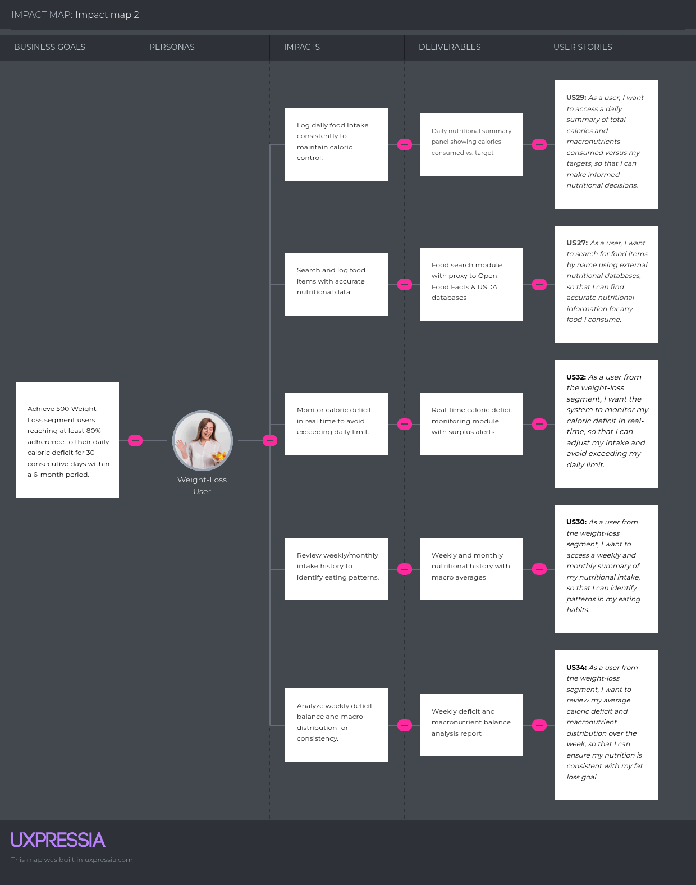
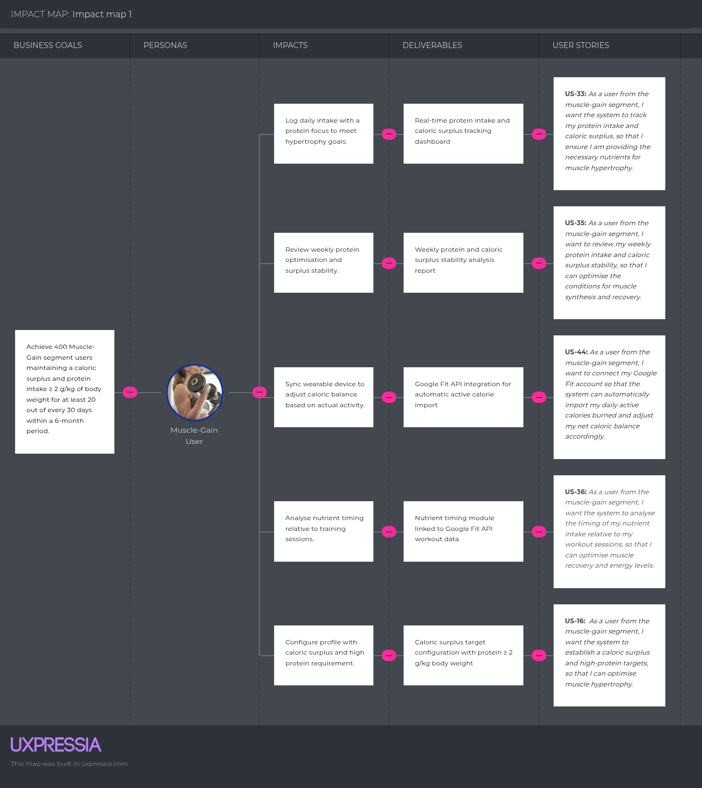

# CAPÍTULO III: REQUIREMENTS SPECIFICATION

## 3.1. User Stories

| **Epic / Story ID** | **Title** | **Description** | **Acceptance Criteria** | **Related with (Epic ID)** |
| :--- | :--- | :--- | :--- | :--- |
| **EP01** | Behavioral Consistency | As a user, I want the system to monitor my nutritional adherence over time so that it can detect when I am at risk of abandoning my plan and act before I lose consistency. | | |
| US01 | Maintain Daily Nutritional Adherence | As a user with physical goals, I want the system to evaluate whether I met my daily nutritional targets so that my adherence status is always up to date and reflects my real consistency. | *Scenario 1: AdherenceStatus is updated to ON_TRACK after a successful day*    Given the user has logged all meals for the day and total calories consumed are within ±10% of the daily target   When the end-of-day evaluation runs   Then the system updates AdherenceStatus to ON_TRACK, increments the streak by one, and resets consecutive misses to zero    *Scenario 2: AdherenceStatus reflects a deviation when daily goal is exceeded*    Given the user's total caloric intake for the day surpasses the daily target by more than 10%   When the DailyGoalExceeded event is processed by BehavioralProgress   Then the system increments consecutive misses by one without resetting the streak yet and keeps AdherenceStatus as ON_TRACK until the 3-day threshold is reached    *Scenario 3: MealSkipped contributes to consecutive miss count*    Given a meal time window has passed without any MealRecord registered for that window   When the system detects the MealSkipped event   Then the system increments consecutive misses by one and sends a push notification asking the user if they forgot to log their meal | EP01 |
| US02 | Receive Early Warning Before Abandoning the Plan | As a user with a history of dropping nutritional plans, I want the system to detect when I have been inconsistent for 3 consecutive days so that I receive a preventive recommendation before I fully abandon my routine. | *Scenario 1: BehavioralDropDetected is triggered after 3 consecutive misses*    Given the user has accumulated 3 consecutive days of either MealSkipped or DailyGoalExceeded events   When the system evaluates the BehavioralProgress aggregate   Then AdherenceStatus transitions to AT_RISK, the streak is marked as broken, and a push notification is sent informing the user they have been off track for 3 days    *Scenario 2: A preventive recommendation is generated upon drop detection*    Given AdherenceStatus has just transitioned to AT_RISK   When the BehavioralDropDetected event is published to Smart Recommendation   Then the system generates a PreventiveRecommendation with a simple and achievable meal option aligned to the user's remaining macros and goal type    *Scenario 3: Push notifications for behavioral drop can be disabled from settings*    Given the user has disabled behavioral drop notifications in their profile settings   When BehavioralDropDetected is triggered   Then the system generates the preventive recommendation internally but does not send a push notification | EP01 |
| US03 | Prevent Nutritional Abandonment Through Intervention | As a user who has been inactive for an extended period, I want the system to escalate its intervention so that I receive a simplified reactivation plan that makes it easier to return without pressure. | *Scenario 1: NutritionalAbandonmentRisk is triggered after 7 days of inactivity*    Given the user has had no MealRecord registered for 7 consecutive days after BehavioralDropDetected was emitted   When the system evaluates the BehavioralProgress aggregate   Then AdherenceStatus transitions to DROPPED and an urgent push notification is sent with a supportive message inviting the user to return gradually    *Scenario 2: An intervention recommendation is generated for DROPPED users*    Given AdherenceStatus is DROPPED   When the NutritionalAbandonmentRisk event is published to Smart Recommendation   Then the system generates an InterventionRecommendation proposing a simplified version of the nutritional plan with reduced tracking requirements for the first three days    *Scenario 3: Intervention push notifications can be disabled from settings*    Given the user has disabled intervention notifications in their profile settings   When NutritionalAbandonmentRisk is triggered   Then the system generates the intervention recommendation without sending a push notification | EP01 |
| US04 | Recover Nutritional Consistency After a Drop | As a user who has been off track, I want the system to recognize when I resume logging meals so that my adherence progress is updated and I receive positive reinforcement that motivates me to continue. | *Scenario 1: ConsistencyRecovered is triggered on the first MealRecord after a drop*    Given AdherenceStatus is AT_RISK or DROPPED   When the user registers a MealRecord for the current day   Then the system transitions AdherenceStatus to RECOVERED and then to ON_TRACK, resets consecutive misses to zero, and sends a push notification celebrating the user's return    *Scenario 2: Adherence history reflects the recovery event*    Given ConsistencyRecovered has been emitted   When Analytics processes the event   Then the adherence history record is updated with the recovery date and the total days inactive during the drop period    *Scenario 3: Recovery push notification can be disabled from settings*    Given the user has disabled recovery notifications in their profile settings   When ConsistencyRecovered is triggered   Then the system updates the adherence history without sending a push notification | EP01 |
| US05 | Celebrate Consistency Milestones to Reinforce Habits | As a user building a nutritional routine, I want the system to recognize when I reach streak milestones so that I feel motivated to maintain the habit long term. | *Scenario 1: StreakMilestoneReached is triggered at 7 consecutive days*    Given the user has met their daily nutritional goal for 7 consecutive days   When the system evaluates the BehavioralProgress aggregate at end of day   Then StreakMilestoneReached is emitted and a push notification congratulates the user on their 7-day streak    *Scenario 2: Milestones are triggered at 14, 21, and 30 consecutive days*    Given the user continues meeting their daily goal beyond 7 days   When the streak count reaches 14, 21, or 30   Then the system emits a StreakMilestoneReached event for each milestone and sends a distinct push notification    *Scenario 3: Streak resets to zero after a missed day*    Given the user has an active streak of any length   When the end-of-day evaluation determines the user did not meet their daily goal   Then the streak resets to zero and no milestone event is emitted | EP01 |
| US06 | Detect Strategy Mismatch to Protect Adherence | As a user whose metabolic targets have just been recalculated, I want the system to verify that the new targets are compatible with my adherence history so that I am not assigned a plan too aggressive for my real behavioral capacity. | *Scenario 1: StrategyMismatchDetected when new target exceeds adherence capacity*    Given MetabolicTargetsRecalculated has been emitted with a new daily caloric target significantly different from the previous one   When the system evaluates BehavioralProgress and finds historical adherence rate is below 60%   Then StrategyMismatchDetected is emitted and Smart Recommendation generates a GradualAdjustmentSuggested with a softer intermediate target    *Scenario 2: StrategyConsistencyConfirmed when new target is achievable*    Given MetabolicTargetsRecalculated has been emitted   When the system evaluates BehavioralProgress and finds historical adherence rate is 60% or above   Then StrategyConsistencyConfirmed is emitted and the new targets are applied without modification | EP01 |
| **EP02** | Nutrition Tracking | As a user, I want to record everything I eat each day with minimal friction so that my daily intake is always accurate and the system can validate my progress toward my nutritional goals. | | |
| US07 | Block Incompatible Foods Automatically to Eliminate Nutritional Risk | As a user with allergies or medical conditions, I want every food item I attempt to log to be automatically validated against my active restrictions so that I never accidentally consume something that puts my health at risk without relying on my own memory. | *Scenario 1: RestrictedItemBlocked prevents logging a food with a conflicting ingredient*    Given the user has lactose intolerance registered as an active dietary restriction   When the user attempts to log a food item that contains lactose   Then the system emits RestrictedItemBlocked, prevents the log entry from being saved, and sends a push notification identifying the conflicting ingredient and the restriction that triggered the block    *Scenario 2: Medical condition triggers nutritional risk flagging on food search*    Given the user has Type 2 Diabetes registered as a medical condition   When the user searches for food items   Then the system flags high glycemic index items in the search results with NutritionalRiskLevel HIGH and excludes them from all recommendations    *Scenario 3: No restrictions applied when profile has none configured*    Given the user has no dietary restrictions or medical conditions in their profile   When the user logs any food item   Then the system applies no filtering logic and stores the entry without restriction validation | EP02 |
| US08 | Find Accurate Nutritional Data to Make Informed Food Decisions | As a user tracking my nutrition, I want to search for any food by name against verified external databases so that the macro values I log are based on real nutritional data and not estimates that could silently break my caloric strategy. | *Scenario 1: Search returns matching results with full nutritional detail*    Given the user enters a food name as a search query   When the system queries Open Food Facts and USDA FoodData Central   Then the system returns a list of matching items each containing food name, serving size, calories, protein, carbohydrates, and fat    *Scenario 2: Restricted items are flagged to protect nutritional safety*    Given the user has active dietary restrictions configured   When the search results are returned   Then items containing restricted ingredients are flagged with the specific restriction that applies and with the corresponding NutritionalRiskLevel so the user can make a safe decision    *Scenario 3: No results returns an option to log manually*    Given the user submits a food name that returns no matches from either external database   When the empty result set is returned   Then the system informs the user that no match was found and offers a manual entry option | EP02 |
| US09 | Log a Meal to Maintain an Accurate Daily Intake Record and Validate Macro Progress | As a user with a nutritional goal, I want to add food items to my daily log by meal type with a custom portion so that my DailyIntake aggregate always reflects what I actually ate, my macro balance is recalculated in real time, and the system can determine whether I met or exceeded my daily target. | *Scenario 1: MealRecorded is emitted and macros are scaled to the entered quantity*    Given the user selects a food item, enters a quantity in grams, and assigns a meal category   When the user confirms the entry   Then the system stores the MealRecord, scales all macronutrients proportionally to the entered quantity, emits MealRecorded, and updates the daily macro balance in real time    *Scenario 2: DailyGoalExceeded is emitted when logging causes the total to surpass the target*    Given the user's cumulative daily intake is within target before the new entry   When the confirmed entry causes total calories to exceed the daily target by more than 10%   Then the system emits DailyGoalExceeded, sends a push notification indicating the exceeded amount in kilocalories, and the BehavioralProgress aggregate increments consecutive misses by one    *Scenario 3: Editing a logged quantity recalculates macros without affecting other entries*    Given the user has a MealRecord with an incorrect quantity   When the user updates the quantity   Then the system recalculates the macros for that specific entry only and re-emits MealRecorded to trigger a new daily macro validation    *Scenario 4: Deleting a log entry corrects the daily totals and re-evaluates goal status*    Given the user has a MealRecord they want to remove   When the user deletes the entry   Then the system removes the record, recalculates the DailyIntake totals, and re-evaluates whether the daily goal is met, on track, or exceeded | EP02 |
| US10 | Detect Meal Skips Automatically to Prevent Silent Adherence Losses | As a user with a structured meal schedule, I want the system to detect when I have not logged a meal during its expected time window so that skips are automatically counted toward my adherence evaluation and I cannot lose my streak without the system noticing. | *Scenario 1: MealSkipped is emitted when a meal window closes without a log*    Given the breakfast window (06:00–10:00) has closed without any MealRecord for that window   When the system evaluates the DailyIntake at 10:01   Then the system emits MealSkipped for the breakfast window and sends a push notification asking if the user forgot to register their meal    *Scenario 2: MealSkipped increments consecutive misses and re-evaluates AdherenceStatus*    Given MealSkipped has been emitted   When BehavioralConsistency processes the event   Then consecutive misses are incremented by one and AdherenceStatus is re-evaluated against the 3-day threshold that triggers BehavioralDropDetected    *Scenario 3: MealSkipped push notifications can be disabled from settings*    Given the user has disabled meal skip notifications in their profile settings   When MealSkipped is triggered   Then the system emits the event for adherence evaluation but does not send a push notification | EP02 |
| US11 | Know at Every Moment Whether My Current Intake Is Keeping Me on Track | As a user tracking my daily nutrition, I want the system to always show me how far I am from my caloric and macro targets based on what I have logged so far today so that I can decide what to eat next without breaking my plan or unknowingly falling into a deficit or surplus that triggers a behavioral drop. | *Scenario 1: Remaining balance is recalculated after every MealRecord*    Given the user has at least one MealRecord for the current day   When the user logs a new meal entry and MealRecorded is emitted   Then the system immediately recalculates calories consumed, calories remaining, and individual macro balances for protein, carbohydrates, and fat against the daily targets set by the NutritionPlan aggregate    *Scenario 2: Net balance incorporates active calories from wearable sync*    Given the user has Google Fit connected and active calories have been synced for the day   When CaloricTargetAdjusted has been emitted by Metabolic Adaptation   Then the remaining calorie balance reflects the adjusted net target that includes active calories burned and not the original baseline target    *Scenario 3: Empty day shows full targets as available capacity*    Given the user has not logged any food for the current day   When the user checks their nutritional status   Then all consumed values are zero and the full daily targets are shown as the available capacity for the day | EP02 |
| US12 | Reduce Logging Friction by Photographing a Meal Instead of Searching Item by Item | As a user who eats varied meals and finds manual search tedious, I want to photograph my food plate and have the system estimate its nutritional content automatically so that the cognitive effort of maintaining my daily log does not become the reason I abandon my nutritional plan. | *Scenario 1: MealPhotoAnalyzed returns estimated food items and macros for Pro/Premium users*    Given the user is on a Pro or Premium plan and submits a clear image of a food plate   When the system forwards the image to Google Cloud Vision API and cross-references with Open Food Facts   Then the system returns a list of identified food items each with estimated quantity, calories, protein, carbohydrates, and fat    *Scenario 2: Confirmed scan result is stored as a MealRecord and triggers macro validation*    Given the system has returned a scan analysis result   When the user reviews the identified items, assigns a meal category, and confirms the entry   Then the system stores each identified item as a MealRecord, emits MealRecorded, and triggers the daily macro validation that evaluates whether DailyGoalMet or DailyGoalExceeded should be emitted    *Scenario 3: Unprocessable image rejects the scan and redirects to manual entry*    Given the user submits an image that is blurry, does not contain food, or cannot be processed   When the analysis completes   Then the system rejects the scan, informs the user that no food items could be detected, and directs them to the manual food search without losing the current day's log    *Scenario 4: Basic plan users are blocked from accessing Smart Scan*    Given the user is on a Basic plan   When the user attempts to access the Smart Scan feature   Then the system denies access and informs the user that Smart Scan requires a Pro or Premium plan | EP02 |
| US13 | Identify Which Specific Foods Are Breaking My Macro Balance | As a user who consistently misses one macro target, I want to trace back exactly which logged items contributed the most to the imbalance so that I can make precise substitutions instead of guessing what to change in my diet. | *Scenario 1: Meal detail returns each item with its individual macro contribution*    Given the user selects a specific meal category such as lunch   When the user requests the nutritional breakdown for that category   Then the system returns each registered food item with its name, quantity in grams, calories, protein, carbohydrates, and fat so the user can identify the specific item driving the imbalance    *Scenario 2: Consolidated meal summary shows whether the meal contributed to an exceeded target*    Given the user wants a quick summary without item-level detail   When the user requests a consolidated view of a meal category   Then the system returns the total calories and macros for that meal time and indicates whether that meal alone exceeded the recommended allocation for its time slot | EP02 |
| US14 | Identify Weekly Eating Patterns That Are Sabotaging Fat Loss Consistency | As a user focused on losing weight, I want to review which days and periods I consistently broke my caloric deficit so that I can detect the behavioral pattern behind my failures and correct it before it triggers a behavioral drop. | *Scenario 1: Weekly history returns daily calorie totals flagged against the deficit target*    Given the user requests their nutritional history for the past 7 days   When the system retrieves the DailyIntake records   Then the system returns the total calories consumed for each day, flags the days where the deficit was not maintained, and shows weekly macro averages    *Scenario 2: Monthly history surfaces recurring non-adherent days for pattern detection*    Given the user requests their nutritional history for the current month   When the system aggregates the DailyIntake records   Then the system returns the monthly caloric average, the total days where the deficit was maintained, and identifies which weekdays had the highest rate of DailyGoalExceeded events    *Scenario 3: Historical navigation allows reviewing any prior period*    Given the user wants to review a specific past week or month   When the user selects a prior time range   Then the system retrieves and returns the accurate nutritional data for that specific period | EP02 |
| US15 | Prevent Exceeding the Caloric Deficit Limit Before It Counts as a Behavioral Miss | As a user with a weight loss goal, I want the system to recalculate my remaining caloric capacity after every meal I log so that I always know exactly how much I can still eat before triggering a DailyGoalExceeded event that damages my streak. | *Scenario 1: Remaining deficit capacity is recalculated after every MealRecord*    Given the user has a caloric deficit target established by the NutritionPlan aggregate   When the user logs a meal entry and MealRecorded is emitted   Then the system immediately recalculates the remaining calories before the deficit limit is reached and updates the daily balance    *Scenario 2: DailyGoalExceeded emits a behavioral miss and notifies the user*    Given the user's cumulative intake surpasses their deficit target by more than 10%   When DailyGoalExceeded is emitted   Then the system sends a push notification with the exact kilocalories exceeded, increments consecutive misses in BehavioralProgress, and marks the day as a deviation | EP02 |
| US16 | Ensure Muscle Growth Conditions Are Met Through Daily Protein and Surplus Tracking | As a user focused on muscle gain, I want the system to continuously evaluate whether my protein intake and caloric surplus are sufficient for hypertrophy so that I never finish a day having unknowingly undermined my muscle synthesis conditions. | *Scenario 1: Protein compliance is shown as a real-time percentage of the hypertrophy target*    Given the user from the muscle-gain segment has a protein target of at least 2.0g per kg of body weight   When the user logs meals throughout the day   Then the system recalculates after each MealRecord the grams of protein consumed, the percentage of the target achieved, and the grams remaining to meet the muscle synthesis requirement    *Scenario 2: Insufficient surplus triggers a DailyGoalExceeded notification in reverse at end of day*    Given the user from the muscle-gain segment has a caloric surplus target and the day ends with total intake below the surplus threshold   When the end-of-day evaluation runs   Then the system identifies the caloric gap in kilocalories needed to have met the surplus, sends a push notification, and records the day as a deviation in BehavioralProgress | EP02 |
| US17 | Detect Recurring Macro Imbalances That Are Eroding Fat Loss Progress Over the Week | As a user focused on losing weight, I want the system to analyze my weekly macro distribution so that I can identify which recurring nutritional patterns are reducing my satiety or energy and are likely driving my adherence drops before they become a streak reset. | *Scenario 1: Weekly analysis identifies each day where the deficit was not maintained*    Given the user from the weight-loss segment has at least 5 logged days in the past 7 days   When the user requests the weekly macro analysis   Then the system returns each day's caloric total against the deficit target, flags specific days where the limit was exceeded, and shows the average daily deviation in kilocalories    *Scenario 2: Macro distribution breakdown surfaces patterns that explain satiety failures*    Given the user requests the weekly nutritional distribution   When the system calculates average macro percentages across logged days   Then the system flags any day where fat or carbohydrate intake deviates more than 15% from the recommended distribution and correlates those days with the DailyGoalExceeded events in the adherence history | EP02 |
| US18 | Identify Protein and Surplus Gaps That Are Blocking Weekly Muscle Synthesis | As a user focused on gaining muscle, I want the system to show me precisely which days I fell below my protein target or failed to maintain the caloric surplus so that I can identify the specific nutritional gaps preventing consistent muscle recovery and synthesis. | *Scenario 1: Weekly protein compliance flags each day below the hypertrophy threshold*    Given the user from the muscle-gain segment requests the weekly macro analysis   When the system evaluates each logged day against the protein target   Then the system returns protein consumed per day, flags days where intake fell below the minimum target, and calculates the overall weekly protein compliance as a percentage    *Scenario 2: Surplus stability report correlates irregular days with potential recovery deficits*    Given the user requests the weekly nutritional detail   When the system aggregates the caloric surplus or deficit for each logged day   Then the system identifies days where the surplus dropped below zero and returns the average surplus maintained across the week so the user can assess whether synthesis conditions were consistently met | EP02 |
| **EP03** | Metabolic Adaptation | As a user, I want the system to continuously adapt my nutritional plan based on my physical progress and activity so that my targets always reflect my real metabolic state and not an outdated calculation. | | |
| US19 | Complete Onboarding to Generate a Nutritional Plan Calibrated to My Actual Metabolism | As a new user, I want to provide my physical data, goal, activity level, restrictions, and medical conditions during onboarding so that the system derives my metabolic targets from real measurements on the first session and I never operate on generic recommendations that do not match my body. | *Scenario 1: MetabolicTargetSet is emitted after onboarding with WEIGHT_LOSS goal*    Given a new user provides age, biological sex, weight, height, activity level MODERATE, and selects WEIGHT_LOSS   When the user completes the onboarding   Then the system emits MetabolicTargetSet with a daily caloric target equal to TDEE minus 500 kcal and a macro distribution of 30% protein, 40% carbohydrates, and 30% fat    *Scenario 2: MetabolicTargetSet is emitted after onboarding with MUSCLE_GAIN goal*    Given a new user selects MUSCLE_GAIN and provides a body weight of 70 kg   When the user completes onboarding   Then the system emits MetabolicTargetSet with a daily caloric target equal to TDEE plus 300 kcal, a minimum protein target of 140 grams (2.0g per kg), and a macro distribution of 35% protein, 45% carbohydrates, and 20% fat    *Scenario 3: Onboarding is blocked when required fields are missing*    Given the user attempts to complete onboarding without providing weight, height, or biological sex   When the user submits the form   Then the system rejects the submission, identifies the specific missing fields, and does not emit OnboardingCompleted    *Scenario 4: Dietary restrictions and medical conditions activate immediately upon onboarding completion*    Given the user declares lactose intolerance and Type 2 Diabetes during onboarding   When OnboardingCompleted is emitted   Then the system registers both restrictions in the Nutrition Tracking context and enforces them on all subsequent food searches, logs, and recommendations from the first session | EP03 |
| US20 | Update Body Metrics So the Nutritional Plan Does Not Become Outdated as My Body Changes | As a user progressing toward my physical goal, I want to register my current weight periodically so that the system recalculates my TDEE and macro targets with my actual measurements and I am never following a plan calculated for a body weight I no longer have. | *Scenario 1: MetabolicTargetsRecalculated is emitted and propagated after a weight update*    Given the user provides a new valid weight value in kilograms   When the user saves the body metrics update   Then the system recalculates BMI, BMR, and TDEE based on the new weight, emits MetabolicTargetsRecalculated, and the updated daily caloric and macro targets are propagated to the DailyIntake aggregate in Nutrition Tracking    *Scenario 2: Invalid weight value is rejected without storing any record*    Given the user enters a weight value of zero or a negative number   When the user attempts to save the update   Then the system rejects the input without storing any record and identifies the valid weight range    *Scenario 3: Multiple entries on the same day use the latest value as the primary input*    Given the user has already registered a weight entry for the current day   When the user submits a new weight value   Then the system stores the new entry as a separate record and uses the latest value as the sole input for all metabolic recalculations | EP03 |
| US21 | Recalibrate the Entire Nutritional Strategy When My Objective Changes | As a user whose goal has shifted from losing weight to gaining muscle or vice versa, I want to change my goal from my profile so that the system immediately switches my caloric strategy and macro distribution without me having to restart the onboarding or lose my historical data. | *Scenario 1: Caloric strategy switches to surplus when goal changes to MUSCLE_GAIN*    Given the user currently has a WEIGHT_LOSS goal with a caloric deficit target   When the user updates their goal to MUSCLE_GAIN from profile settings   Then the system recalculates the NutritionPlan with a caloric surplus of TDEE plus 300 kcal, updates the protein target to 2.0g per kg of body weight, emits MetabolicTargetsRecalculated, and preserves all historical meal logs and adherence records    *Scenario 2: Caloric strategy switches to deficit when goal changes to WEIGHT_LOSS*    Given the user currently has a MUSCLE_GAIN goal with a caloric surplus target   When the user updates their goal to WEIGHT_LOSS   Then the system recalculates the NutritionPlan with a caloric deficit of TDEE minus 500 kcal, updates the macro distribution to prioritize satiety, and emits MetabolicTargetsRecalculated | EP03 |
| US22 | Understand the Metabolic Basis of My Nutritional Targets So I Can Make Informed Adjustments | As a user who wants to understand why the system assigns me a specific caloric target, I want to see my calculated BMI, BMR, and TDEE so that I can assess whether my activity level declaration is accurate and whether the plan the system derived actually reflects my current metabolic reality. | *Scenario 1: Metabolic indicators show the calculation chain that produced the daily target*    Given the user has a complete profile with current weight and height   When the user accesses the metabolic summary   Then the system displays BMI with its WHO health category, BMR calculated via Mifflin-St Jeor, TDEE based on the current activity multiplier, and the daily caloric target derived from TDEE plus or minus the strategy offset so the user understands the full calculation chain    *Scenario 2: Indicators update automatically after a body metrics change without requiring a manual refresh*    Given the user has just updated their weight   When MetabolicTargetsRecalculated is emitted   Then the metabolic summary reflects the updated BMI, BMR, TDEE, and daily caloric target before the user navigates back to the summary screen    *Scenario 3: Outdated data is surfaced proactively to prevent silent plan drift*    Given the user's most recent weight entry is more than 14 days old   When the user accesses the metabolic summary   Then the system displays the current calculations alongside a warning that the data may no longer reflect the user's current metabolic state and prompts them to log a new weight | EP03 |
| US23 | Keep My Caloric Capacity Accurate on Training Days Without Manual Recalculation | As a user who exercises regularly, I want my daily caloric target to increase automatically after my physical activity is registered so that I never accidentally undereat on a training day and compromise my recovery or muscle synthesis without realizing it. | *Scenario 1: CaloricTargetAdjusted is emitted after Google Fit sync for Premium users*    Given the user is on a Premium plan, has Google Fit connected, and the API reports 400 active calories burned   When the system performs the hourly wearable sync   Then the system emits CaloricTargetAdjusted with a new net daily target equal to the original target plus 400 kcal and the daily nutritional balance updates immediately without any user action    *Scenario 2: Manual activity log triggers a caloric target adjustment for users without a wearable*    Given the user does not have a wearable and manually logs a 45-minute run   When the system calculates active calories using the MET value for running and the user's body weight   Then the system emits CaloricTargetAdjusted with the estimated calories added to the net daily target    *Scenario 3: Sync failure retains the last valid data to prevent silent target distortion*    Given the user has Google Fit connected but the sync fails due to a connectivity issue   When the sync error is returned   Then the system retains the most recently synced active calorie value, does not alter the current net target, and marks the sync as failed in the daily summary | EP03 |
| US24 | Authorize Google Fit Once to Eliminate Manual Activity Logging Forever | As a Premium user who trains regularly, I want to connect Google Fit through a one-time authorization so that my daily steps and active calories are imported automatically every day and I never have to manually log physical activity to keep my caloric balance accurate. | *Scenario 1: WearableConnected is emitted after successful OAuth and today's data is imported immediately*    Given the user is on a Premium plan and completes the Google Fit OAuth authorization   When Google Fit returns the authorization confirmation   Then the system emits WearableConnected, imports today's step count and active calories without any additional user action, and recalculates the net caloric balance    *Scenario 2: Wearable connection is blocked for Basic and Pro plan users*    Given the user is on a Basic or Pro plan   When the user attempts to connect Google Fit   Then the system blocks the connection and informs the user that Wearable Sync requires a Premium plan | EP03 |
| US25 | Force a Strategy Recalibration When My Body Has Stopped Responding to the Current Plan | As a user who has been consistent but stopped seeing physical results, I want the system to detect when I have been stagnant for 14 days and automatically apply an adjusted nutritional strategy so that I do not waste additional weeks on a plan my metabolism has already adapted to. | *Scenario 1: StagnationDetected is emitted after 14 days without measurable physical progress*    Given the user has logged body metrics at least 4 times in the past 14 days and the weight trend shows no measurable change toward the goal   When the system evaluates the NutritionPlan aggregate   Then the system emits StagnationDetected and publishes it to Smart Recommendation to trigger StrategyAdjustmentSuggested    *Scenario 2: Strategy adjustment is applied automatically to break the plateau*    Given StagnationDetected has been emitted and Smart Recommendation has generated a StrategyAdjustmentSuggested   When the system applies the adjustment   Then MetabolicTargetsRecalculated is emitted with the new caloric target and macro distribution and the daily nutritional balance updates immediately | EP03 |
| US26 | Set a Target Weight to Make Progress Measurable and Give the System a Reference for Projection | As a user focused on losing weight, I want to define a target weight so that the system can calculate when I will reach it at my current rate of deficit and I can assess whether my pace is realistic or whether I need to adjust my strategy. | *Scenario 1: Target weight is saved and projected achievement date is derived from the current deficit rate*    Given the user from the weight-loss segment provides a target weight lower than their current weight   When the user saves the goal   Then the system stores the target weight and calculates a projected achievement date based on the current daily caloric deficit rate derived from the NutritionPlan aggregate    *Scenario 2: Target weight inconsistent with WEIGHT_LOSS goal is rejected*    Given the user enters a target weight equal to or greater than their current weight   When the user attempts to save the goal   Then the system rejects the input and identifies the inconsistency with the active GoalType | EP03 |
| US27 | Verify That Weight Gain Is Muscle and Not Fat to Protect the Quality of the Bulk | As a user focused on gaining muscle, I want to log body circumference measurements so that the system estimates my body fat percentage and lean mass and I can confirm that my caloric surplus is producing muscle tissue and not just accumulating fat. | *Scenario 1: Body fat percentage and lean mass breakdown are calculated from circumference inputs*    Given the user from the muscle-gain segment provides waist, neck, and height measurements   When the user saves the body composition update   Then the system calculates estimated body fat percentage using the U.S. Navy formula and displays the split between lean mass and fat mass in kilograms    *Scenario 2: Excessive fat gain rate triggers an automatic surplus reduction to protect the lean bulk*    Given the user registers a body fat increase exceeding 1.5% over a two-week period   When the system evaluates the body composition trend against the lean bulk invariant of the NutritionPlan aggregate   Then the system emits StrategyAdjustmentSuggested recommending a reduction of the caloric surplus and applies the adjustment automatically | EP03 |
| **EP04** | Restaurant Intelligence | As a user, I want to photograph a restaurant menu and receive an instant ranking of the dishes most compatible with my nutritional plan so that eating out never forces me to choose between enjoying a meal and staying on track. | | |
| US28 | Analyze a Restaurant Menu to Eliminate Nutritional Uncertainty When Eating Out | As a Premium user who eats at restaurants frequently, I want to photograph the menu and have the system identify every dish and estimate its nutritional content so that I am never forced to guess the caloric impact of a meal and risk a DailyGoalExceeded event that breaks my streak. | *Scenario 1: RestaurantMealAnalyzed is emitted with all identified dishes after a valid menu scan*    Given the user is on a Premium plan and submits a legible photo of a restaurant menu   When the system processes the image through Google Cloud Vision API and cross-references identified dishes with nutritional databases   Then the system emits RestaurantMealAnalyzed with a list of dishes each containing estimated calories, protein, carbohydrates, and fat    *Scenario 2: Unreadable image is rejected and the user is informed*    Given the user submits an image that is too blurry or does not contain a readable menu   When the vision analysis completes   Then the system rejects the scan and informs the user that the menu could not be processed    *Scenario 3: Non-Premium users are blocked from menu analysis*    Given the user is on a Basic or Pro plan   When the user attempts to access Restaurant Menu Analysis   Then the system blocks access and informs the user that this feature requires a Premium plan | EP04 |
| US29 | Automatically Remove Unsafe Dishes From Consideration to Protect Nutritional Safety at Restaurants | As a user with dietary restrictions or medical conditions, I want every dish identified in a menu scan to be checked against my active restrictions so that unsafe options are flagged before I see the ranking and I never have to read through the entire menu to protect my health. | *Scenario 1: RestrictedDishFlagged is emitted for each dish containing a restricted ingredient*    Given the user has gluten intolerance registered and a menu analysis has completed   When the system applies the dietary restriction filter to the identified dishes   Then every dish containing gluten emits RestrictedDishFlagged with the specific restriction that applies and is excluded from the compatibility ranking    *Scenario 2: No dishes are flagged when none contain restricted ingredients*    Given the user has active restrictions but none of the identified dishes contain restricted ingredients   When the restriction filter is applied   Then the system confirms no restrictions were triggered and proceeds to rank all dishes | EP04 |
| US30 | Get an Instant Best-Dish Recommendation to Make the Optimal Choice at a Restaurant Without Calculation | As a user eating out, I want the system to rank the safe dishes by compatibility with my remaining daily macros and present the top option with a nutritional justification so that I can order the best choice for my plan in seconds without doing any manual evaluation. | *Scenario 1: CompatibleDishesRanked presents the lowest-calorie option for WEIGHT_LOSS users*    Given the user from the weight-loss segment has received a menu analysis result with unrestricted dishes   When the system ranks dishes by caloric density relative to the remaining daily caloric budget   Then the system returns CompatibleDishesRanked with the dish that best preserves the caloric deficit as the top result and at least two ranked alternatives    *Scenario 2: CompatibleDishesRanked presents the highest-protein option for MUSCLE_GAIN users*    Given the user from the muscle-gain segment has received a menu analysis result   When the system ranks dishes by protein content per serving   Then the system returns the dish with the highest protein content above 20g as the top result with its full macro breakdown    *Scenario 3: User can log the chosen dish directly from the ranking to complete the meal record without leaving the screen*    Given the user has reviewed CompatibleDishesRanked   When the user selects a dish from the ranking and confirms the log   Then the system creates a MealRecord for the selected dish, emits MealRecorded, and the daily macro summary updates without requiring the user to navigate to the manual food search | EP04 |
| **EP05** | Smart Recommendation | As a user, I want to receive food suggestions adapted to my current location, weather, pantry, and adherence status so that I always have a relevant and actionable option regardless of my context. | | |
| US31 | Receive a Simple Meal Suggestion That Makes Returning to Consistency Easy After a Drop | As a user whose adherence has dropped, I want the system to proactively offer a single easy and achievable meal option so that I have a clear path back to consistency without having to plan what to eat on my own in a moment when motivation is already low. | *Scenario 1: PreventiveRecommendationGenerated offers a contextually appropriate meal upon BehavioralDropDetected*    Given BehavioralDropDetected has been emitted because the user has 3 consecutive misses   When Smart Recommendation processes the event   Then the system returns a meal suggestion that fits within the user's remaining daily macros, respects active dietary restrictions, requires minimal preparation effort, and is accompanied by a message acknowledging the drop without adding pressure    *Scenario 2: Preventive recommendation is available in the app even when push notification is disabled*    Given the user has disabled preventive recommendation notifications in settings   When PreventiveRecommendationGenerated is emitted   Then the recommendation is surfaced in the app interface but no push notification is sent | EP05 |
| US32 | Get a Graduated Return Plan After Abandonment That Does Not Overwhelm Me With the Full Routine Immediately | As a user who has been inactive for more than a week, I want the system to offer a simplified nutritional plan for the first few days back so that returning feels manageable and I am not deterred by having to immediately comply with targets I have been ignoring for days. | *Scenario 1: InterventionRecommendationGenerated proposes a phased return plan upon NutritionalAbandonmentRisk*    Given NutritionalAbandonmentRisk has been emitted because the user has been inactive for 7 consecutive days   When Smart Recommendation processes the event   Then the system generates an InterventionRecommendation with reduced daily tracking requirements for days 1 to 3 and progressively increases toward the original targets starting on day 4 so the user is never confronted with the full plan on the first day back | EP05 |
| US33 | Automatically Adjust My Nutritional Strategy When My Body Has Adapted and Progress Has Stalled | As a user who has been consistent but is no longer progressing, I want the system to detect the stagnation and apply a new strategy automatically so that I never spend more than two weeks on a plan that my metabolism has already outgrown. | *Scenario 1: StrategyAdjustmentSuggested proposes a modified macro distribution and applies it automatically*    Given StagnationDetected has been emitted after 14 days without physical progress   When Smart Recommendation processes the event   Then the system generates StrategyAdjustmentSuggested with a modified caloric target and macro distribution, applies the adjustment automatically to the NutritionPlan aggregate by emitting MetabolicTargetsRecalculated, and the daily nutritional balance updates immediately    *Scenario 2: Gradual adjustment protects adherence when strategy mismatch is detected*    Given StrategyMismatchDetected has been emitted because historical adherence rate is below 60%   When Smart Recommendation processes the event   Then the system generates GradualAdjustmentSuggested with a softer intermediate target that the user can realistically achieve given their demonstrated adherence capacity | EP05 |
| US34 | Receive a Justified Best-Dish Recommendation That Confirms My Order Is the Right Nutritional Choice | As a Premium user who has just scanned a restaurant menu, I want the system to present the single dish that best fits my current macro deficits with a clear nutritional explanation so that I can order with confidence knowing the decision is grounded in my plan and not in a guess. | *Scenario 1: BestDishRecommended includes a macro-based justification that explains why the dish fits the plan*    Given CompatibleDishesRanked has been emitted by Restaurant Intelligence   When Smart Recommendation processes the ranking   Then the system presents the top-ranked dish as BestDishRecommended with a justification that identifies which of the user's daily macro deficits the dish addresses most effectively and by how many grams | EP05 |
| US35 | Receive Meal Suggestions That Match the Weather So My Body Gets What It Needs in Each Climate | As a Pro or Premium user, I want the system to factor in the current temperature at my location when suggesting meals so that I am not recommended a heavy calorie-dense dish on a 32-degree day when my body needs hydration and lighter food. | *Scenario 1: Hot weather recommendation addresses hydration and light caloric density*    Given the user is on a Pro or Premium plan, has location access enabled, and the current temperature exceeds 28°C   When the user requests a meal recommendation   Then the system returns suggestions that are low in caloric density and high in water content filtered by active dietary restrictions and the user's remaining macro balance    *Scenario 2: Cold weather recommendation addresses warmth and caloric adequacy*    Given the current temperature at the user's location is below 12°C   When the user requests a recommendation   Then the system returns warm meal suggestions with higher caloric density filtered by the user's restrictions    *Scenario 3: Location denied falls back to profile-based recommendations without blocking the feature*    Given the user has denied location access   When the user requests a recommendation   Then the system returns profile-based recommendations not dependent on weather data and prompts the user to enable location or enter a city manually | EP05 |
| US36 | Stay on Track Nutritionally When Traveling Without Knowing the Local Cuisine | As a Pro or Premium user traveling to an unfamiliar city, I want the system to detect my new location and suggest local dishes compatible with my plan so that I can enjoy the local food culture without breaking my consistency because I do not know which local options fit my macros. | *Scenario 1: Travel Mode activates automatically and delivers local dish suggestions without user action*    Given the Geolocation API detects that the user's current city differs from their registered home city   When the user opens the recommendations screen   Then Travel Mode activates automatically, the detected city is identified, and the system returns healthy local dish suggestions filtered by the user's restrictions and goal type without requiring the user to configure anything    *Scenario 2: Manual city entry activates Travel Mode when auto-detection is insufficient*    Given the user enters a city name manually to activate Travel Mode   When the user confirms the selection   Then the system returns local food recommendations for that city filtered by restrictions and goal type    *Scenario 3: Travel Mode deactivation restores home-location recommendations*    Given Travel Mode is active   When the user deactivates it   Then the system resumes standard recommendations based on the home location and current weather    *Scenario 4: Unrecognized city does not break the feature and offers a fallback*    Given the user enters a city not found in the location database   When the system processes the request   Then the system informs the user the city was not recognized and suggests trying a nearby major city | EP05 |
| US37 | Convert Available Pantry Ingredients Into a Meal That Covers My Most Critical Macro Deficit | As a Pro or Premium user who prefers cooking at home, I want to register my available ingredients and receive recipe suggestions so that the system converts what I already have into a meal that specifically addresses the macro I am most deficient in today without requiring me to shop or search for new options. | *Scenario 1: Recipe suggestions address the most deficient macro for WEIGHT_LOSS users*    Given the user from the weight-loss segment has ingredients in their pantry and protein is the most deficient macro of the day   When the user requests pantry-based suggestions   Then the system returns recipes using available ingredients that do not exceed the remaining caloric budget and are sorted by protein content to address the deficit    *Scenario 2: Recipe suggestions maximize protein synthesis conditions for MUSCLE_GAIN users*    Given the user from the muscle-gain segment has not yet met their daily protein target   When the user requests pantry-based suggestions   Then the system returns recipes ranked by protein content per serving using only available pantry ingredients and filtered by active restrictions    *Scenario 3: Restricted ingredients are excluded unconditionally from all recipe suggestions*    Given the user has active dietary restrictions   When recipe suggestions are generated   Then the system excludes any recipe containing a restricted ingredient regardless of whether that ingredient is available in the pantry    *Scenario 4: Empty pantry surfaces the absence immediately and prompts action*    Given the user has no ingredients registered   When the user requests suggestions   Then the system returns an empty result and prompts the user to add ingredients to their pantry | EP05 |
| **EP06** | Identity & Access Management | As a user, I want to securely create and manage my account and profile so that my personal and health data is protected and my session persists correctly across devices. | | |
| US38 | Create an Account to Gain Access to a Nutritional Plan Calibrated to My Body | As a visitor, I want to register with a unique email and a secure password so that I gain access to the onboarding process that will generate my personalized metabolic targets based on my actual physical data. | *Scenario 1: AccountCreated is emitted and onboarding is triggered on valid registration*    Given the visitor provides a valid name, a unique email, and a password of at least 8 characters and accepts the terms   When the visitor submits the registration   Then the system creates the account, emits AccountCreated, and immediately redirects to the onboarding flow that will produce the user's first MetabolicTargetSet event    *Scenario 2: Registration is rejected when the email is already registered*    Given the visitor provides an email already associated with an account   When the visitor submits   Then the system rejects the request and informs the visitor the email is already in use    *Scenario 3: Registration is rejected when the password is too short*    Given the visitor provides a password of fewer than 8 characters   When the visitor submits   Then the system rejects the request and displays the minimum password length requirement    *Scenario 4: Registration is rejected when terms are not accepted*    Given the visitor provides all required data but does not accept the terms   When the visitor submits   Then the system rejects the request and identifies acceptance of terms as mandatory | EP06 |
| US39 | Resume My Nutritional Plan and Adherence Progress From Any Session | As a registered user, I want to log in with my credentials so that I can resume exactly where I left off with my nutritional plan, daily log, adherence status, and streak without losing any behavioral continuity between sessions. | *Scenario 1: SessionStarted is emitted and dashboard reflects current adherence state*    Given the user provides the correct email and password   When the user submits the login   Then the system creates a valid session, emits SessionStarted, and presents the dashboard with today's nutritional balance and the current AdherenceStatus including streak and consecutive misses    *Scenario 2: Invalid credentials return a generic message without revealing which field is wrong*    Given the user provides an incorrect password or unregistered email   When the user submits   Then the system returns a generic invalid credentials message without specifying whether the email or password was incorrect    *Scenario 3: Repeated failures trigger a temporary lockout to protect account integrity*    Given the user has failed to log in 5 consecutive times   When the user attempts a sixth login   Then the system temporarily restricts access and informs the user of the lockout duration | EP06 |
| US40 | Recover Access to My Account and Nutritional History After Forgetting the Password | As a user who has forgotten their password, I want to request a reset link sent to my registered email so that I can regain access without losing any of my meal logs, body metrics, or adherence history. | *Scenario 1: Reset link is dispatched for a registered email*    Given the user provides an email associated with an existing account   When the user submits the recovery request   Then the system sends a temporary reset link to that email    *Scenario 2: Unregistered email does not reveal whether an account exists*    Given the user provides an email not associated with any account   When the user submits   Then the system returns a neutral confirmation without disclosing whether an account with that email exists    *Scenario 3: Expired link prompts a new request without confusion*    Given the user receives a reset link but does not use it within the security window   When the user attempts to access the expired link   Then the system informs the user the link has expired and offers to send a new one | EP06 |
| US41 | Keep Nutritional Recommendations Accurate by Updating Physical Conditions and Restrictions | As a user whose health situation has changed, I want to edit my activity level, dietary restrictions, and medical conditions at any time from my profile so that every future recommendation, food search, and caloric target reflects my current health reality and not the state I was in when I registered. | *Scenario 1: MetabolicTargetsRecalculated is emitted when activity level changes*    Given the user changes their activity level from SEDENTARY to ACTIVE   When the profile update is saved   Then the system recalculates the TDEE with the new multiplier, emits MetabolicTargetsRecalculated, and propagates the updated daily caloric target to the DailyIntake aggregate    *Scenario 2: New dietary restrictions are enforced immediately on all subsequent logs and searches*    Given the user adds a new allergy to their profile   When the update is saved   Then the restriction is registered in Nutrition Tracking and applied to all food searches and meal log validations from that moment forward without requiring a new session    *Scenario 3: Historical data is preserved after any profile edit*    Given the user updates any profile field   When the changes are saved   Then all previous MealRecords, body metrics entries, and BehavioralProgress history remain unchanged and only future calculations use the updated values | EP06 |
| US42 | Terminate the Session to Prevent Unauthorized Access to Personal Health Data | As a user accessing the platform on a shared or public device, I want to log out and have every session token invalidated so that no other person can access my nutritional history, adherence data, or health profile after I leave the device. | *Scenario 1: SessionTerminated clears all tokens and blocks access to protected routes*    Given the user is logged in on any device   When the user selects the logout option   Then the system terminates the session, clears all locally stored tokens, emits SessionTerminated, and redirects to the login screen    *Scenario 2: All authenticated routes reject access after logout*    Given the user has logged out   When the user attempts to navigate to the dashboard, meal log, or any profile section   Then the system denies access and redirects to the login screen | EP06 |
| **EP07** | Subscriptions & Billing | As a user, I want to subscribe to and manage my NutriSmart plan so that I can access the features corresponding to my tier and control my billing without friction. | | |
| US43 | Subscribe to a Plan to Unlock the Domain Features Required to Achieve My Nutritional Goals | As a user, I want to complete the subscription process so that BenefitsEnabled is emitted immediately and the system unlocks the features I need to properly follow my nutritional plan without artificial gaps in capability. | *Scenario 1: SubscriptionActivated and BenefitsEnabled are emitted after successful payment*    Given the user selects a plan and completes the payment flow through Stripe   When the payment is confirmed   Then the system emits SubscriptionActivated followed by BenefitsEnabled with the full feature list for the selected tier and the user gains immediate access to all included features    *Scenario 2: Subscription is not activated when payment is declined*    Given the user submits invalid payment details   When Stripe processes the payment   Then the system does not emit SubscriptionActivated, does not unlock features, and informs the user the payment was not accepted    *Scenario 3: Trial period activates for first-time Pro subscribers*    Given a new user selects Pro for the first time and provides a valid payment method   When the subscription completes   Then the system activates a full Pro trial, does not charge until the trial ends, and notifies the user of the trial duration and end date | EP07 |
| US44 | Upgrade the Plan to Unlock Features That Remove the Barriers Preventing Full Adherence | As a user on a lower tier who has identified that a missing feature such as Restaurant Menu Analysis or Wearable Sync is limiting their ability to stay consistent, I want to upgrade my plan so that BenefitsEnabled is emitted for the new tier immediately and the feature gap no longer disrupts my nutritional routine. | *Scenario 1: Upgrade from Basic to Pro immediately enables the Pro feature set*    Given the user is on Basic and requests an upgrade to Pro   When the upgrade is confirmed   Then the system emits BenefitsEnabled with the Pro feature list including Smart Scan, Travel Mode, Weather Recommendations, and Pantry, and charges the prorated difference for the remaining billing cycle    *Scenario 2: Upgrade from Pro to Premium immediately enables the full feature set*    Given the user is on Pro and requests an upgrade to Premium   When the upgrade is confirmed   Then the system emits BenefitsEnabled with the Premium additions including Wearable Sync, Restaurant Menu Analysis, Unlimited History, and PDF Reports | EP07 |
| US45 | Downgrade the Plan Without Losing Paid Access Until the Current Billing Period Ends | As a user who wants to reduce costs without being penalized for a mid-cycle decision, I want to schedule a plan downgrade that takes effect at the end of my current billing period so that I continue to have access to the features I have already paid for until the last day of the cycle. | *Scenario 1: Downgrade is scheduled for the end of the billing cycle and current access is preserved*    Given the user requests a downgrade to a lower plan   When the downgrade is confirmed   Then the system schedules the change for the last day of the current billing cycle and maintains full access to the current tier until that date    *Scenario 2: BenefitsDisabled is emitted for tier-exclusive features when the downgrade takes effect*    Given the billing cycle has ended and the downgrade is now active   When the user attempts to access a feature exclusive to the previous tier   Then the system emits BenefitsDisabled for those features, blocks access, and informs the user which plan is required to reactivate them | EP07 |
| US46 | Track Billing History to Maintain Control Over Subscription Expenditure | As a user managing their own expenses, I want to see all my past payments with their amounts and dates and download a receipt for any transaction so that I always have verifiable evidence of what I was charged and when without having to contact support. | *Scenario 1: All past transactions are returned with full detail*    Given the user has at least one past payment   When the user accesses the billing history section   Then the system returns all transactions each with date, plan name, amount charged, and payment status    *Scenario 2: Receipt is generated as a downloadable PDF for any selected transaction*    Given the user selects a past transaction   When the user requests the receipt   Then the system generates a PDF with the transaction details and provides a secure download link | EP07 |
| US47 | Know Exactly What My Plan Includes So I Can Make Informed Upgrade or Downgrade Decisions | As a user, I want to see my active subscription tier, renewal date, and the complete feature list I currently have access to so that I can evaluate at any moment whether my plan still matches my nutritional needs or whether upgrading would unlock a capability that is currently blocking my progress. | *Scenario 1: Active plan returns the full feature set and renewal date*    Given the user accesses the subscription management section   When the user requests plan information   Then the system returns the current plan name, renewal date, billing amount, and the complete list of features included in the active tier    *Scenario 2: Available upgrade and downgrade options are shown with feature differences*    Given the user views their current plan   When the user requests management options   Then the system returns the plans available for upgrade or downgrade each with the specific features added or removed and the price difference | EP07 |
| **EP08** | Analytics & Reporting | As a user, I want a consolidated view of my nutritional progress, adherence history, and physical evolution so that I can assess how well my plan is working over time and share that data with a professional if needed. | | |
| US48 | Get a Complete Picture of My Nutritional and Behavioral State at a Glance to Make the Next Food Decision With Confidence | As a user, I want all the information that determines whether I am on track today — caloric balance, macro progress, adherence status, and streak — to be available in one place so that I can decide what to eat next or whether I am at risk of breaking my plan without navigating between multiple sections. | *Scenario 1: All relevant domain state is surfaced together to support the next nutritional decision*    Given the user has at least one MealRecord for the current day   When the user accesses the consolidated progress view   Then the system returns calories consumed and remaining against the daily target, individual macro balances for protein, carbohydrates, and fat versus targets, the current AdherenceStatus, the active streak count, and the number of consecutive misses if any    *Scenario 2: Net caloric balance incorporates activity data to reflect the real available capacity*    Given the user has Google Fit connected and CaloricTargetAdjusted has been emitted   When the user accesses the consolidated view   Then the calories remaining reflect the adjusted net target that includes active calories burned and not the original baseline target derived from TDEE alone    *Scenario 3: AdherenceStatus AT_RISK is surfaced prominently to trigger corrective action*    Given BehavioralDropDetected has been emitted and AdherenceStatus is AT_RISK   When the user accesses the consolidated view   Then the system surfaces the AT_RISK status and the number of consecutive misses in a way that makes the risk visible without hiding it behind other metrics | EP08 |
| US49 | Export Objective Evidence of Nutritional Compliance to Support a Professional Health Consultation | As a Premium user working with a nutritionist or personal trainer, I want to export a PDF report covering any date range so that I can provide my health professional with objective evidence of my caloric compliance, macro trends, physical evolution, and adherence history without having to compile the data manually from multiple screens. | *Scenario 1: PDF is generated for Premium users with data in the selected range*    Given the user is on Premium and selects a date range with logged data   When the user requests the export   Then the system generates a PDF containing daily calorie summaries, macro averages, weight evolution, adherence history including drop and recovery events, and activity records for the period and provides a download link    *Scenario 2: Export is blocked for Basic and Pro users*    Given the user is on Basic or Pro   When the user attempts the export   Then the system blocks the request and informs the user that PDF Reports require a Premium plan    *Scenario 3: Empty range does not generate a file and informs the user clearly*    Given the user selects a date range with no logged data   When the user requests the export   Then the system informs the user that no data exists for the selected period and does not generate or initiate any file download | EP08 |
| **EP_TS** | RESTful API — Technical Stories | As a Developer, I want a fully documented RESTful API that exposes all domain capabilities across the eight Bounded Contexts so that frontend applications can consume NutriSmart services reliably and consistently. | | |
| TS01 | API: User Registration, Authentication, and Session Management Endpoints | As a Developer, I want to implement POST /api/v1/auth/register, POST /api/v1/auth/login, POST /api/v1/auth/refresh, POST /api/v1/auth/logout, and POST /api/v1/auth/password-reset/request so that account creation, session lifecycle, and account recovery are fully available via the API. | *Scenario 1: Registration returns 201 with JWT on valid data*    Given the Developer sends POST /api/v1/auth/register with a valid name, unique email, and password of at least 8 characters   When the server processes the request   Then the server responds 201 Created with userId and a JWT access token and initiates the onboarding flow    *Scenario 2: Duplicate email returns 409*    Given the Developer sends POST /api/v1/auth/register with an already-registered email   When the server validates   Then the server responds 409 Conflict with error code EMAIL_ALREADY_REGISTERED    *Scenario 3: Login with valid credentials returns 200 with access and refresh tokens*    Given the Developer sends POST /api/v1/auth/login with correct credentials   When the server validates   Then the server responds 200 OK with a JWT access token and a refresh token    *Scenario 4: Invalid credentials return 401*    Given the Developer sends POST /api/v1/auth/login with incorrect credentials   When the server validates   Then the server responds 401 Unauthorized with error code INVALID_CREDENTIALS    *Scenario 5: Token refresh returns a new access token with a valid refresh token*    Given the Developer sends POST /api/v1/auth/refresh with a valid non-expired refresh token   When the server validates   Then the server responds 200 OK with a new JWT and refresh token and invalidates the previous refresh token    *Scenario 6: Logout invalidates the refresh token*    Given the Developer sends POST /api/v1/auth/logout with a valid JWT and active refresh token   When the server processes   Then the server responds 204 No Content and adds the token to the denylist | EP_TS |
| TS02 | API: Onboarding, User Profile, and Dietary Restrictions Endpoints | As a Developer, I want to implement POST /api/v1/onboarding, GET and PUT /api/v1/users/me/profile, and PUT /api/v1/users/me/restrictions so that onboarding completion, profile management, and restriction enforcement are available via the API and trigger the correct domain events. | *Scenario 1: POST onboarding emits OnboardingCompleted and returns initial MetabolicTarget*    Given the Developer sends POST /api/v1/onboarding with goal, weight, height, age, biological sex, activity level, allergies, and medical conditions   When the server processes   Then the server responds 201 Created with BMI, BMR, TDEE, dailyCalorieTarget, and macroDistribution and emits OnboardingCompleted to Metabolic Adaptation and Behavioral Consistency    *Scenario 2: PUT profile emits MetabolicTargetsRecalculated when activity level changes*    Given the Developer sends PUT /api/v1/users/me/profile with an updated activity level   When the server processes   Then the server responds 200 OK with the recalculated TDEE and emits MetabolicTargetsRecalculated    *Scenario 3: PUT restrictions enforces new constraints immediately on all subsequent log and search requests*    Given the Developer sends PUT /api/v1/users/me/restrictions with a new allergy   When the server processes   Then the server responds 200 OK and the restriction is applied to all nutrition log and food search validation calls from the next request onward | EP_TS |
| TS03 | API: Nutrition Log, Daily Intake Validation, and Food Search Endpoints | As a Developer, I want to implement POST, GET, PUT, DELETE /api/v1/nutrition-log/entries, GET /api/v1/nutrition-log/daily, and GET /api/v1/foods/search so that meal logging with domain event emission, macro validation, and food search are available via the API. | *Scenario 1: POST entry returns 201 with scaled macros and emits MealRecorded*    Given the Developer sends POST /api/v1/nutrition-log/entries with a valid foodId, quantity in grams, mealType, and date   When the server processes   Then the server responds 201 Created with macronutrients scaled to the quantity and emits MealRecorded to trigger daily macro validation    *Scenario 2: POST entry returns 409 when the food contains a restricted ingredient*    Given the Developer sends a log entry with a foodId that contains an ingredient matching an active restriction   When the server validates   Then the server responds 409 Conflict with error code RESTRICTED_ITEM_BLOCKED and the conflicting ingredient    *Scenario 3: GET daily log returns entries grouped by meal type with totals versus targets*    Given the Developer sends GET /api/v1/nutrition-log/daily?date=YYYY-MM-DD   When the server processes   Then the server responds 200 OK with entries grouped by MealCategory and dailyTotals showing consumed versus target for calories and each macro    *Scenario 4: Food search returns normalized results with restriction flags*    Given the Developer sends GET /api/v1/foods/search?q=cheese for a user with lactose intolerance   When the server queries Open Food Facts and USDA   Then the server responds 200 OK with items flagged RESTRICTED where they contain restricted ingredients | EP_TS |
| TS04 | API: Behavioral Consistency Tracking and Adherence Status Endpoints | As a Developer, I want to implement GET /api/v1/behavioral/status and GET /api/v1/behavioral/streak so that the AdherenceStatus, streak, and consecutive miss count of the BehavioralProgress aggregate are queryable via the API. | *Scenario 1: GET behavioral status returns current AdherenceStatus and behavioral metrics*    Given the Developer sends GET /api/v1/behavioral/status with a valid JWT   When the server queries BehavioralProgress   Then the server responds 200 OK with adherenceStatus, streakDays, consecutiveMisses, and lastGoalMetDate    *Scenario 2: GET behavioral status returns AT_RISK after 3 consecutive misses*    Given the user has accumulated 3 consecutive MealSkipped or DailyGoalExceeded events   When the Developer sends GET /api/v1/behavioral/status   Then the server responds 200 OK with adherenceStatus AT_RISK and streakBroken true    *Scenario 3: GET behavioral streak returns milestone progress*    Given the Developer sends GET /api/v1/behavioral/streak   When the server processes   Then the server responds 200 OK with currentStreak, longestStreak, and nextMilestone | EP_TS |
| TS05 | API: Metabolic Adaptation, Body Metrics, and Wearable Sync Endpoints | As a Developer, I want to implement POST /api/v1/body-metrics, GET /api/v1/metabolic/targets, GET /api/v1/wearable/connect, and GET /api/v1/wearable/sync so that body tracking, metabolic target queries, and Google Fit integration are available via the API. | *Scenario 1: POST body metrics returns recalculated targets and emits MetabolicTargetsRecalculated*    Given the Developer sends POST /api/v1/body-metrics with a valid weight and date   When the server processes   Then the server responds 201 Created with updated BMI, BMR, TDEE, and dailyCalorieTarget and emits MetabolicTargetsRecalculated    *Scenario 2: GET metabolic targets returns the full NutritionPlan state*    Given the Developer sends GET /api/v1/metabolic/targets   When the server queries NutritionPlan   Then the server responds 200 OK with dailyCalorieTarget, proteinTarget, carbsTarget, fatTarget, goalType, and caloricStrategy    *Scenario 3: GET wearable connect returns OAuth URL for Premium users*    Given the Developer sends GET /api/v1/wearable/connect with a Premium JWT   When the server processes   Then the server responds 200 OK with the Google Fit OAuth authorization URL    *Scenario 4: GET wearable sync emits CaloricTargetAdjusted and returns updated balance*    Given the Developer sends GET /api/v1/wearable/sync for a user with an active Google Fit connection   When the server queries Google Fit   Then the server responds 200 OK with stepCount, activeCaloriesBurned, and updatedNetDailyTarget and emits CaloricTargetAdjusted    *Scenario 5: Wearable endpoints return 403 for non-Premium users*    Given the Developer sends any wearable endpoint with a Basic or Pro JWT   When the server checks entitlement   Then the server responds 403 Forbidden with error code FEATURE_REQUIRES_PREMIUM | EP_TS |
| TS06 | API: Restaurant Intelligence Menu Scan and Dish Ranking Endpoints | As a Developer, I want to implement POST /api/v1/restaurant/scan-menu and GET /api/v1/restaurant/ranked-dishes so that menu photo analysis, restriction filtering, and compatible dish ranking are available via the API for Premium users. | *Scenario 1: POST scan-menu returns RestaurantMealAnalyzed for Premium users*    Given the Developer sends POST /api/v1/restaurant/scan-menu with a base64 menu image and a Premium JWT   When the server forwards to Google Cloud Vision and cross-references nutritional databases   Then the server responds 200 OK with identified dishes each containing name, estimatedCalories, protein, carbohydrates, and fat    *Scenario 2: Restricted dishes are flagged in the response*    Given the user has active restrictions and the menu contains restricted dishes   When the server applies the restriction filter   Then the response includes a restrictedDishes array with each flagged dish and the specific restriction triggered    *Scenario 3: GET ranked-dishes returns CompatibleDishesRanked sorted by goal type*    Given the Developer sends GET /api/v1/restaurant/ranked-dishes after a successful scan   When the server scores dishes against remaining macros and goalType   Then the server responds 200 OK with dishes sorted by compatibilityScore descending and a bestDish object with a nutritional justification    *Scenario 4: Menu scan returns 403 for non-Premium users*    Given the Developer sends the scan endpoint with a Basic or Pro JWT   When the server checks entitlement   Then the server responds 403 Forbidden with error code FEATURE_REQUIRES_PREMIUM | EP_TS |
| TS07 | API: Smart Recommendation Engine Endpoints | As a Developer, I want to implement GET /api/v1/recommendations, GET /api/v1/recommendations/preventive, GET /api/v1/recommendations/strategy, POST and GET /api/v1/pantry/items, and GET /api/v1/pantry/recipe-suggestions so that all recommendation types and pantry management are available via the API. | *Scenario 1: GET recommendations returns weather-adapted results for Pro and Premium users*    Given the Developer sends GET /api/v1/recommendations with valid coordinates and a Pro or Premium JWT   When the server queries OpenWeatherMap and the user profile   Then the server responds 200 OK with meal recommendations adapted to temperature and filtered by restrictions    *Scenario 2: GET recommendations with travel mode returns local dish suggestions*    Given the Developer sends GET /api/v1/recommendations?mode=travel&city=Cusco with a Pro or Premium JWT   When the server processes   Then the server responds 200 OK with local dish recommendations for Cusco filtered by restrictions and goalType    *Scenario 3: GET recommendations/preventive returns PreventiveRecommendation when AdherenceStatus is AT_RISK*    Given AdherenceStatus is AT_RISK   When the Developer sends GET /api/v1/recommendations/preventive   Then the server responds 200 OK with recommendationType PREVENTIVE, a meal suggestion, and a motivational message    *Scenario 4: GET recommendations/strategy returns StrategyAdjustmentSuggested after stagnation*    Given StagnationDetected has been emitted   When the Developer sends GET /api/v1/recommendations/strategy   Then the server responds 200 OK with recommendationType STRATEGY_ADJUSTMENT, the new macro distribution, and the stagnation reason    *Scenario 5: Recipe suggestions are sorted by protein for MUSCLE_GAIN users*    Given the Developer sends GET /api/v1/pantry/recipe-suggestions for a MUSCLE_GAIN user with pantry items   When the server scores recipes   Then the server responds 200 OK with recipes sorted descending by protein content per serving | EP_TS |
| TS08 | API: Analytics Dashboard and PDF Report Export Endpoints | As a Developer, I want to implement GET /api/v1/analytics/dashboard and GET /api/v1/analytics/reports/export so that the aggregated progress dashboard including adherence data and the downloadable PDF report are available via the API. | *Scenario 1: Dashboard returns aggregated nutritional and behavioral summary*    Given the Developer sends GET /api/v1/analytics/dashboard?period=weekly with a valid JWT   When the server aggregates nutrition log, body metrics, and behavioral consistency records   Then the server responds 200 OK with averageDailyCalories, macroBreakdown, daysLogged, caloricGoalAdherencePct, currentWeight, targetWeight, currentStreak, and currentAdherenceStatus    *Scenario 2: Dashboard with no data returns zeroed summary*    Given the Developer requests the dashboard for a period with no data   When the server processes   Then the server responds 200 OK with all values at zero and daysLogged equal to zero    *Scenario 3: PDF export returns a valid file for Premium users*    Given the Developer sends the export endpoint with a valid Premium JWT and a range containing data   When the server compiles   Then the server responds 200 OK with Content-Type application/pdf containing daily summaries, macro averages, weight evolution, adherence history, and activity data    *Scenario 4: Export returns 403 for Basic and Pro users*    Given the Developer sends the export with a Basic or Pro JWT   When the server checks entitlement   Then the server responds 403 Forbidden with error code FEATURE_REQUIRES_PREMIUM | EP_TS |
| TS09 | API: Subscription Management and Plan Feature Control Endpoints | As a Developer, I want to implement GET and PUT /api/v1/subscriptions, POST /api/v1/subscriptions/upgrade, POST /api/v1/subscriptions/downgrade, and GET /api/v1/subscriptions/billing-history so that the full subscription lifecycle and billing history are available via the API. | *Scenario 1: GET subscriptions returns active plan with feature list and renewal date*    Given the Developer sends GET /api/v1/subscriptions with a valid JWT   When the server queries Subscription   Then the server responds 200 OK with currentPlan, renewalDate, billingAmount, and featuresIncluded array    *Scenario 2: POST upgrade emits BenefitsEnabled and activates the new tier immediately*    Given the Developer sends POST /api/v1/subscriptions/upgrade with targetPlan premium   When the server processes through Stripe   Then the server responds 200 OK with the updated subscription and emits BenefitsEnabled with the Premium feature list    *Scenario 3: POST downgrade schedules the change for the end of the billing cycle*    Given the Developer sends POST /api/v1/subscriptions/downgrade with targetPlan basic   When the server processes   Then the server responds 200 OK with effectiveDate set to the last day of the current cycle and current access preserved until then    *Scenario 4: GET billing history returns all past transactions*    Given the Developer sends GET /api/v1/subscriptions/billing-history   When the server queries transaction records   Then the server responds 200 OK with an array of transactions each containing date, planName, amountCharged, and paymentStatus | EP_TS |
| TS10 | API: Smart Scan Plate Analysis Endpoint and System Health Check | As a Developer, I want to implement POST /api/v1/smart-scan/analyze and GET /api/v1/health so that food plate image analysis for Pro and Premium users and full system dependency verification are available via the API. | *Scenario 1: POST smart-scan returns MealPhotoAnalyzed for Pro and Premium users*    Given the Developer sends POST /api/v1/smart-scan/analyze with a base64 food image and a Pro or Premium JWT   When the server forwards to Google Cloud Vision   Then the server responds 200 OK with identified food items each containing estimatedQuantityG, calories, protein, carbohydrates, and fat    *Scenario 2: Smart Scan returns 403 for Basic users*    Given the Developer sends the analyze endpoint with a Basic JWT   When the server checks entitlement   Then the server responds 403 Forbidden with error code FEATURE_REQUIRES_PRO_OR_PREMIUM    *Scenario 3: Health check returns 200 with all dependencies healthy*    Given the Developer sends GET /api/v1/health and all dependencies are reachable   When the server queries PostgreSQL, Open Food Facts, USDA, Google Cloud Vision, OpenWeatherMap, Google Fit, and Stripe   Then the server responds 200 OK with status healthy and a checks array with each dependency's status and latency    *Scenario 4: Health check returns 503 when a dependency is unreachable*    Given one or more dependencies fail connectivity   When the server processes GET /api/v1/health   Then the server responds 503 Service Unavailable with status degraded and the failing dependencies identified with status unhealthy | EP_TS |
| **EP_LP** | Landing Page | As a visitor, I want to navigate a well-structured landing page so that I understand NutriSmart's value proposition and can access the web application according to my interest. | | |
| US-LP01 | View Hero Section with Carousel | As a visitor, I want to view a hero section with a carousel that contains a call-to-action slide, an About-the-Product video slide, and an About-the-Team video slide, so that I can quickly understand the platform's value, watch the promotional videos, and access the application. | *Scenario 1: First slide displays the main call to action*    Given the visitor accesses the landing page   When the visitor views the hero section   Then the system presents the main promotional content with a title, a subtitle, and an option to access the web application    *Scenario 2: Go to App button redirects to the web application*    Given the visitor is on the first slide of the hero section   When the visitor selects the option to access the web application   Then the system redirects the visitor to the web application authentication entry point    *Scenario 3: Second slide displays the About-the-Product video*    Given the visitor navigates to the second slide   When the slide is displayed   Then the system makes the About-the-Product video available for playback    *Scenario 4: Third slide displays the About-the-Team video*    Given the visitor navigates to the third slide   When the slide is displayed   Then the system makes the About-the-Team video available for playback    *Scenario 5: Carousel navigation is available to the visitor*    Given the visitor views the hero section   When the visitor interacts with the carousel navigation   Then the system transitions between slides in sequential order | EP_LP |
| US-LP02 | View Main Features Section | As a visitor, I want to see the platform's three main features highlighted on the landing page and access a subpage with the complete feature list, so that I can evaluate the platform's capabilities before registering. | *Scenario 1: Three main features are displayed on the landing page*    Given the visitor accesses the landing page   When the visitor views the features section   Then the system displays exactly three featured capabilities each with a title and a brief description    *Scenario 2: Visitor accesses the full features subpage*    Given the visitor views the main features section   When the visitor selects the option to view all features   Then the system navigates the visitor to the full features subpage listing all platform capabilities    *Scenario 3: Full features subpage displays complete feature catalog*    Given the visitor accesses the full features subpage   When the page loads   Then the system displays all platform features organized by category each with a title and functional description | EP_LP |
| US-LP03 | View Subscription Plans Comparison Table | As a visitor, I want to compare the Basic, Pro, and Premium subscription plans and their features, so that I can choose the plan that fits my needs before registering. | *Scenario 1: All three plans are displayed with their features*    Given the visitor accesses the landing page   When the visitor views the subscription plans section   Then the system displays three distinct plans — Basic, Pro, and Premium — each with their respective included features and monthly price    *Scenario 2: Feature availability differentiation is visible across tiers*    Given the visitor views the plans comparison   When the visitor compares features across different tiers   Then the system distinguishes available features from restricted ones for each plan based on the subscription level    *Scenario 3: Plan selection redirects to the registration process*    Given the visitor selects a specific subscription plan   When the visitor confirms the plan selection   Then the system redirects the visitor to the registration flow corresponding to the chosen plan | EP_LP |
| US-LP04 | Switch Interface Language | As a visitor, I want to switch the landing page language between English and Spanish, so that I can browse the platform's features in my preferred language. | *Scenario 1: Visitor switches to English*    Given the visitor is on the landing page in the default Spanish version   When the visitor selects the English language option   Then the system displays the entire page content in English    *Scenario 2: Visitor switches back to Spanish*    Given the visitor has previously switched to English   When the visitor selects the Spanish language option   Then the system reverts all displayed content to Spanish    *Scenario 3: Language preference persists throughout the session*    Given the visitor selects a preferred language   When the visitor explores different sections of the landing page   Then the system maintains the selected language throughout the entire browsing session | EP_LP |
| US-LP05 | View Terms of Service | As a visitor, I want to access the platform's terms of service from the footer, so that I can review the complete legal and privacy framework before registering. | *Scenario 1: Terms of Service link is accessible from the footer*    Given the visitor navigates the landing page   When the visitor looks for legal information in the footer   Then the system displays a link to the Terms of Service page    *Scenario 2: Terms of Service page displays full legal content*    Given the visitor selects the Terms of Service link   When the page loads   Then the system displays the full and readable legal content including privacy policy information in the active language | EP_LP |
| US-LP06 | View About Us Section | As a visitor, I want to read about the startup behind NutriSmart, including its mission and vision, so that I can understand the team's purpose and values before deciding to register. | *Scenario 1: About Us section displays mission and vision*    Given the visitor accesses the landing page   When the visitor navigates to the About Us section   Then the system displays the startup description, mission statement, and vision statement    *Scenario 2: About Us content is available in the active language*    Given the visitor has a preferred language selected   When the visitor views the About Us section   Then the system displays all content in the currently active language | EP_LP |
| US-LP07 | View Frequently Asked Questions Section | As a visitor, I want to read answers to common questions about the platform, so that I can resolve doubts about features, pricing, and usage before registering. | *Scenario 1: FAQ section returns a set of question-and-answer pairs*    Given the visitor accesses the FAQ section   When the page loads   Then the system displays at least five question-and-answer pairs covering platform features, pricing, and data privacy    *Scenario 2: Selecting a question reveals only its answer*    Given the visitor views the FAQ section   When the visitor selects a specific question   Then the system reveals the corresponding answer and keeps all other answers collapsed    *Scenario 3: FAQ content is displayed in the active language*    Given the visitor has selected a preferred language   When the visitor views the FAQ section   Then the system displays all questions and answers in the currently active language | EP_LP |
| US-LP08 | Access Login from Landing Page | As a visitor, I want to access the authentication entry point directly from the landing page, so that I can sign in to my existing account without having to navigate to the web application manually. | *Scenario 1: Authentication access point is reachable from any section*    Given the visitor is on any section of the landing page   When the visitor looks for the login option   Then the system confirms that the login access point is reachable from the current section without requiring prior navigation    *Scenario 2: Login option redirects to the web application login page*    Given the visitor selects the login access option   When the request is processed   Then the system redirects the visitor to the login page of the web application | EP_LP |
| US-LP09 | Submit Contact Form | As a visitor, I want to send a message through a contact form on the landing page, so that I can reach the NutriSmart team with questions, feedback, or partnership inquiries. | *Scenario 1: Contact form is submitted successfully*    Given the visitor provides a valid name, a valid email address, and a non-empty message   When the visitor submits the contact form   Then the system processes the submission and returns a reception confirmation to the visitor    *Scenario 2: Submission is rejected when required fields are empty*    Given the visitor submits the form with at least one required field left empty   When the system validates the form   Then the system rejects the submission and identifies the incomplete required field    *Scenario 3: Submission is rejected when the email format is invalid*    Given the visitor provides an email address that does not conform to the standard email format   When the system validates the email field   Then the system rejects the submission and identifies the email field as invalid | EP_LP |
| US-LP10 | View Social Media Links | As a visitor, I want to see the platform's social media links from the landing page, so that I can follow NutriSmart on its official channels and stay informed about updates. | *Scenario 1: At least three distinct social media profiles are accessible*    Given the visitor is exploring the landing page   When the visitor views the social media section   Then the system provides access to at least three social media profiles each corresponding to a distinct platform    *Scenario 2: Each link redirects to the official external profile*    Given the visitor selects a specific social media link   When the system processes the request   Then the system redirects the visitor to the official profile on that social network without interrupting the current browsing session | EP_LP |

## 3.2. Impact Mapping

***Imapct Map - Segmento 1: Pérdida de peso***

***Imapct Map - Segmento 2: Ganancia de masa muscular***

## 3.3. Product Backlog

| # | Epic ID | Story ID | Título | Descripción | SP |
|---|---|---|---|---|---|
| 1 | EP01 | US01 | Maintain Daily Nutritional Adherence | As a user with physical goals, I want the system to evaluate whether I met my daily nutritional targets so that my adherence status is always up to date and reflects my real consistency. | 5 |
| 2 | EP01 | US02 | Receive Early Warning Before Abandoning the Plan | As a user with a history of dropping nutritional plans, I want the system to detect when I have been inconsistent for 3 consecutive days so that I receive a preventive recommendation before I fully abandon my routine. | 8 |
| 3 | EP01 | US03 | Prevent Nutritional Abandonment Through Intervention | As a user who has been inactive for an extended period, I want the system to escalate its intervention so that I receive a simplified reactivation plan that makes it easier to return without pressure. | 8 |
| 4 | EP01 | US04 | Recover Nutritional Consistency After a Drop | As a user who has been off track, I want the system to recognize when I resume logging meals so that my adherence progress is updated and I receive positive reinforcement that motivates me to continue. | 5 |
| 5 | EP01 | US05 | Celebrate Consistency Milestones to Reinforce Habits | As a user building a nutritional routine, I want the system to recognize when I reach streak milestones so that I feel motivated to maintain the habit long term. | 3 |
| 6 | EP01 | US06 | Detect Strategy Mismatch to Protect Adherence | As a user whose metabolic targets have just been recalculated, I want the system to verify that the new targets are compatible with my adherence history so that I am not assigned a plan too aggressive for my real behavioral capacity. | 5 |
| 7 | EP02 | US07 | Block Incompatible Foods Automatically to Eliminate Nutritional Risk | As a user with allergies or medical conditions, I want every food item I attempt to log to be automatically validated against my active restrictions so that I never accidentally consume something that puts my health at risk without relying on my own memory. | 5 |
| 8 | EP02 | US09 | Log a Meal to Maintain an Accurate Daily Intake Record and Validate Macro Progress | As a user with a nutritional goal, I want to add food items to my daily log by meal type with a custom portion so that my DailyIntake aggregate always reflects what I actually ate, my macro balance is recalculated in real time, and the system can determine whether I met or exceeded my daily target. | 5 |
| 9 | EP02 | US10 | Detect Meal Skips Automatically to Prevent Silent Adherence Losses | As a user with a structured meal schedule, I want the system to detect when I have not logged a meal during its expected time window so that skips are automatically counted toward my adherence evaluation and I cannot lose my streak without the system noticing. | 5 |
| 10 | EP02 | US08 | Find Accurate Nutritional Data to Make Informed Food Decisions | As a user tracking my nutrition, I want to search for any food by name against verified external databases so that the macro values I log are based on real nutritional data and not estimates that could silently break my caloric strategy. | 5 |
| 11 | EP02 | US11 | Know at Every Moment Whether My Current Intake Is Keeping Me on Track | As a user tracking my daily nutrition, I want the system to always show me how far I am from my caloric and macro targets based on what I have logged so far today so that I can decide what to eat next without breaking my plan or unknowingly falling into a deficit or surplus that triggers a behavioral drop. | 3 |
| 12 | EP02 | US15 | Prevent Exceeding the Caloric Deficit Limit Before It Counts as a Behavioral Miss | As a user with a weight loss goal, I want the system to recalculate my remaining caloric capacity after every meal I log so that I always know exactly how much I can still eat before triggering a DailyGoalExceeded event that damages my streak. | 3 |
| 13 | EP02 | US16 | Ensure Muscle Growth Conditions Are Met Through Daily Protein and Surplus Tracking | As a user focused on muscle gain, I want the system to continuously evaluate whether my protein intake and caloric surplus are sufficient for hypertrophy so that I never finish a day having unknowingly undermined my muscle synthesis conditions. | 3 |
| 14 | EP02 | US12 | Reduce Logging Friction by Photographing a Meal Instead of Searching Item by Item | As a user who eats varied meals and finds manual search tedious, I want to photograph my food plate and have the system estimate its nutritional content automatically so that the cognitive effort of maintaining my daily log does not become the reason I abandon my nutritional plan. | 8 |
| 15 | EP02 | US13 | Identify Which Specific Foods Are Breaking My Macro Balance | As a user who consistently misses one macro target, I want to trace back exactly which logged items contributed the most to the imbalance so that I can make precise substitutions instead of guessing what to change in my diet. | 2 |
| 16 | EP02 | US14 | Identify Weekly Eating Patterns That Are Sabotaging Fat Loss Consistency | As a user focused on losing weight, I want to review which days and periods I consistently broke my caloric deficit so that I can detect the behavioral pattern behind my failures and correct it before it triggers a behavioral drop. | 3 |
| 17 | EP02 | US17 | Detect Recurring Macro Imbalances That Are Eroding Fat Loss Progress Over the Week | As a user focused on losing weight, I want the system to analyze my weekly macro distribution so that I can identify which recurring nutritional patterns are reducing my satiety or energy and are likely driving my adherence drops before they become a streak reset. | 5 |
| 18 | EP02 | US18 | Identify Protein and Surplus Gaps That Are Blocking Weekly Muscle Synthesis | As a user focused on gaining muscle, I want the system to show me precisely which days I fell below my protein target or failed to maintain the caloric surplus so that I can identify the specific nutritional gaps preventing consistent muscle recovery and synthesis. | 5 |
| 19 | EP03 | US19 | Complete Onboarding to Generate a Nutritional Plan Calibrated to My Actual Metabolism | As a new user, I want to provide my physical data, goal, activity level, restrictions, and medical conditions during onboarding so that the system derives my metabolic targets from real measurements on the first session and I never operate on generic recommendations that do not match my body. | 5 |
| 20 | EP03 | US20 | Update Body Metrics So the Nutritional Plan Does Not Become Outdated as My Body Changes | As a user progressing toward my physical goal, I want to register my current weight periodically so that the system recalculates my TDEE and macro targets with my actual measurements and I am never following a plan calculated for a body weight I no longer have. | 3 |
| 21 | EP03 | US25 | Force a Strategy Recalibration When My Body Has Stopped Responding to the Current Plan | As a user who has been consistent but stopped seeing physical results, I want the system to detect when I have been stagnant for 14 days and automatically apply an adjusted nutritional strategy so that I do not waste additional weeks on a plan my metabolism has already adapted to. | 8 |
| 22 | EP03 | US21 | Recalibrate the Entire Nutritional Strategy When My Objective Changes | As a user whose goal has shifted from losing weight to gaining muscle or vice versa, I want to change my goal from my profile so that the system immediately switches my caloric strategy and macro distribution without me having to restart the onboarding or lose my historical data. | 3 |
| 23 | EP03 | US23 | Keep My Caloric Capacity Accurate on Training Days Without Manual Recalculation | As a user who exercises regularly, I want my daily caloric target to increase automatically after my physical activity is registered so that I never accidentally undereat on a training day and compromise my recovery or muscle synthesis without realizing it. | 5 |
| 24 | EP03 | US24 | Authorize Google Fit Once to Eliminate Manual Activity Logging Forever | As a Premium user who trains regularly, I want to connect Google Fit through a one-time authorization so that my daily steps and active calories are imported automatically every day and I never have to manually log physical activity to keep my caloric balance accurate. | 8 |
| 25 | EP03 | US22 | Understand the Metabolic Basis of My Nutritional Targets So I Can Make Informed Adjustments | As a user who wants to understand why the system assigns me a specific caloric target, I want to see my calculated BMI, BMR, and TDEE so that I can assess whether my activity level declaration is accurate and whether the plan the system derived actually reflects my current metabolic reality. | 3 |
| 26 | EP03 | US26 | Set a Target Weight to Make Progress Measurable and Give the System a Reference for Projection | As a user focused on losing weight, I want to define a target weight so that the system can calculate when I will reach it at my current rate of deficit and I can assess whether my pace is realistic or whether I need to adjust my strategy. | 2 |
| 27 | EP03 | US27 | Verify That Weight Gain Is Muscle and Not Fat to Protect the Quality of the Bulk | As a user focused on gaining muscle, I want to log body circumference measurements so that the system estimates my body fat percentage and lean mass and I can confirm that my caloric surplus is producing muscle tissue and not just accumulating fat. | 5 |
| 28 | EP04 | US28 | Analyze a Restaurant Menu to Eliminate Nutritional Uncertainty When Eating Out | As a Premium user who eats at restaurants frequently, I want to photograph the menu and have the system identify every dish and estimate its nutritional content so that I am never forced to guess the caloric impact of a meal and risk a DailyGoalExceeded event that breaks my streak. | 8 |
| 29 | EP04 | US29 | Automatically Remove Unsafe Dishes From Consideration to Protect Nutritional Safety at Restaurants | As a user with dietary restrictions or medical conditions, I want every dish identified in a menu scan to be checked against my active restrictions so that unsafe options are flagged before I see the ranking and I never have to read through the entire menu to protect my health. | 5 |
| 30 | EP04 | US30 | Get an Instant Best-Dish Recommendation to Make the Optimal Choice at a Restaurant Without Calculation | As a user eating out, I want the system to rank the safe dishes by compatibility with my remaining daily macros and present the top option with a nutritional justification so that I can order the best choice for my plan in seconds without doing any manual evaluation. | 5 |
| 31 | EP05 | US31 | Receive a Simple Meal Suggestion That Makes Returning to Consistency Easy After a Drop | As a user whose adherence has dropped, I want the system to proactively offer a single easy and achievable meal option so that I have a clear path back to consistency without having to plan what to eat on my own in a moment when motivation is already low. | 5 |
| 32 | EP05 | US32 | Get a Graduated Return Plan After Abandonment That Does Not Overwhelm Me With the Full Routine Immediately | As a user who has been inactive for more than a week, I want the system to offer a simplified nutritional plan for the first few days back so that returning feels manageable and I am not deterred by having to immediately comply with targets I have been ignoring for days. | 5 |
| 33 | EP05 | US33 | Automatically Adjust My Nutritional Strategy When My Body Has Adapted and Progress Has Stalled | As a user who has been consistent but is no longer progressing, I want the system to detect the stagnation and apply a new strategy automatically so that I never spend more than two weeks on a plan that my metabolism has already outgrown. | 5 |
| 34 | EP05 | US34 | Receive a Justified Best-Dish Recommendation That Confirms My Order Is the Right Nutritional Choice | As a Premium user who has just scanned a restaurant menu, I want the system to present the single dish that best fits my current macro deficits with a clear nutritional explanation so that I can order with confidence knowing the decision is grounded in my plan and not in a guess. | 3 |
| 35 | EP05 | US35 | Receive Meal Suggestions That Match the Weather So My Body Gets What It Needs in Each Climate | As a Pro or Premium user, I want the system to factor in the current temperature at my location when suggesting meals so that I am not recommended a heavy calorie-dense dish on a 32-degree day when my body needs hydration and lighter food. | 8 |
| 36 | EP05 | US36 | Stay on Track Nutritionally When Traveling Without Knowing the Local Cuisine | As a Pro or Premium user traveling to an unfamiliar city, I want the system to detect my new location and suggest local dishes compatible with my plan so that I can enjoy the local food culture without breaking my consistency because I do not know which local options fit my macros. | 8 |
| 37 | EP05 | US37 | Convert Available Pantry Ingredients Into a Meal That Covers My Most Critical Macro Deficit | As a Pro or Premium user who prefers cooking at home, I want to register my available ingredients and receive recipe suggestions so that the system converts what I already have into a meal that specifically addresses the macro I am most deficient in today without requiring me to shop or search for new options. | 8 |
| 38 | EP06 | US38 | Create an Account to Gain Access to a Nutritional Plan Calibrated to My Body | As a visitor, I want to register with a unique email and a secure password so that I gain access to the onboarding process that will generate my personalized metabolic targets based on my actual physical data. | 3 |
| 39 | EP06 | US39 | Resume My Nutritional Plan and Adherence Progress From Any Session | As a registered user, I want to log in with my credentials so that I can resume exactly where I left off with my nutritional plan, daily log, adherence status, and streak without losing any behavioral continuity between sessions. | 2 |
| 40 | EP06 | US40 | Recover Access to My Account and Nutritional History After Forgetting the Password | As a user who has forgotten their password, I want to request a reset link sent to my registered email so that I can regain access without losing any of my meal logs, body metrics, or adherence history. | 2 |
| 41 | EP06 | US41 | Keep Nutritional Recommendations Accurate by Updating Physical Conditions and Restrictions | As a user whose health situation has changed, I want to edit my activity level, dietary restrictions, and medical conditions at any time from my profile so that every future recommendation, food search, and caloric target reflects my current health reality and not the state I was in when I registered. | 3 |
| 42 | EP06 | US42 | Terminate the Session to Prevent Unauthorized Access to Personal Health Data | As a user accessing the platform on a shared or public device, I want to log out and have every session token invalidated so that no other person can access my nutritional history, adherence data, or health profile after I leave the device. | 1 |
| 43 | EP07 | US43 | Subscribe to a Plan to Unlock the Domain Features Required to Achieve My Nutritional Goals | As a user, I want to complete the subscription process so that BenefitsEnabled is emitted immediately and the system unlocks the features I need to properly follow my nutritional plan without artificial gaps in capability. | 5 |
| 44 | EP07 | US44 | Upgrade the Plan to Unlock Features That Remove the Barriers Preventing Full Adherence | As a user on a lower tier who has identified that a missing feature is limiting their ability to stay consistent, I want to upgrade my plan so that BenefitsEnabled is emitted for the new tier immediately and the feature gap no longer disrupts my nutritional routine. | 3 |
| 45 | EP07 | US45 | Downgrade the Plan Without Losing Paid Access Until the Current Billing Period Ends | As a user who wants to reduce costs without being penalized for a mid-cycle decision, I want to schedule a plan downgrade that takes effect at the end of my current billing period so that I continue to have access to the features I have already paid for until the last day of the cycle. | 3 |
| 46 | EP07 | US46 | Track Billing History to Maintain Control Over Subscription Expenditure | As a user managing their own expenses, I want to see all my past payments with their amounts and dates and download a receipt for any transaction so that I always have verifiable evidence of what I was charged and when. | 2 |
| 47 | EP07 | US47 | Know Exactly What My Plan Includes So I Can Make Informed Upgrade or Downgrade Decisions | As a user, I want to see my active subscription tier, renewal date, and the complete feature list I currently have access to so that I can evaluate at any moment whether my plan still matches my nutritional needs. | 2 |
| 48 | EP08 | US48 | Get a Complete Picture of My Nutritional and Behavioral State at a Glance to Make the Next Food Decision With Confidence | As a user, I want all the information that determines whether I am on track today to be available in one place so that I can decide what to eat next or whether I am at risk of breaking my plan without navigating between multiple sections. | 5 |
| 49 | EP08 | US49 | Export Objective Evidence of Nutritional Compliance to Support a Professional Health Consultation | As a Premium user working with a nutritionist or personal trainer, I want to export a PDF report covering any date range so that I can provide my health professional with objective evidence of my caloric compliance, macro trends, physical evolution, and adherence history. | 5 |
| 50 | EP_TS | TS01 | API: User Registration, Authentication, and Session Management Endpoints | As a Developer, I want to implement POST /api/v1/auth/register, POST /api/v1/auth/login, POST /api/v1/auth/refresh, POST /api/v1/auth/logout, and POST /api/v1/auth/password-reset/request so that account creation, session lifecycle, and account recovery are fully available via the API. | 3 |
| 51 | EP_TS | TS02 | API: Onboarding, User Profile, and Dietary Restrictions Endpoints | As a Developer, I want to implement POST /api/v1/onboarding, GET and PUT /api/v1/users/me/profile, and PUT /api/v1/users/me/restrictions so that onboarding completion, profile management, and restriction enforcement are available via the API and trigger the correct domain events. | 5 |
| 52 | EP_TS | TS04 | API: Behavioral Consistency Tracking and Adherence Status Endpoints | As a Developer, I want to implement GET /api/v1/behavioral/status and GET /api/v1/behavioral/streak so that the AdherenceStatus, streak, and consecutive miss count of the BehavioralProgress aggregate are queryable via the API. | 3 |
| 53 | EP_TS | TS03 | API: Nutrition Log, Daily Intake Validation, and Food Search Endpoints | As a Developer, I want to implement POST, GET, PUT, DELETE /api/v1/nutrition-log/entries, GET /api/v1/nutrition-log/daily, and GET /api/v1/foods/search so that meal logging with domain event emission, macro validation, and food search are available via the API. | 5 |
| 54 | EP_TS | TS05 | API: Metabolic Adaptation, Body Metrics, and Wearable Sync Endpoints | As a Developer, I want to implement POST /api/v1/body-metrics, GET /api/v1/metabolic/targets, GET /api/v1/wearable/connect, and GET /api/v1/wearable/sync so that body tracking, metabolic target queries, and Google Fit integration are available via the API. | 8 |
| 55 | EP_TS | TS06 | API: Restaurant Intelligence Menu Scan and Dish Ranking Endpoints | As a Developer, I want to implement POST /api/v1/restaurant/scan-menu and GET /api/v1/restaurant/ranked-dishes so that menu photo analysis, restriction filtering, and compatible dish ranking are available via the API for Premium users. | 8 |
| 56 | EP_TS | TS07 | API: Smart Recommendation Engine Endpoints | As a Developer, I want to implement GET /api/v1/recommendations, GET /api/v1/recommendations/preventive, GET /api/v1/recommendations/strategy, POST and GET /api/v1/pantry/items, and GET /api/v1/pantry/recipe-suggestions so that all recommendation types and pantry management are available via the API. | 8 |
| 57 | EP_TS | TS08 | API: Analytics Dashboard and PDF Report Export Endpoints | As a Developer, I want to implement GET /api/v1/analytics/dashboard and GET /api/v1/analytics/reports/export so that the aggregated progress dashboard including adherence data and the downloadable PDF report are available via the API. | 5 |
| 58 | EP_TS | TS09 | API: Subscription Management and Plan Feature Control Endpoints | As a Developer, I want to implement GET and PUT /api/v1/subscriptions, POST /api/v1/subscriptions/upgrade, POST /api/v1/subscriptions/downgrade, and GET /api/v1/subscriptions/billing-history so that the full subscription lifecycle and billing history are available via the API. | 5 |
| 59 | EP_TS | TS10 | API: Smart Scan Plate Analysis Endpoint and System Health Check | As a Developer, I want to implement POST /api/v1/smart-scan/analyze and GET /api/v1/health so that food plate image analysis for Pro and Premium users and full system dependency verification are available via the API. | 3 |
| 60 | EP_LP | US-LP01 | View Hero Section with Carousel | As a visitor, I want to view a hero section with a carousel that contains a call-to-action slide, an About-the-Product video slide, and an About-the-Team video slide, so that I can quickly understand the platform's value, watch the promotional videos, and access the application. | 3 |
| 61 | EP_LP | US-LP02 | View Main Features Section | As a visitor, I want to see the platform's three main features highlighted on the landing page and access a subpage with the complete feature list, so that I can evaluate the platform's capabilities before registering. | 2 |
| 62 | EP_LP | US-LP03 | View Subscription Plans Comparison Table | As a visitor, I want to compare the Basic, Pro, and Premium subscription plans and their features, so that I can choose the plan that fits my needs before registering. | 2 |
| 63 | EP_LP | US-LP04 | Switch Interface Language | As a visitor, I want to switch the landing page language between English and Spanish, so that I can browse the platform's features in my preferred language. | 1 |
| 64 | EP_LP | US-LP05 | View Terms of Service | As a visitor, I want to access the platform's terms of service from the footer, so that I can review the complete legal and privacy framework before registering. | 1 |
| 65 | EP_LP | US-LP06 | View About Us Section | As a visitor, I want to read about the startup behind NutriSmart, including its mission and vision, so that I can understand the team's purpose and values before deciding to register. | 1 |
| 66 | EP_LP | US-LP07 | View Frequently Asked Questions Section | As a visitor, I want to read answers to common questions about the platform, so that I can resolve doubts about features, pricing, and usage before registering. | 1 |
| 67 | EP_LP | US-LP08 | Access Login from Landing Page | As a visitor, I want to access the authentication entry point directly from the landing page, so that I can sign in to my existing account without having to navigate to the web application manually. | 1 |
| 68 | EP_LP | US-LP09 | Submit Contact Form | As a visitor, I want to send a message through a contact form on the landing page, so that I can reach the NutriSmart team with questions, feedback, or partnership inquiries. | 2 |
| 69 | EP_LP | US-LP10 | View Social Media Links | As a visitor, I want to see the platform's social media links from the landing page, so that I can follow NutriSmart on its official channels and stay informed about updates. | 1 |