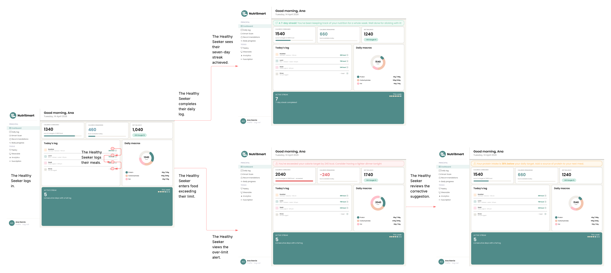
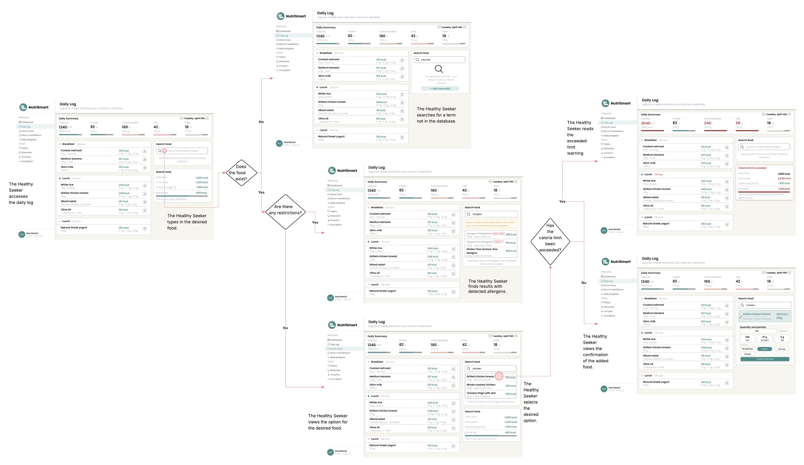
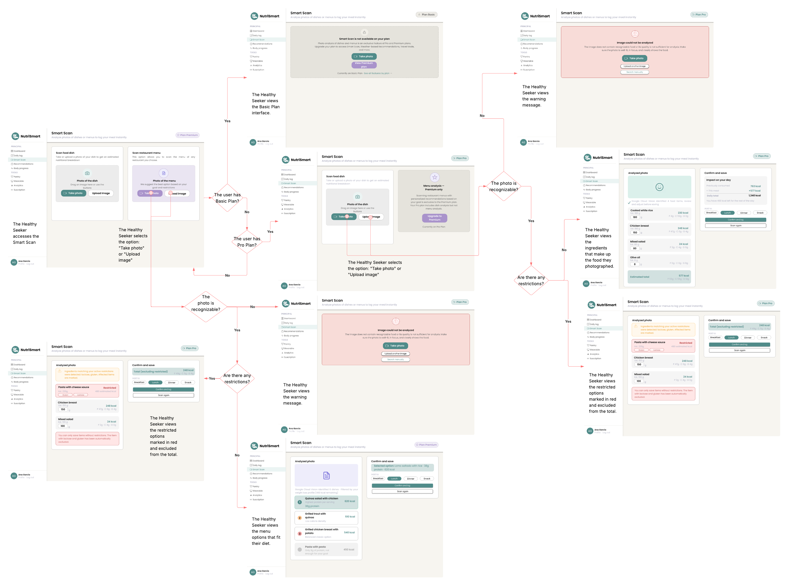
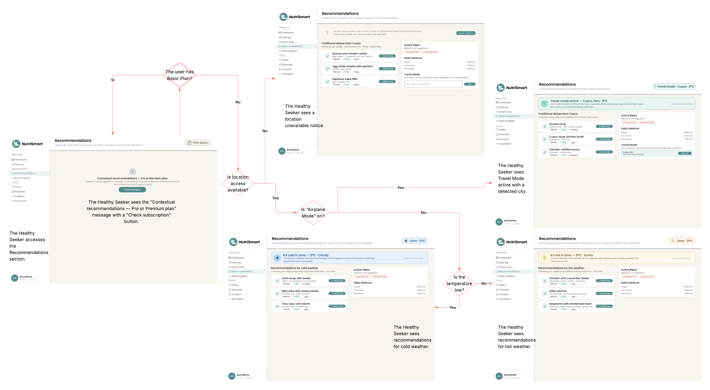
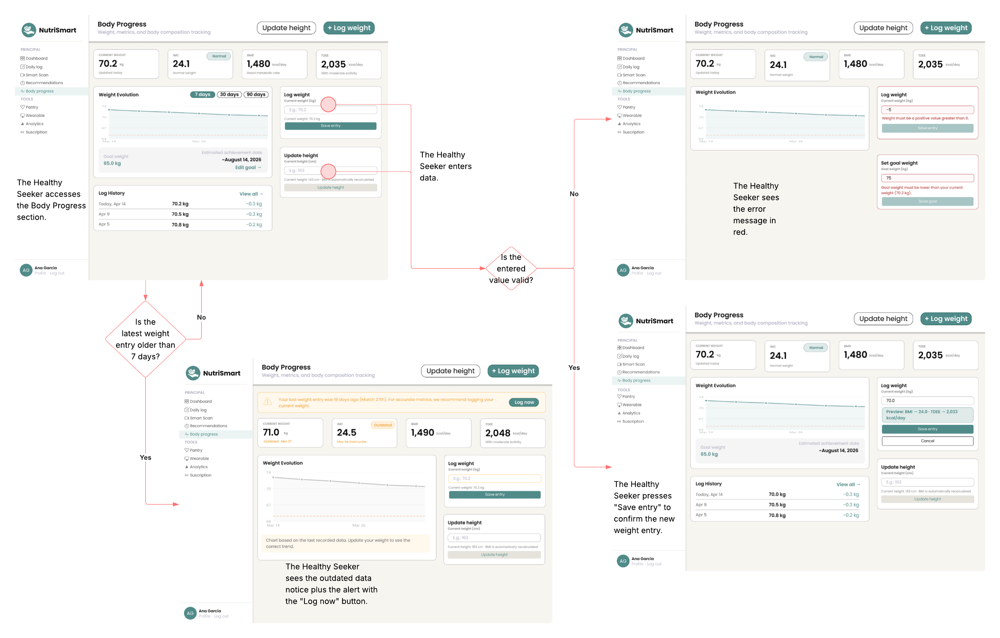
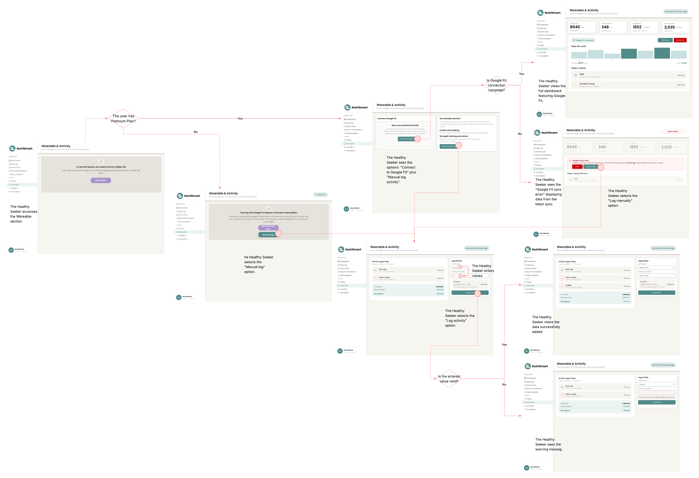
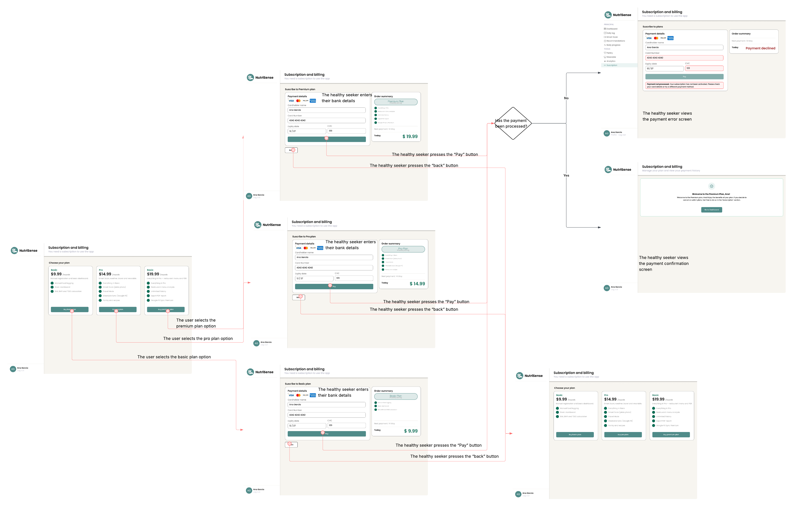
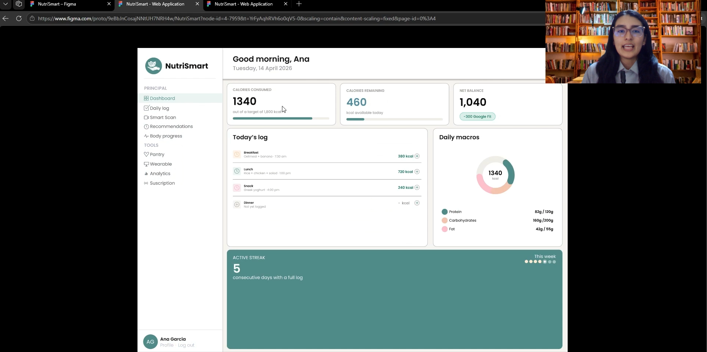
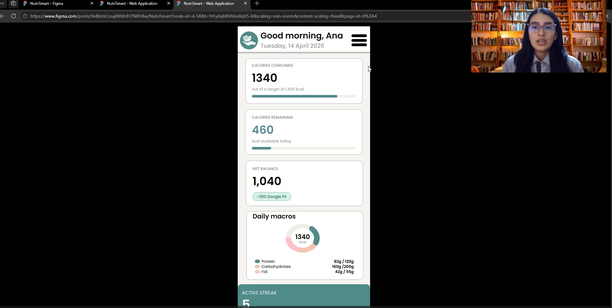

# CAPÍTULO IV: PRODUCT DESIGN

## 4.1. Style Guidelines

### 4.1.1. General Style Guidelines

### 4.1.2. Web Style Guidelines

## 4.2. Information Architecture

### 4.2.1. Organization Systems

### 4.2.2. Labeling Systems

### 4.2.3. SEO Tags and Meta Tags

### 4.2.4. Searching Systems

### 4.2.5. Navigation Systems

## 4.3. Landing Page UI Design

### 4.3.1. Landing Page Wireframe

### 4.3.2. Landing Page Mock-up

## 4.4. Web Applications UX/UI Design

### 4.4.1. Web Applications Wireframes

### 4.4.2. Web Applications Wireflow Diagrams

### 4.4.2. Web Applications Mock-ups

### 4.4.3. Web Applications User Flow Diagrams

### User Flow 1 — Dashboard

| | |
|---|---|
| **User Goal N°1** | Como buscador saludable, quiero visualizar un resumen de mi progreso nutricional diario y recibir alertas cuando supere mis límites calóricos, para mantener el control de mi alimentación. |

| | |
|---|---|
| **Happy Path** | 1. El buscador saludable accede al Dashboard. |
| | 2. El buscador saludable visualiza sus calorías consumidas, quemadas y el balance neto del día. |
| | 3. El buscador saludable registra sus comidas a lo largo del día. |
| | 4. El buscador saludable completa su registro diario. |
| | 5. El buscador saludable visualiza su racha activa de 7 días consecutivos completada. |

| | |
|---|---|
| **Unhappy Path 1** | 1. El buscador saludable accede al Dashboard. |
| | 2. El buscador saludable registra alimentos superando su límite calórico. |
| | 3. El buscador saludable visualiza la alerta de exceso calórico con el mensaje: *"You've exceeded your calorie target by 240 kcal. Consider having a lighter dinner tonight."* |
| | 4. El buscador saludable revisa la sugerencia correctiva mostrada en el Dashboard. |

| 
**User Flow** |
|---|
||

---

### User Flow 2 — Daily Log

| | |
|---|---|
| **User Goal N°2** | Como buscador saludable, quiero buscar y registrar los alimentos que consumo en mi registro diario, para llevar un control preciso de mis macronutrientes y calorías. |

| | |
|---|---|
| **Happy Path** | 1. El buscador saludable accede a la sección Daily Log. |
| | 2. El buscador saludable escribe el nombre del alimento en el buscador. |
| | 3. El alimento existe en la base de datos y no tiene restricciones. |
| | 4. El buscador saludable visualiza la opción del alimento deseado en los resultados. |
| | 5. El buscador saludable selecciona el alimento deseado. |
| | 6. El buscador saludable selecciona la porción y la comida (Breakfast / Lunch / Dinner). |
| | 7. El buscador saludable visualiza la confirmación del alimento añadido al log. |

| | |
|---|---|
| **Unhappy Path 1** | 1. El buscador saludable accede a la sección Daily Log. |
| | 2. El buscador saludable escribe el nombre del alimento en el buscador. |
| | 3. El alimento no existe en la base de datos. |
| | 4. El buscador saludable visualiza el mensaje de que no hay resultados y la opción *"+ Add manually"*. |

| | |
|---|---|
| **Unhappy Path 2** | 1. El buscador saludable accede a la sección Daily Log. |
| | 2. El buscador saludable escribe el nombre del alimento en el buscador. |
| | 3. El alimento existe pero contiene restricciones (alérgenos detectados). |
| | 4. El buscador saludable visualiza los resultados con los alérgenos detectados resaltados en amarillo. |

| | |
|---|---|
| **Unhappy Path 3** | 1. El buscador saludable accede a la sección Daily Log. |
| | 2. El buscador saludable añade un alimento que supera el límite calórico diario. |
| | 3. El límite calórico ha sido excedido. |
| | 4. El buscador saludable visualiza la advertencia de límite calórico superado resaltada en rojo dentro del Daily Log. |

| 
**User Flow** |
|---|
||

---

### User Flow 3 — Smart Scan

| | |
|---|---|
| **User Goal N°3** | Como buscador saludable, quiero escanear o fotografiar un plato o menú para identificar automáticamente sus ingredientes y registrar su información nutricional, ahorrando tiempo en el registro manual. |

| | |
|---|---|
| **Happy Path** | 1. El buscador saludable accede a la sección Smart Scan. |
| | 2. El buscador saludable tiene Plan Pro o Premium. |
| | 3. El buscador saludable selecciona la opción *"Take photo"* o *"Upload image"*. |
| | 4. La foto es reconocible y no tiene restricciones. |
| | 5. El buscador saludable visualiza los ingredientes identificados que componen el plato fotografiado. |
| | 6. El buscador saludable confirma y guarda el registro nutricional. |

| | |
|---|---|
| **Unhappy Path 1** | 1. El buscador saludable accede a la sección Smart Scan. |
| | 2. El buscador saludable tiene Plan Basic. |
| | 3. El buscador saludable visualiza la interfaz del Plan Basic con el mensaje de que Smart Scan no está disponible en su plan actual. |

| | |
|---|---|
| **Unhappy Path 2** | 1. El buscador saludable accede a la sección Smart Scan. |
| | 2. El buscador saludable tiene Plan Pro. |
| | 3. El buscador saludable selecciona la opción *"Take photo"* o *"Upload image"*. |
| | 4. La foto no es reconocible. |
| | 5. El buscador saludable visualiza el mensaje de advertencia: *"The image does not contain recognizable food"*, con las opciones de tomar otra foto o cargar una imagen. |

| | |
|---|---|
| **Unhappy Path 3** | 1. El buscador saludable accede a la sección Smart Scan. |
| | 2. El buscador saludable tiene Plan Pro. |
| | 3. El buscador saludable selecciona la opción *"Take photo"* o *"Upload image"*. |
| | 4. La foto es reconocible pero contiene restricciones alimentarias. |
| | 5. El buscador saludable visualiza los ingredientes con restricciones marcados en rojo y excluidos del total nutricional. |

| 
**User Flow** |
|---|
||

---

### User Flow 4 — Recommendations

| | |
|---|---|
| **User Goal N°4** | Como buscador saludable, quiero recibir recomendaciones de platos personalizadas según mi ubicación y clima actual, para elegir opciones que se adapten a mi contexto y perfil nutricional. |

| | |
|---|---|
| **Happy Path** | 1. El buscador saludable accede a la sección Recommendations. |
| | 2. El buscador saludable tiene Plan Pro o Premium. |
| | 3. El acceso a la ubicación está disponible y el modo avión está desactivado. |
| | 4. La temperatura detectada es baja. |
| | 5. El buscador saludable visualiza recomendaciones de platos para clima frío, filtradas por su perfil y ubicación (Lima). |

| | |
|---|---|
| **Unhappy Path 1** | 1. El buscador saludable accede a la sección Recommendations. |
| | 2. El buscador saludable tiene Plan Basic. |
| | 3. El buscador saludable visualiza el mensaje *"Contextual recommendations — Pro or Premium plan"* con el botón *"Check subscription"*. |

| | |
|---|---|
| **Unhappy Path 2** | 1. El buscador saludable accede a la sección Recommendations. |
| | 2. El buscador saludable tiene Plan Pro o Premium. |
| | 3. El acceso a la ubicación no está disponible. |
| | 4. El buscador saludable visualiza el aviso de ubicación no disponible. |

| | |
|---|---|
| **Unhappy Path 3** | 1. El buscador saludable accede a la sección Recommendations. |
| | 2. El buscador saludable tiene Plan Pro o Premium. |
| | 3. El acceso a la ubicación está disponible pero el modo avión está activado, detectando una ciudad distinta (Cusco). |
| | 4. El buscador saludable visualiza el Travel Mode activo con la ciudad detectada y recomendaciones de platos tradicionales de Cusco. |

| 
**User Flow** |
|---|
||

---

### User Flow 5 — Body Progress

| | |
|---|---|
| **User Goal N°5** | Como buscador saludable, quiero registrar y actualizar mi peso corporal para monitorear mi evolución física y mantener datos precisos sobre mi progreso. |

| | |
|---|---|
| **Happy Path** | 1. El buscador saludable accede a la sección Body Progress. |
| | 2. El último registro de peso tiene menos de 7 días de antigüedad. |
| | 3. El buscador saludable ingresa un valor de peso válido (positivo). |
| | 4. El buscador saludable visualiza la previsualización del BMI, TDEE actualizados. |
| | 5. El buscador saludable presiona *"Save entry"* para confirmar el nuevo registro de peso. |

| | |
|---|---|
| **Unhappy Path 1** | 1. El buscador saludable accede a la sección Body Progress. |
| | 2. El último registro de peso tiene más de 7 días de antigüedad. |
| | 3. El buscador saludable visualiza el aviso de datos desactualizados con el botón *"Log now"* para registrar su peso actual. |

| | |
|---|---|
| **Unhappy Path 2** | 1. El buscador saludable accede a la sección Body Progress. |
| | 2. El buscador saludable ingresa un valor inválido (negativo o no numérico). |
| | 3. El buscador saludable visualiza el mensaje de error en rojo: *"Weight must be a positive value greater than 0"* o *"Goal weight must be lower than your current weight"*. |

| 
**User Flow** |
|---|
||

---

### User Flow 6 — Wearable

| | |
|---|---|
| **User Goal N°6** | Como buscador saludable, quiero conectar mi dispositivo wearable o registrar manualmente mi actividad física, para que mis calorías quemadas se reflejen con precisión en mi balance nutricional diario. |

| | |
|---|---|
| **Happy Path** | 1. El buscador saludable accede a la sección Wearable. |
| | 2. El buscador saludable tiene Plan Premium. |
| | 3. El buscador saludable visualiza las opciones: *"Connect to Google Fit"* y *"Manual log activity"*. |
| | 4. La conexión con Google Fit es exitosa. |
| | 5. El buscador saludable visualiza el dashboard completo con los datos sincronizados desde Google Fit. |

| | |
|---|---|
| **Unhappy Path 1** | 1. El buscador saludable accede a la sección Wearable. |
| | 2. El buscador saludable no tiene Plan Premium. |
| | 3. El buscador saludable visualiza el mensaje de que la función requiere un plan superior, con el botón *"View plans"*. |

| | |
|---|---|
| **Unhappy Path 2** | 1. El buscador saludable accede a la sección Wearable. |
| | 2. El buscador saludable tiene Plan Premium. |
| | 3. La conexión con Google Fit no se completa correctamente. |
| | 4. El buscador saludable visualiza el error de sincronización *"Google Fit sync error"* con los datos del último sync disponible. |
| | 5. El buscador saludable selecciona la opción *"Manual log activity"*. |
| | 6. El buscador saludable ingresa un valor inválido al registrar la actividad. |
| | 7. El buscador saludable visualiza el mensaje de advertencia de valor incorrecto. |

| 
**User Flow** |
|---|
||

---

### User Flow 7 — Subscription

| | |
|---|---|
| **User Goal N°7** | Como buscador saludable, quiero suscribirme a un plan de pago para acceder a las funcionalidades avanzadas de NutriSmart. |

| | |
|---|---|
| **Happy Path** | 1. El buscador saludable accede a la sección Subscription and Billing. |
| | 2. El buscador saludable visualiza los tres planes disponibles: Basic ($9.99), Pro ($14.99) y Premium ($19.99). |
| | 3. El buscador saludable selecciona el plan deseado (Basic, Pro o Premium). |
| | 4. El buscador saludable ingresa sus datos bancarios en el formulario de pago. |
| | 5. El buscador saludable presiona el botón *"Pay"*. |
| | 6. El pago es procesado exitosamente. |
| | 7. El buscador saludable visualiza la pantalla de confirmación de pago con el mensaje de bienvenida al plan seleccionado. |

| | |
|---|---|
| **Unhappy Path 1** | 1. El buscador saludable accede a la sección Subscription and Billing. |
| | 2. El buscador saludable selecciona un plan y completa el formulario de pago. |
| | 3. El buscador saludable presiona el botón *"Pay"*. |
| | 4. El pago no es procesado. |
| | 5. El buscador saludable visualiza la pantalla de error de pago con el mensaje *"Payment not processed. Your subscription has not been activated. Please check your details or try a different payment method."* |

| | |
|---|---|
| **Unhappy Path 2** | 1. El buscador saludable accede a la sección Subscription and Billing. |
| | 2. El buscador saludable selecciona un plan y revisa el resumen del pedido. |
| | 3. El buscador saludable presiona el botón *"Back"* para regresar a la selección de planes. |
| | 4. El buscador saludable visualiza nuevamente la pantalla de selección de planes. |

| 
**User Flow** |
|---|
||

## 4.5. Web Applications Prototyping

|   |
|---|
|
 Desktop Web Browser|
||

https://upcedupe-my.sharepoint.com/:v:/g/personal/u202411669_upc_edu_pe/IQARIaNnElxCSJ2CHvTwWK1NAZvtl3lP4tIWEVJMpTv8qkY?e=3WhL8q&nav=eyJyZWZlcnJhbEluZm8iOnsicmVmZXJyYWxBcHAiOiJTdHJlYW1XZWJBcHAiLCJyZWZlcnJhbFZpZXciOiJTaGFyZURpYWxvZy1MaW5rIiwicmVmZXJyYWxBcHBQbGF0Zm9ybSI6IldlYiIsInJlZmVycmFsTW9kZSI6InZpZXcifX0%3D

|   |
|---|
|
 Mobile Web Browser|
||

https://upcedupe-my.sharepoint.com/:v:/g/personal/u202411669_upc_edu_pe/IQARIaNnElxCSJ2CHvTwWK1NAZvtl3lP4tIWEVJMpTv8qkY?e=3WhL8q&nav=eyJyZWZlcnJhbEluZm8iOnsicmVmZXJyYWxBcHAiOiJTdHJlYW1XZWJBcHAiLCJyZWZlcnJhbFZpZXciOiJTaGFyZURpYWxvZy1MaW5rIiwicmVmZXJyYWxBcHBQbGF0Zm9ybSI6IldlYiIsInJlZmVycmFsTW9kZSI6InZpZXcifX0%3D

## 4.6. Domain-Driven Software Architecture

### 4.6.1. Design-Level EventStorming

### 4.6.2. Software Architecture Context Diagram

### 4.6.3. Software Architecture Container Diagrams

### 4.6.4. Software Architecture Components Diagrams

## 4.7. Software Object-Oriented Design

### 4.7.1. Class Diagrams

## 4.8. Database Design

### 4.8.1. Database Diagrams