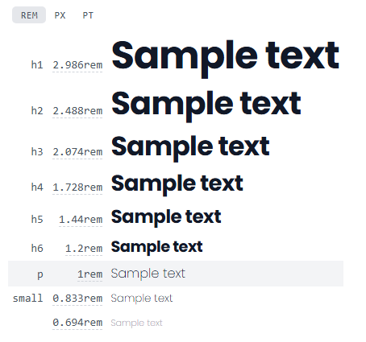
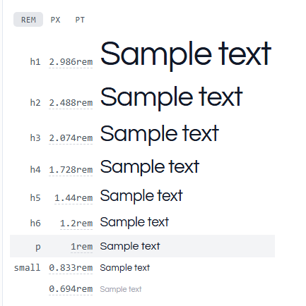
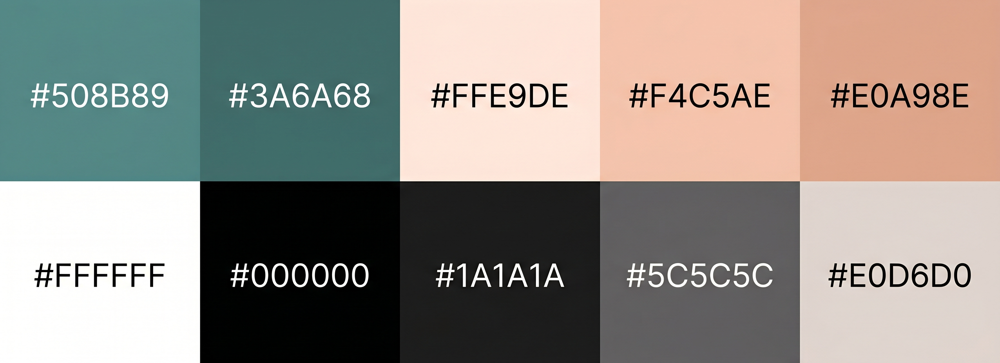
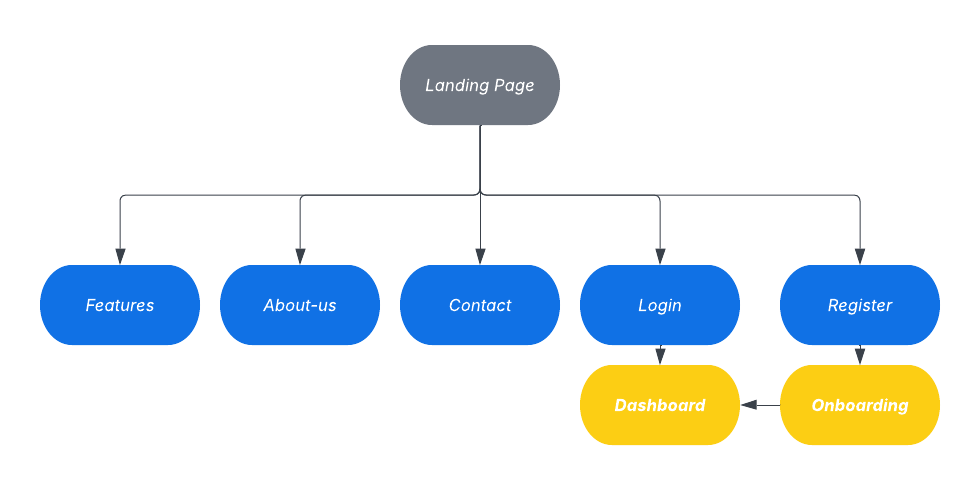
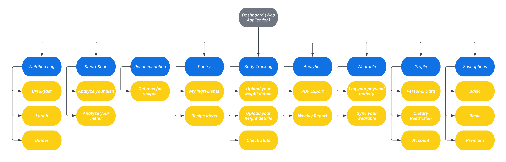

# CAPÍTULO IV: PRODUCT DESIGN

## 4.1. Style Guidelines

### 4.1.1. General Style Guidelines

NutriSmart busca un tono equilibrado entre lo motivador y lo accesible, con un lenguaje claro, empático y alentador, orientado a personas que desean mejorar sus hábitos alimenticios sin sentirse abrumadas. La comunicación es entusiasta pero serena, formal en la información nutricional y casual en los mensajes de acompañamiento al usuario. Se evita el tono intimidante o clínico, priorizando cercanía y confianza.

**Branding**

La identidad visual de NutriSmart busca transmitir bienestar, modernidad y confianza. El nombre combina "Nutrición" y "Smart" (tecnología), reflejando la propuesta de una plataforma inteligente que adapta las recomendaciones al contexto del usuario. El logo, acompañado del nombre en tipografía Poppins, transmite una imagen limpia y contemporánea, apta tanto para interfaces digitales como para materiales de comunicación.

  

**Typography**

Para mantener la legibilidad y la personalidad visual de NutriSmart se establecen dos tipografías complementarias: Poppins como fuente primaria y Questrial como fuente secundaria, ambas provenientes de Google Fonts y con alta compatibilidad en entornos digitales.

Poppins es una sans-serif geométrica de corte moderno, utilizada en títulos y encabezados. Sus variantes de peso (400, 500, 600, 700 y 800) permiten establecer jerarquías visuales claras. Su geometría transmite energía, precisión y modernidad, valores centrales de la marca.

Questrial es una sans-serif de trazo amigable y legible, utilizada para cuerpos de texto, párrafos y elementos secundarios. Su diseño redondeado complementa a Poppins aportando calidez y accesibilidad en la lectura extendida.

Los tamaños base definidos son: H1 en 48px, H2 en 36px, H3 en 28px, H4 en 24px, cuerpo de texto en 16px y caption en 13px. 

   

**Colors**

La paleta de NutriSmart fue diseñada para evocar salud, naturaleza y bienestar digital, con tonos cálidos y orgánicos que contrastan con un color principal de acento tecnológico.

El color principal es el verde azulado (`#508B89`), que transmite calma, salud y equilibrio. Se emplea en el header, botones primarios, íconos activos y elementos de navegación. Su variante oscura (`#3A6A68`) se utiliza en estados hover y énfasis de interacción.

Como color de fondo predominante se usa el melocotón muy claro (`#FFE9DE`), que aporta calidez y diferencia a NutriSmart de plataformas de salud de estética clínica. El color de llamada a la acción es un melocotón medio (`#F4C5AE`), complementado por su variante activa (`#E0A98E`), que se aplica en botones secundarios y elementos interactivos.

Los colores neutros incluyen blanco (`#FFFFFF`) para fondos limpios, negro (`#000000`) para textos de alto contraste y dos tonos de texto: gris oscuro (`#1A1A1A`) para texto principal y gris medio (`#5C5C5C`) para texto secundario. El color de bordes y separadores es un gris cálido (`#E0D6D0`) que armoniza con el fondo melocotón.

  

**Spacing**

Se establece una unidad base de 8px para el espaciado interno de componentes. Los márgenes mínimos entre secciones son de 16px en mobile y 24px en desktop. Para los contenedores principales se define un ancho máximo de 1200px con padding lateral de 24px. Los radios de borde siguen tres niveles: 8px para elementos pequeños (botones, inputs), 16px para tarjetas y módulos, y 24px para modales y secciones destacadas.

### 4.1.2. Web Style Guidelines

La interfaz web de NutriSmart adopta un enfoque mobile-first, utilizando un sistema de grid de 12 columnas en escritorio y 4 columnas en móvil. Se garantiza que todos los componentes escalen adecuadamente entre breakpoints, priorizando la legibilidad y la usabilidad táctil en pantallas pequeñas antes de enriquecer la experiencia en pantallas más grandes.

**Tipografía**

Se utiliza Poppins para títulos y encabezados de sección, con tamaños responsivos que emplean `clamp()` para escalar fluidamente. Questrial se aplica en párrafos, etiquetas, descripciones de funcionalidades y textos de apoyo. El interlineado base es de 1.6 para asegurar comodidad de lectura en bloques de texto extendido. La jerarquía tipográfica establece que H1 y H2 se reservan para héroes y títulos de sección respectivamente, mientras que H3 y H4 organizan subsecciones y tarjetas de contenido.

**Colores**

La selección de colores para la interfaz web refleja el sistema definido en la guía general. El verde azulado (`#508B89`) actúa como color de marca en la barra de navegación, botones primarios y elementos de énfasis. El fondo principal de las páginas utiliza blanco puro (`#FFFFFF`), mientras que secciones alternadas emplean el melocotón claro (`#FFE9DE`) para generar ritmo visual sin recurrir a sombras agresivas. Los botones de llamada a la acción combinan el melocotón medio (`#F4C5AE`) con texto en negro, garantizando contraste accesible. Los estados de error o alerta se reservan para colores rojizos que no forman parte de la paleta principal, evitando confusión con los tonos cálidos de la marca.

**Interacción y responsividad**

Los botones cuentan con transiciones de 0.3 segundos en hover y focus, proporcionando retroalimentación visual clara al usuario. La barra de navegación es fija con una altura de 68px, colapsando en un menú hamburguesa para viewports móviles. EL formulario de contacto utiliza inputs con radio de borde de 8px y etiquetas flotantes para maximizar el espacio disponible. El scroll entre secciones en la página principal utiliza `scroll-snap` para una experiencia fluida y estructurada. Todos los elementos interactivos cuentan con atributos ARIA y contraste suficiente para cumplir con criterios básicos de accesibilidad web.

## 4.2. Information Architecture

### 4.2.1. Organization Systems

La organización del contenido en NutriSmart responde a dos contextos distintos: el Landing Page, dirigido a visitantes que aún evalúan la plataforma, y la Web Application, usada por usuarios registrados con metas nutricionales activas.

**Landing Page**

Se aplica una organización jerárquica (visual hierarchy) como criterio principal. La página ordena sus secciones de mayor a menor relevancia decisional:

1. Héroe con propuesta de valor
2. Funcionalidades destacadas
3. Segmentos de usuario (Perder peso / Ganar músculo)
4. Planes de suscripción
5. FAQ
6. Contacto

Esta disposición expone primero la información que impulsa la conversión y delega los detalles al desplazamiento progresivo. La categorización del contenido sigue un esquema por tópicos, agrupando bloques temáticamente independientes (features, pricings) a los que el usuario puede llegar desde el menú de navegación directamente.

**Web Application**

Dentro de la aplicación se combinan tres esquemas según la naturaleza de cada módulo. Se aplica organización secuencial (step-by-step) en los flujos de onboarding:

1. Configuración de meta
2. Datos físicos
3. Restricciones alimentarias
4. Confirmación

Y en el registro de comidas:

1. Selección de momento del día
2. Búsqueda del alimento
3. Confirmación de porción
4. Guardado en el log

Ambos flujos guían al usuario paso a paso para evitar errores y reducir la carga cognitiva. Se aplica organización jerárquica en el Dashboard principal, donde los indicadores más críticos (calorías consumidas vs. meta, macros del día) se presentan de forma prominente y los módulos secundarios (historial, recomendaciones, sincronización wearable) se acceden desde secciones subsiguientes. Se aplica organización matricial en la pantalla de comparación de planes de suscripción (Basic / Pro / Premium), donde las características se disponen en filas y los planes en columnas, y en el módulo de Analytics, donde múltiples métricas se presentan en paralelo. La categorización del contenido de la aplicación sigue además un esquema según audiencia: usuarios del segmento Perder peso ven recomendaciones orientadas a déficit calórico, mientras que los del segmento Ganar músculo visualizan objetivos de superávit y mayor peso en proteína.

### 4.2.2. Labeling Systems

Las etiquetas empleadas en NutriSmart priorizan la brevedad y la claridad, evitando tecnicismos que puedan confundir a usuarios no especializados.

**Landing Page**

| Etiqueta | Contenido que representa |
|---|---|
| About Us | Misión, visión y equipo de NutriSmart |
| Features | Catálogo completo de funcionalidades |
| Contact | Formulario y canales de contacto |
| Log In | Acceso a la Web Application |

**Web Application**

| Etiqueta | Contenido que representa |
|---|---|
| Dashboard | Resumen diario de calorías y macros |
| Nutrition Log | Registro de comidas por momento del día |
| Smart Scan | Análisis visual de platos y menús |
| Recommendations | Sugerencias contextuales (clima, viaje) |
| Pantry | Ingredientes disponibles y recetas |
| Body Tracking | Registro de peso, talla, BMI y TDEE |
| Wearable| Conexión con Google Fit |
| Analytics | Historial y reportes de progreso |
| Profile| Datos personales, restricciones, suscripción |
| Subscriptions | Planes y facturación |

Las etiquetas de encabezado dentro de cada módulo siguen la misma lógica de concisión: "Today's Summary", "Log a Meal", "Scan a Dish", "My Pantry", "Weekly Report". En todas las vistas se usan atributos `alt` descriptivos en imágenes e íconos para garantizar accesibilidad con lectores de pantalla.

### 4.2.3. SEO Tags and Meta Tags

A continuación se detallan los valores asignados a las principales páginas de la experiencia.

**Landing Page**

| Tag | Valor |
|---|---|
| Title | NutriSmart: Smart Nutrition, Your Way |
| Description | NutriSmart is the smart nutrition platform that adapts meal recommendations to your location, weather, and health profile. Lose weight or gain muscle, on your terms. |
| Keywords | nutrition app, calorie tracker, smart nutrition, weight loss, muscle gain, meal planner, food tracker, NutriSmart, diet app, healthy eating |
| Author | NutriSmart Team |

**Features Page**

| Tag | Valor |
|---|---|
| Title | Features: NutriSmart |
| Description | Explore all NutriSmart features: Smart Scan food analysis, weather-based recommendations, travel mode, pantry recipes, wearable sync, and more. |
| Keywords | NutriSmart features, smart scan, calorie tracker, travel mode, weather nutrition, meal logging, wearable sync, recipe ideas, menu analysis |
| Author | NutriSmart Team |

**About Us Page**

| Tag | Valor |
|---|---|
| Title | About Us: NutriSmart |
| Description | Learn about the NutriSmart team and our mission to empower people to eat better through visual food analysis and context-aware smart recommendations. |
| Keywords | NutriSmart team, about NutriSmart, nutrition mission, healthy eating platform, Latin America nutrition app |
| Author | NutriSmart Team |

**Contact Page**

| Tag | Valor |
|---|---|
| Title | Contact: NutriSmart |
| Description | Get in touch with the NutriSmart team. Send us a message for questions, feedback, or partnership inquiries. |
| Keywords | NutriSmart contact, nutrition app support, feedback, partnership, customer service |
| Author | NutriSmart Team |

**Web Application**

| Tag | Valor |
|---|---|
| Title | NutriSmart App – Your Smart Nutrition Assistant |
| Description | Log your meals, analyze dishes with your camera, and receive personalized recommendations based on your weather and location. Reach your goal with NutriSmart. |
| Keywords | nutrition log, calorie tracking, smart scan, weather recommendations, travel mode, wearable sync, NutriSmart app, meal tracker, healthy eating assistant |
| Author | NutriSmart Team |

Todas las páginas incluyen `charset="UTF-8"`, `robots: index, follow`, etiqueta canónica (`rel="canonical"`) y Open Graph tags para compartir en redes sociales.

### 4.2.4. Searching Systems

El sistema de búsqueda de NutriSmart está presente principalmente dentro de la Web Application, en los módulos donde el volumen de datos podría abrumar al usuario si no se ofrecen medios de filtrado eficientes.

**Nutrition Log**

Al registrar una comida, el usuario accede a una barra de búsqueda con las siguientes capacidades:

- *Búsqueda por nombre*: el usuario escribe el nombre del alimento y el sistema muestra resultados en tiempo real desde la base de datos nutricional.
- *Historial de recientes*: los últimos alimentos registrados se muestran debajo del campo de búsqueda para agilizar el reingreso de comidas habituales.

Tras la búsqueda, cada resultado muestra: nombre del alimento, calorías por porción estándar, macros principales (P / C / G) y una opción para ajustar la cantidad antes de guardar.

**Pantry**

El usuario puede buscar ingredientes disponibles en su despensa. El sistema cruza los ingredientes registrados con la base de recetas y filtra las sugerencias por: restricciones alimentarias del perfil (aplicadas automáticamente) y objetivo nutricional (alto en proteína, bajo en carbohidratos, equilibrado).

Los resultados se presentan como tarjetas con: nombre de la receta, imagen referencial, tiempo estimado de preparación, calorías por porción y compatibilidad con el perfil del usuario.

**Analytics**

En la pantalla de análisis, el usuario puede filtrar su historial por: rango de fechas (última semana, último mes, rango personalizado), métrica a visualizar (calorías, proteínas, carbohidratos, grasas, peso corporal) y tipo de vista (gráfico de líneas, gráfico de barras, tabla de datos). Los filtros aplicados se muestran como chips activos sobre el gráfico, con opción de eliminarlos individualmente.

### 4.2.5. Navigation Systems

La navegación del Landing Page se articula mediante una barra fija en la parte superior (sticky navbar) que permanece visible durante el scroll, con las secciones principales (About Us, Features, Contact) y el acceso directo a Log In.

  

La Web Application utiliza una barra lateral de navegación persistente (sidebar) que organiza los módulos en dos bloques: acciones principales en la parte superior (Dashboard, Nutrition Log, Smart Scan, Recommendations, Pantry, Body Tracking) y configuración en la parte inferior (Analytics, Wearable, Profile, Subscriptions), permitiendo al usuario acceder a cualquier módulo en un solo clic desde cualquier pantalla. 

  

## 4.3. Landing Page UI Design

### 4.3.1. Landing Page Wireframe

### 4.3.2. Landing Page Mock-up

## 4.4. Web Applications UX/UI Design

### 4.4.1. Web Applications Wireframes

### 4.4.2. Web Applications Wireflow Diagrams

### 4.4.2. Web Applications Mock-ups

### 4.4.3. Web Applications User Flow Diagrams

## 4.5. Web Applications Prototyping

## 4.6. Domain-Driven Software Architecture

### 4.6.1. Design-Level EventStorming

### 4.6.2. Software Architecture Context Diagram

### 4.6.3. Software Architecture Container Diagrams

### 4.6.4. Software Architecture Components Diagrams

## 4.7. Software Object-Oriented Design

### 4.7.1. Class Diagrams

## 4.8. Database Design

### 4.8.1. Database Diagrams