# CAPÍTULO V: Product Implementation, Validation & Deployment

El proceso de construcción, verificación y puesta en marcha de NutriSmart representa la fase donde los conceptos arquitectónicos se materializan en una solución funcional. Esta etapa es determinante para transformar los modelos de diseño en una plataforma operativa, permitiendo validar la viabilidad de nuestra propuesta tecnológica y asegurar que el producto final cumpla con los estándares de calidad esperados por los usuarios en el ecosistema de salud digital.

## 5.1. Software Configuration Management

La gestión de configuración de software (SCM) en NutriSmart garantiza la integridad y trazabilidad de todos los artefactos del proyecto durante su ciclo de vida. Este apartado detalla los procesos para administrar los cambios en el código fuente y la documentación, asegurando versiones reproducibles y una colaboración estructurada que minimice conflictos y optimice la calidad de las entregas finales.

### 5.1.1. Software Development Environment Configuration

En este apartado, el equipo detalla el ecosistema de herramientas digitales seleccionadas para la construcción de NutriSmart. Cada solución ha sido elegida para optimizar una fase específica del ciclo de vida, garantizando la interoperabilidad y el flujo de trabajo constante entre los miembros del proyecto.

**Project Management**

Con el fin de centralizar la administración de tareas y asegurar la sincronía del grupo, se adoptaron plataformas que permiten una planificación ágil y un seguimiento detallado del backlog.

- **Trello:** Herramienta de tipo SaaS. Se utilizó como el tablero Kanban principal para la organización de las User Stories y la asignación de responsabilidades individuales. Su interfaz permitió visualizar el progreso de cada funcionalidad desde su etapa de "To Do" hasta su validación final.

    [Link de registro o inicio de sesion](https://trello.com)

    **Evidencia de uso:**

    

- **Microsoft Teams:** Herramienta de tipo SaaS. Se empleó como el centro neurálgico para la comunicación formal y síncrona del equipo. Esta plataforma permitió integrar las sesiones de videoconferencia con el almacenamiento compartido de archivos y el chat grupal, facilitando la toma de decisiones estratégicas y la organización de reuniones de sprint review y daily stand-ups.

    [Link de registro, inicio de sesion y descarga](https://www.microsoft.com/teams)

    **Evidencia de uso:**

    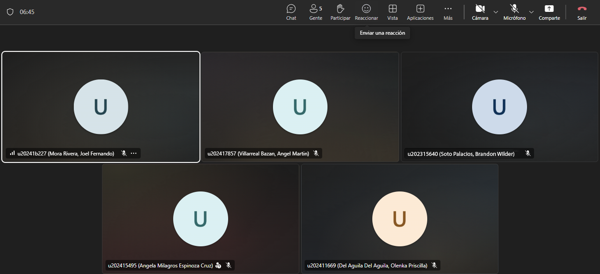

**Requirement Management**

Para la fase de análisis y especificación de los requerimientos de NutriSmart, se implementaron herramientas de modelado visual que permiten transformar las necesidades del usuario en estructuras técnicas comprensibles para todo el equipo.

- **Miro:** Herramienta de tipo SaaS. Se estableció como el entorno colaborativo principal para la captura de requisitos dinámicos. A través de sesiones de EventStorming, el equipo pudo identificar los eventos de dominio, las reglas de negocio y los flujos de trabajo de los 7 Bounded Contexts. Esta herramienta facilitó la transición de las necesidades del cliente hacia una lógica de sistema reactiva.

    [Link de registro o inicio de sesion](https://miro.com)

    **Evidencia de uso:**

    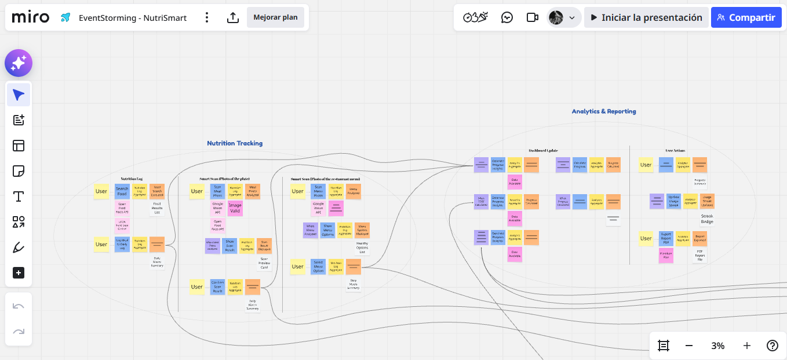

- **Structurizr:** Herramienta de tipo SaaS. Se utilizó para la especificación técnica de los requisitos arquitectónicos mediante el modelo C4. Esta suite permitió documentar el contexto del sistema, los contenedores y los componentes de manera jerárquica, asegurando que el diseño de software esté alineado estrictamente con las capacidades funcionales exigidas por la plataforma.

    [Link de registro o inicio de sesion](https://structurizr.com)

    **Evidencia de uso:**

    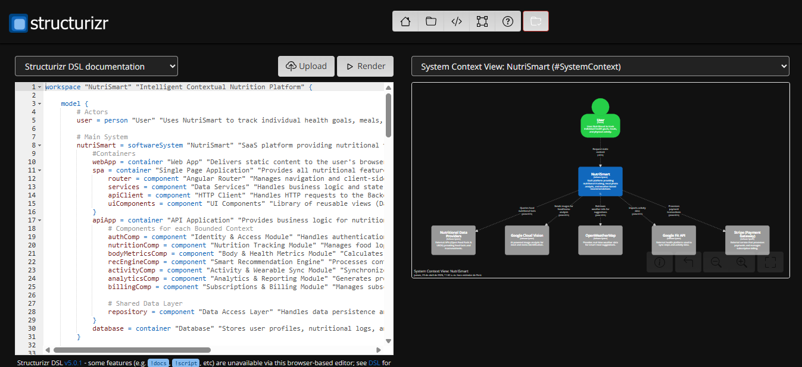

**Product UX/UI Design**

En el diseño de la interfaz y la experiencia del usuario para la salud digital, se utilizaron soluciones enfocadas en la fidelidad visual y el entendimiento de las necesidades del cliente.

- **Figma:** Herramienta de tipo SaaS. Se utilizó para la arquitectura visual de NutriSmart, permitiendo la creación de prototipos interactivos de alta fidelidad. Mediante esta plataforma, se definieron los estilos, la tipografía y los componentes de UI que aseguran una experiencia coherente y atractiva.

    [Link de registro, inicio de sesion y descarga](https://www.figma.com)

    **Evidencia de uso:**

    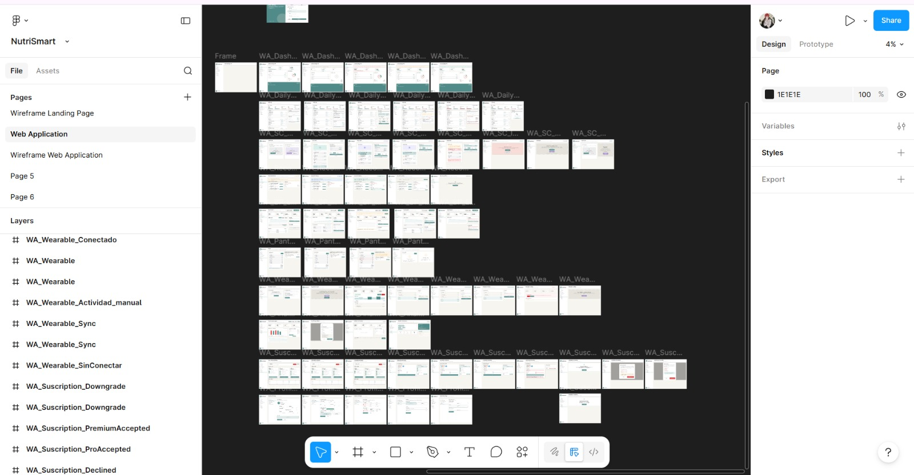

- **UXPressia:** Herramienta de tipo SaaS. Se aplicó para la construcción de los Customer Journey Maps y el análisis de los perfiles de usuario (User Personas). Permitió identificar los puntos de dolor de los usuarios al gestionar su nutrición, orientando el diseño hacia soluciones personalizadas.

    [Link de registro o inicio de sesion](https://uxpressia.com)

    **Evidencia de uso:**

    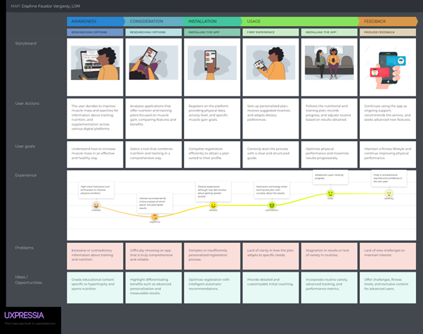

**Software Development**

Para la fase de construcción de la plataforma, se seleccionaron entornos de desarrollo integrados (IDE) que maximizan la productividad del equipo y aseguran la calidad del código fuente mediante herramientas avanzadas de depuración y autocompletado.

- **Visual Studio Code:** Herramienta de tipo Desktop (IDE). Se utilizó como el entorno de trabajo versátil para la edición de scripts, archivos de configuración y la integración de herramientas de control de versiones. Gracias a su ecosistema de extensiones, permitió una edición ágil y personalizada de los diferentes módulos del proyecto, facilitando una codificación ligera y eficiente.

    [Link de descarga](https://code.visualstudio.com/)

    **Evidencia de uso:**

    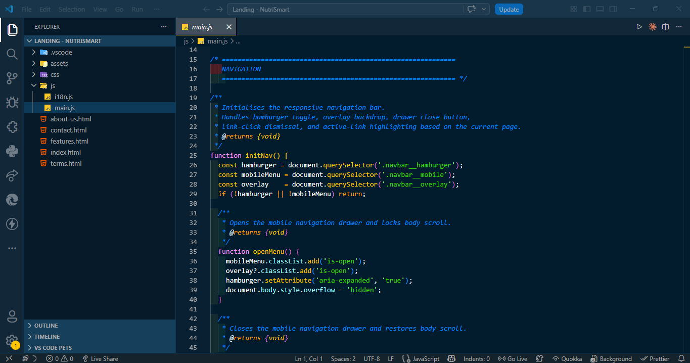

- **IntelliJ IDEA:** Herramienta de tipo Desktop (IDE). Se empleó como el entorno de desarrollo integrado especializado para la arquitectura del backend en Spring Boot con Java. Su potente motor de análisis de código permitió gestionar de forma robusta los componentes del dominio y asegurar que la lógica del servidor cumpliera con los estándares de rendimiento exigidos por la plataforma.

    [Link de descarga](https://www.jetbrains.com/idea/)

- **WebStorm:** Herramienta de tipo Desktop (IDE). Se empleó como el entorno de desarrollo integrado especializado para la arquitectura del frontend en Angular. Su potente motor de análisis de código permitió gestionar de forma robusta los componentes reactivos de la interfaz y asegurar que la lógica de cliente cumpliera con los estándares de rendimiento exigidos por la plataforma.

    [Link de descarga](https://www.jetbrains.com/webstorm/)

**Software Testing**

Con el objetivo de garantizar la calidad y el cumplimiento de los criterios de aceptación, se utilizó un estándar de especificación basado en el comportamiento.

- **Gherkin:** Lenguaje de especificación técnica. Se implementó para definir los escenarios de prueba bajo el formato "Given, When, Then". Su uso permitió que las validaciones del sistema fueran legibles tanto para el equipo de desarrollo como para el área de negocio, asegurando que cada funcionalidad opere según lo previsto.

    [Link de la documentacion y uso](https://cucumber.io/docs/gherkin/)

    **Evidencia de uso:**

    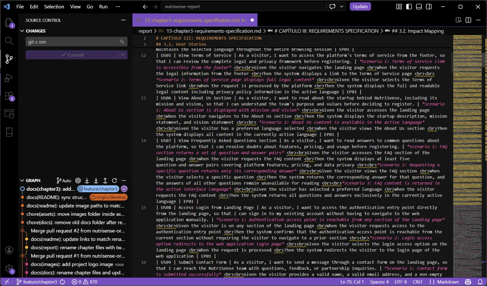

**Software Documentation**

La gestión de los activos digitales y la preservación del historial de cambios se realizó mediante una plataforma líder en el control de versiones.

- **GitHub:** Herramienta de tipo SaaS. Se utilizó como el repositorio maestro de NutriSmart, donde se resguardó el código fuente, la documentación técnica y las definiciones de pruebas. Su infraestructura permitió la colaboración asíncrona entre desarrolladores y garantizó la trazabilidad total del proyecto.

    [Link de registro o inicio de sesion](https://github.com)

    **Evidencia de uso:**

    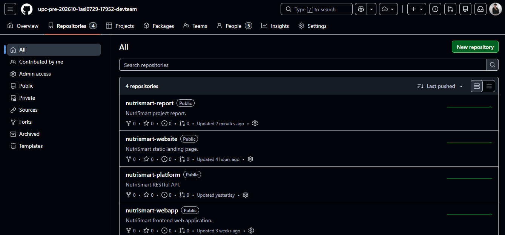

**Software Deployment**

Con el propósito de garantizar la accesibilidad de la propuesta de valor inicial y automatizar su publicación, se utilizó un servicio de alojamiento en la nube que permite el despliegue efectivo del sitio de presentación (Landing Page). Este enfoque asegura que los interesados puedan visualizar la solución preliminar de forma rápida y confiable.

- **GitHub Pages:** Herramienta de tipo SaaS. Actúa como la plataforma de publicación estática para la difusión inicial del proyecto. Su implementación permitió automatizar el ciclo de actualización a partir del código fuente resguardado en la rama principal, facilitando una sincronización inmediata entre los ajustes realizados por el equipo y la versión web disponible para los usuarios.

    [Link de la documentacion y uso](https://pages.github.com/)

### 5.1.2. Source Code Management

Para garantizar la integridad y el control total sobre las modificaciones del software, el equipo ha seleccionado GitHub como plataforma centralizada de gestión de versiones. Este sistema permite una colaboración distribuida y asíncrona, facilitando la auditoría de cambios y la integración de las diferentes capas de la aplicación NutriSmart.

**Repositorios del Proyecto**

La solución se ha segmentado en repositorios independientes para mantener una arquitectura limpia y una separación de responsabilidades clara:

- **nutrismart-website:** Repositorio dedicado al sitio de presentación estática (Landing Page).

    [Link del repositorio nutrismart-website](https://github.com/upc-pre-202610-1asi0729-17952-devteam/nutrismart-website)

- **nutrismart-platform:** Contiene el núcleo de la solución (Backend), desarrollado como una API RESTful en Java con Spring Boot. Este repositorio aloja la lógica de negocio, los servicios de dominio y las suites de pruebas automatizadas.

    [Link del repositorio nutrismart-platform](https://github.com/upc-pre-202610-1asi0729-17952-devteam/nutrismart-platform)

- **nutrismart-webapp:** Espacio reservado para el código del cliente web (Frontend) construido en Angular.

    [Link del repositorio nutrismart-webapp](https://github.com/upc-pre-202610-1asi0729-17952-devteam/nutrismart-webapp)

- **nutrismart-report:** Repositorio de soporte utilizado para la gestión de la documentación técnica y los informes del proyecto.

    [Link del repositorio nutrismart-report](https://github.com/upc-pre-202610-1asi0729-17952-devteam/nutrismart-report)

**Implementación de GitFlow**

Para la organización y administración de la base de código, el equipo ha adoptado el esquema de ramificación GitFlow. Este flujo de trabajo se fundamenta en el modelo estratégico propuesto por Vincent Driessen en su publicación "A successful Git branching model", el cual proporciona una estructura robusta para gestionar el ciclo de vida del software mediante roles específicos para cada rama:

- **Main Branch:** Resguarda el código fuente definitivo que se encuentra en el entorno de producción. Es la versión oficial y estable de NutriSmart; cualquier cambio aquí representa una versión liberada al usuario.
    - **Notación:** `main o master`.
- **Develop Branch:** Actúa como la rama matriz para la integración de todas las capacidades técnicas en desarrollo. Es el espacio donde se consolidan las funcionalidades antes de ser enviadas a la fase de publicación.
    - **Notación:** `develop`.
- **Feature Branches:** Segmentos temporales creados para trabajar en requerimientos específicos o historias de usuario del backlog. Se originan a partir de develop y deben reintegrarse a esta misma rama una vez finalizada y validada la tarea.
    - **Notación:** `feature/US-nombre`.
- **Release Branches:** Utilizadas para preparar un lanzamiento oficial de la plataforma. Permiten realizar auditorías finales, ajustes de configuración y correcciones menores sin interrumpir el desarrollo de nuevas funciones en la rama matriz.
    - **Notación:** `release/vX.Y.Z`.
- **Hotfix Branches:** Ramas de corrección urgente creadas directamente desde main para resolver errores críticos detectados en producción. Una vez corregido el problema, se fusionan tanto en main como en develop para mantener la consistencia del código en todas las ramas activas.
    - **Notación:** `hotfix/nombre-del-error`.

**Conventional Commits**

Se adopta esta convención para estandarizar el historial de cambios y facilitar la generación automática de bitácoras (changelogs). Este estándar permite identificar rápidamente la intención de cada modificación mediante una estructura semántica clara.

El formato mandatorio es: `<tipo>[alcance]: <descripción>`, el cual incluye un encabezado obligatorio y, de ser necesario, un cuerpo técnico y pie de página para referencias.

Los tipos de confirmación permitidos para este proyecto son:

- **feat:** Incorporación de una nueva funcionalidad o capacidad al sistema.
- **fix:** Resolución de un error técnico, bug o comportamiento no deseado.
- **docs:** Modificaciones exclusivas en la documentación, manuales o archivos README.
- **style:** Ajustes relacionados con el formato, indentación o estética del código sin alterar su lógica funcional.
- **chore:** Labores de mantenimiento, actualizaciones de dependencias o ajustes en la configuración del entorno de compilación.
- **refactor:** Cambios en la estructura del código destinados a mejorar su legibilidad o eficiencia interna.
- **test:** Inclusión, corrección o actualización de escenarios de pruebas unitarias o de integración.

**Semantic Versioning**

Se emplea la versión 2.0.0 de Semantic Versioning bajo el esquema vX.Y.Z:

- **X (MAYOR):** Cambios grandes o incompatibles con versiones anteriores.
- **Y (MINOR):** Nuevas funcionalidades compatibles con versiones anteriores.
- **Z (PATCH):** Correcciones menores o parches que no afectan la funcionalidad.

### 5.1.3. Source Code Style Guide & Conventions

Para asegurar que el código de NutriSmart sea mantenible, escalable y profesional, el equipo ha adoptado una serie de normas y guías de estilo internacionales. Como política fundamental, toda la nomenclatura técnica (variables, clases, métodos y comentarios) será redactada íntegramente en inglés, garantizando un estándar global en el desarrollo.

**Convenciones aplicadas por lenguaje:**

**HTML**

Siguiendo la "HTML Style Guide and Coding Conventions" de W3Schools y la "Google HTML/CSS Style Guide", se mantiene una arquitectura semántica y accesible. El código se escribe íntegramente en minúsculas, con una indentación de dos espacios y comentarios descriptivos para separar bloques funcionales.

**Estructura y etiquetas principales empleadas:**

- **Base:** `<!DOCTYPE html>`, `<html>`, `<head>`, `<body>` para la jerarquía global.
- **Metadatos:** `<meta>`, `<title>`, `<link>` para la configuración y vinculación de estilos.
- **Semántica:** `<nav>`, `<section>`, `<header>`, `<footer>`, `<main>` para la organización del contenido principal.
- **Contenido:** `<h1>`, `<h2>`, `
`, ``, `<a>` para la visualización de métricas y enlaces.
- **Interacción:** `<form>`, `<input>`, `<label>`, `<button>` para el registro de datos en formularios interactivos.

**CSS**

El archivo styles.css se estructuró bajo la "Google HTML/CSS Style Guide", aplicando una organización modular mediante comentarios (ej. /* NAVIGATION */, /* HERO CAROUSEL */). Se emplea kebab-case para clases y una indentación uniforme.

**Propiedades y convenciones aplicadas:**

- **Diseño y Layout:** `display: flex`, `grid-template-columns`, `position`, `z-index` para una interfaz responsiva.
- **Dimensiones:** `width`, `height`, `max-width`, `min-height`.
- **Espaciado:** `padding`, `margin`, `gap`.
- **Tipografía:** `font-family`, `font-size`, `font-weight`, `line-height`, `color`.
- **Decoración:** `background-color`, `border-radius`, `box-shadow`, `border`.
- **Interactividad:** `transition`, `transform`, `:hover` para mejorar la experiencia de usuario.

**JavaScript**

La lógica de cliente se fundamenta en las "MDN JavaScript guidelines" y la "W3C JavaScript Style Guide", priorizando un código modular, seguro y de alto rendimiento. Se emplean comentarios descriptivos en inglés para documentar la finalidad de cada bloque funcional y se aplica la convención camelCase para la nomenclatura de variables y funciones.

**Estructura y elementos técnicos aplicados:**

- **Selección del DOM:** Uso de métodos estandarizados como `document.getElementById()` y `document.querySelector()` para la captura de elementos de la interfaz.
- **Gestión de Eventos:** Implementación de `addEventListener()` para controlar acciones como click (botones de registro), submit (formularios de métricas) y el evento `DOMContentLoaded` para asegurar la carga del script.
- **Validaciones de Datos:** Aplicación de expresiones regulares para verificar la integridad de correos electrónicos, teléfonos y formatos de entrada.
- **Interacción Dinámica:** Manipulación de clases mediante `classList` para menús interactivos, modales de confirmación y feedback visual en formularios.
- **Control Lógico:** Empleo de condicionales `(if/else)`, bucles de iteración `(forEach)` y temporizadores `(setInterval())` para la actualización de datos en tiempo real.

**TypeScript**

El desarrollo del frontend en Angular se rige por la "Angular Style Guide" oficial y las "Google TypeScript Style Guide". Estas normas garantizan que los componentes, servicios e interfaces de NutriSmart sean robustos, escalables y fáciles de mantener por cualquier miembro del equipo.

**Convenciones de tipografía y estructura:**

- **PascalCase:** Para nombres de clases, componentes e interfaces `(ej. NutritionService)`.
- **camelCase:** Para variables locales, propiedades y métodos `(ej. dailyGoal, getUserData())`.
- **kebab-case:** Para nombres de archivos y selectores de componentes `(ej. user-profile.component.ts, app-nutrition-log)`.
- **Principios SOLID:** Implementación del Principio de Responsabilidad Única (SRP). Cada componente o servicio gestiona una operación atómica del dominio, evitando el acoplamiento innecesario y facilitando las pruebas unitarias.
- **Tipado estricto:** Se utiliza el modo estricto de TypeScript para garantizar la integridad de los datos en tiempo de compilación.

**Java**

El desarrollo del backend se rige por la "Google Java Style Guide" y las convenciones oficiales de Oracle. Estas normas aseguran que la lógica de los 7 Bounded Contexts de NutriSmart sea robusta, escalable y fácil de auditar por cualquier miembro del equipo técnico.

**Convenciones de tipografía y estructura:**

- **PascalCase:** Para nombres de clases e interfaces `(ej. public class UserProfile, NutritionService)`.
- **camelCase:** Para métodos, parámetros y variables locales `(ej. int currentCalories, calculateDailyGoal())`.
- **Principios SOLID:** Implementación rigurosa del Principio de Responsabilidad Única (SRP). Cada servicio o controlador de Spring Boot gestiona una operación atómica del dominio, evitando el acoplamiento innecesario y facilitando las pruebas unitarias.
- **Formateo y Claridad:** Se utilizan comentarios concisos en inglés para documentar la finalidad de métodos complejos y se aplican las anotaciones de Spring Boot de forma explícita para mejorar la legibilidad del código.

**Gherkin (.feature)**

Las pruebas de aceptación del sistema fueron redactadas empleando la sintaxis Gherkin, siguiendo las "Gherkin Conventions for Readable Specifications". Estos archivos se encuentran organizados por historias de usuario dentro del repositorio de GitHub, asegurando una trazabilidad total entre el requerimiento funcional y su validación técnica.

**Convenciones aplicadas:**

- **Estructura canónica Given – When – Then:** Se emplea este formato de forma estricta para mapear la secuencia lógica y las precondiciones, acciones y resultados esperados de cada caso de prueba.
- **Uso de Scenario Outline y Examples:** Se implementan plantillas de escenarios junto con tablas de datos para validar de manera eficiente diversos flujos de entrada y salida.
- **Equilibrio de lenguaje:** Se utiliza un léxico que balancea la terminología técnica con el lenguaje de negocio, facilitando que tanto analistas como desarrolladores mantengan una visión compartida del sistema.

### 5.1.4. Software Deployment Configuration

Durante este sprint se configuraron la organización y los repositorios del proyecto NutriSmart en GitHub, estableciendo la estructura base para el despliegue de todos los productos digitales de la solución. A continuación se describen los pasos realizados.

##### Creación de la organización en GitHub

Se creó la organización `upc-pre-202610-1asi0729-17952-devteam` en GitHub, la cual centraliza todos los repositorios del proyecto. Para crearla:

- Iniciar sesión en [github.com](https://github.com)
- Hacer click en el ícono de perfil → **Your organizations**
- Click en **New organization**
- Seleccionar el plan **Free**
- Ingresar el nombre `upc-pre-202610-1asi0729-17952-devteam`
- Completar la configuración e invitar a los miembros del equipo

##### Creación de los repositorios

Dentro de la organización se crearon 4 repositorios, uno por cada producto digital de la solución:

| Repositorio | Descripción |
|---|---|
| `nutrismart-report` | Documentación e informe del proyecto |
| `nutrismart-website` | Landing page estática |
| `nutrismart-webapp` | Frontend Web Application |
| `nutrismart-platform` | Web Services / Backend |

Para crear cada repositorio:

- Ir a la organización → **Repositories** → **New**
- Asignar el nombre correspondiente
- Seleccionar visibilidad **Public**
- Inicializar con un `README.md`
- Click en **Create repository**

##### Configuración de ramas base (Gitflow)

En cada repositorio se configuraron las ramas base del flujo de trabajo:

- Por defecto GitHub crea la rama `main`
- Desde `main` se crea la rama `develop`
- Se establece `develop` como rama base para los Pull Requests en **Settings** → **Branches** → **Default branch**

## 5.2. Landing Page, Services & Applications Implementation

La implementación del Landing Page, los servicios web y las aplicaciones representa la etapa crítica donde el equipo consolida el desarrollo de NutriSmart. Este proceso permite materializar el diseño y las funcionalidades planificadas, transformando los requisitos en un producto tangible y operativo. En esta fase se traduce cada especificación técnica en código fuente, construyendo la infraestructura necesaria para satisfacer las necesidades identificadas de los segmentos objetivo.

### 5.2.1. Sprint 1

#### 5.2.1.1. Sprint Planning 1

<table>
  <tr>
    <th colspan="2">Sprint #</th>
    <th colspan="2">Sprint 1</th>
  </tr>
  <tr>
    <th colspan="4">Sprint Planning Background</th>
  </tr>
  <tr>
    <td colspan="2">Date</td>
    <td colspan="2">2026-04-03</td>
  </tr>
  <tr>
    <td colspan="2">Time</td>
    <td colspan="2">06:00 PM (GMT-5)</td>
  </tr>
  <tr>
    <td colspan="2">Location</td>
    <td colspan="2">Reunión presencial</td>
  </tr>
  <tr>
    <td colspan="2">Prepared By</td>
    <td colspan="2">Villarreal Bazan, Angel Martin</td>
  </tr>
  <tr>
    <td colspan="2">Attendees (to planning meeting)</td>
    <td colspan="2">Del Aguila Del Aguila, Olenka Priscilla / Espinoza Cruz, Angela Milagros / Mora Rivera, Joel Fernando / Soto Palacios, Brandon Wilder / Villarreal Bazan, Angel Martin</td>
  </tr>
  <tr>
    <th colspan="4">Sprint n – 1 Review Summary</th>
  </tr>
  <tr>
    <td colspan="4">No aplica. El Sprint 1 es el primero de la cadencia del proyecto NutriSmart. No existe sprint anterior que revisar.</td>
  </tr>
  <tr>
    <th colspan="4">Sprint n – 1 Retrospective Summary</th>
  </tr>
  <tr>
    <td colspan="4">No aplica. Al ser la primera iteración, no hay retrospectiva previa documentada. El equipo acordó en esta reunión establecer como normas de trabajo el uso de GitFlow con ramas <code>feature/</code>, <code>develop</code> y <code>main</code>, Conventional Commits para todos los mensajes, y revisión de Pull Requests con mínimo un aprobador antes de hacer merge a <code>develop</code>.</td>
  </tr>
  <tr>
    <th colspan="4">Sprint Goal &amp; User Stories</th>
  </tr>
  <tr>
    <td colspan="2">Sprint 1 Goal</td>
    <td colspan="2">Our focus is on delivering a fully functional and publicly accessible NutriSmart Landing Page in both English and Spanish. We believe it delivers a clear understanding of the platform's value proposition, subscription plans, and team identity to potential users from both target segments,adults seeking weight loss and young adults seeking muscle gain. This will be confirmed when any visitor can navigate all landing page sections (Hero, Features, Plans, About Us, FAQ, Contact), switch the interface language between English (en_US) and Spanish (es_419), and access the web application entry point from the landing page without any broken links or accessibility violations.</td>
  </tr>
  <tr>
    <td colspan="2">Sprint 1 Velocity</td>
    <td colspan="2">15 Story Points</td>
  </tr>
  <tr>
    <td colspan="2">Sum of Story Points</td>
    <td colspan="2">15 Story Points</td>
  </tr>
</table>

#### 5.2.1.2. Aspect Leaders and Collaborators

El Sprint 1 abarca exclusivamente la construcción del sitio web estático (Landing Page) de NutriSmart. Los aspectos identificados para organizar el liderazgo y la colaboración en este sprint son los siguientes:

**Hero & Navigation:** Comprende el carrusel de la sección hero con sus tres diapositivas (call-to-action, video del producto, video del equipo), la barra de navegación y el enrutamiento entre páginas del sitio estático.

**Features, Plans & FAQ:** Comprende la sección de tres funciones principales destacadas, la subpágina de lista completa de funciones, la tabla comparativa de planes Basic / Pro / Premium y la sección de preguntas frecuentes con acordeón interactivo.

**About Us & Contact:** Comprende la subpágina About Us con la descripción de la startup, misión y visión, el formulario de contacto con validación del lado cliente y el despliegue de los enlaces a redes sociales.

**i18n & a11y:** Comprende la implementación del módulo de internacionalización (en_US / es_419) con persistencia de preferencia de idioma durante la sesión, y el cumplimiento de accesibilidad con atributos ARIA en todos los componentes interactivos (carrusel, acordeón FAQ, formulario, navegación).

**Terms of Service & Footer:** Comprende la subpágina de Términos y Condiciones, el footer global con enlaces legales, redes sociales, selector de idioma y copyright, y el vínculo del botón de login con el punto de entrada de la aplicación web.

| Team Member (Last Name, First Name) | GitHub Username | Hero & Navigation | Features, Plans & FAQ | About Us & Contact | i18n & a11y | Terms of Service & Footer |
|-------------------------------------|-----------------|:-----------------:|:---------------------:|:------------------:|:-----------:|:-------------------------:|
| Del Aguila Del Aguila, Olenka Priscilla | olenkisha_14 | C | L | C | C | C |
| Espinoza Cruz, Angela Milagros | Emy127 | C | C | L | C | C |
| Mora Rivera, Joel Fernando | xJoelFMRx | L | C | C | C | C |
| Soto Palacios, Brandon Wilder | Brandon1677 | C | C | C | C | L |
| Villarreal Bazan, Angel Martin | nevatrix | C | C | C | L | C |

#### 5.2.1.3. Sprint Backlog 1

El Sprint 1 tiene como objetivo principal entregar el sitio web estático (Landing Page) de NutriSmart completamente funcional, accesible y desplegado públicamente. Todos los User Stories de este sprint pertenecen al Epic EP_LS Landing Page y cubren las secciones del sitio: Hero con carrusel, Funciones principales, Comparativa de planes, Cambio de idioma, Términos y condiciones, About Us, FAQ, formulario de contacto y enlaces a redes sociales. El entregable del sprint es la Landing Page publicada en GitHub Pages y accesible desde cualquier navegador de escritorio o móviL.
A continuación se presenta el board del sprint en Trello y la tabla de work-items correspondiente.

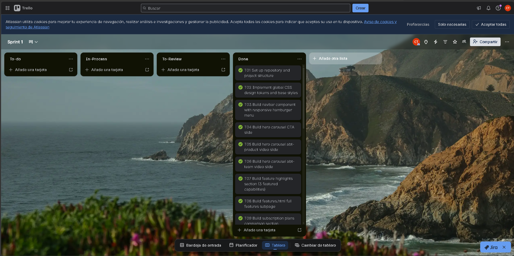
URL del Board (Trello): https://trello.com/invite/b/69e7e914df07d176838add9d/ATTIdd4dfe357744be4dc97cce9e1ff43aeeC1917E49/sprint-1

| US ID | US Title | Task ID | Task Title | Description | Est. (h) | Assigned To | Status |
|-------|----------|---------|------------|-------------|----------|-------------|--------|
| US-LP01 | View Hero Section with Carousel | T01 | Set up repository and project structure | Create the GitHub repository, configure GitFlow with `main` / `develop` / `feature/*` branches, add `.gitignore`, `README.md`, and establish the base folder structure (`/assets`, `/css`, `/js`, `/pages`). | 2 | Villarreal Bazan, Angel Martin | Done |
| US-LP01 | View Hero Section with Carousel | T02 | Implement global CSS design tokens and base styles | Define CSS custom properties (color palette, typography scale, spacing, border-radius, transition) aligned with Material Design guidelines and the NutriSmart style guide. | 3 | Villarreal Bazan, Angel Martin | Done |
| US-LP01 | View Hero Section with Carousel | T03 | Build navbar component with responsive hamburger menu | Implement the fixed top navigation bar including logo, navigation links, language selector, login button, and hamburger menu for mobile breakpoints with ARIA `role="navigation"` and `aria-label`. | 3 | Villarreal Bazan, Angel Martin | Done |
| US-LP01 | View Hero Section with Carousel | T04 | Build hero carousel CTA slide | Implement the first carousel slide with headline, subtitle, and CTA button that redirects to the web application authentication entry point. Apply `aria-live="polite"` and `role="region"` to the carousel container. | 3 | Villarreal Bazan, Angel Martin | Done |
| US-LP01 | View Hero Section with Carousel | T05 | Build hero carousel abt-product video slide | Implement the second carousel slide embedding the About-the-Product video, ensuring the video is playable and the slide is reachable via carousel navigation controls. | 2 | Villarreal Bazan, Angel Martin | Done |
| US-LP01 | View Hero Section with Carousel | T06 | Build hero carousel abt-team video slide | Implement the third carousel slide embedding the About-the-Team video. Add previous/next navigation buttons with `aria-label="Previous slide"` and `aria-label="Next slide"`. | 2 | Villarreal Bazan, Angel Martin | Done |
| US-LP02 | View Main Features Section | T07 | Build feature highlights section (3 featured capabilities) | Implement the features section on `index.html` displaying exactly three capability cards, each with an icon, title, and brief description. Add a "See all features" link pointing to `features.html`. | 3 | Del Aguila Del Aguila, Olenka Priscilla | Done |
| US-LP02 | View Main Features Section | T08 | Build `features.html` full features subpage | Create the complete features subpage listing all platform capabilities organised by category, each with title and functional description. Apply page hero, teal grid layout and consistent footer. | 3 | Del Aguila Del Aguila, Olenka Priscilla | Done |
| US-LP03 | View Subscription Plans Comparison Table | T09 | Build subscription plans comparison section | Implement the three-column plans comparison table (Basic, Pro, Premium) with feature availability indicators and a CTA button per plan that redirects to the registration flow. | 3 | Del Aguila Del Aguila, Olenka Priscilla | Done |
| US-LP04 | Switch Interface Language (Landing) | T10 | Implement i18n module with `en_US` and `es_419` string dictionaries | Create `i18n.js` with `en` and `es` translation maps covering all text content across all pages. Implement the `applyTranslation(lang)` function that updates all elements with `data-i18n` attributes. | 4 | Mora Rivera, Joel Fernando | Done |
| US-LP04 | Switch Interface Language (Landing) | T11 | Implement language toggle and session persistence | Wire the language selector in the navbar and footer to `applyTranslation()`. Persist the selected language in `sessionStorage` so the choice is maintained as the visitor navigates between pages. | 2 | Mora Rivera, Joel Fernando | Done |
| US-LP04 | Switch Interface Language (Landing) | T12 | Add `data-i18n` attributes to all HTML elements across all pages | Audit all pages (`index.html`, `features.html`, `about-us.html`, `contact.html`, `terms.html`) and add `data-i18n` attributes to every text node that must be translated. | 3 | Mora Rivera, Joel Fernando | Done |
| US-LP05 | View Terms of Service | T13 | Build `terms.html` Terms and Conditions subpage | Create the Terms of Service page with full legal content (privacy policy, data use, subscription terms). Ensure the page is linked from the footer on all pages and content renders in the active language. | 2 | Soto Palacios, Brandon Wilder | Done |
| US-LP05 | View Terms of Service | T14 | Build global footer component | Implement the site-wide footer with the NutriSmart tagline, navigation links, social media links, language selector, Terms and Conditions link, and copyright notice. Apply consistent styles across all pages. | 3 | Soto Palacios, Brandon Wilder | Done |
| US-LP06 | View About Us Section | T15 | Build `about-us.html` — startup description, mission and vision | Implement the About Us page hero section and the startup description block with mission and vision cards. Content must be i18n-ready with `data-i18n` attributes. | 3 | Espinoza Cruz, Angela Milagros | Done |
| US-LP06 | View About Us Section | T16 | Add team member cards section to `about-us.html` | Implement the team member cards section displaying each member's name, role, and avatar image. | 2 | Espinoza Cruz, Angela Milagros | Done |
| US-LP07 | View Frequently Asked Questions Section | T17 | Build FAQ accordion component on `about-us.html` and `features.html` | Implement the FAQ section with at least five question-and-answer pairs using a keyboard-accessible accordion pattern with `aria-expanded`, `aria-controls`, and `role="region"` on each answer panel. | 3 | Espinoza Cruz, Angela Milagros | Done |
| US-LP08 | Access Login from Landing Page | T18 | Add persistent login access option to all page headers | Ensure the login button is present in the navbar on every page and correctly redirects to the web application authentication entry point URL. | 1 | Mora Rivera, Joel Fernando | Done |
| US-LP09 | Submit Contact Form | T19 | Build `contact.html` contact form with client-side validation | Create the contact page with name, email, phone, and message fields. Implement client-side validation: required fields, email format, phone format, minimum message length. Display inline error messages with `role="alert"` for each invalid field. | 4 | Espinoza Cruz, Angela Milagros | Done |
| US-LP09 | Submit Contact Form | T20 | Implement contact form submission confirmation feedback | On valid submission, display a success confirmation message and reset the form. Ensure the confirmation is announced by screen readers using `aria-live="assertive"`. | 2 | Espinoza Cruz, Angela Milagros | Done |
| US-LP10 | View Social Media Links | T21 | Implement social media links section in footer | Add at least three social media profile links to the footer. Each link must open in a new tab with `target="_blank" rel="noopener noreferrer"` and include an `aria-label` describing the destination. | 1 | Soto Palacios, Brandon Wilder | Done |

#### 5.2.1.4. Development Evidence for Sprint Review

Durante este sprint, el equipo completó la implementación completa de la landing page de NutriSmart. El desarrollo abarcó la creación de todas las páginas (index, features, about us, contact y terms), la hoja de estilos compartida con su sistema de diseño, las interacciones en JavaScript, la internacionalización (i18n) y los assets estáticos del proyecto. Todo el trabajo fue gestionado mediante Gitflow, con ramas feature individuales por página fusionadas en `develop` y finalmente liberadas en `main` como versión 1.0.0.

| Repository | Branch | Commit Id | Commit Message | Commit Message Body | Committed on |
|---|---|---|---|---|---|
| upc-pre-202610-1asi0729-17952-devteam/nutrismart-website | feature/set-up | 4c65aba | feat: initial project setup | — | 24/04/2026 |
| upc-pre-202610-1asi0729-17952-devteam/nutrismart-website | feature/set-up | f3715be | style: add style guidelines section | — | 24/04/2026 |
| upc-pre-202610-1asi0729-17952-devteam/nutrismart-website | feature/index | 1c1142c | style: add navbar styles | — | 24/04/2026 |
| upc-pre-202610-1asi0729-17952-devteam/nutrismart-website | feature/index | d05346a | feat: add navbar markup | — | 24/04/2026 |
| upc-pre-202610-1asi0729-17952-devteam/nutrismart-website | feature/index | 7e4bd8a | feat: add hero section markup | — | 24/04/2026 |
| upc-pre-202610-1asi0729-17952-devteam/nutrismart-website | feature/index | ab2e26d | feat: add main features hero markup | — | 24/04/2026 |
| upc-pre-202610-1asi0729-17952-devteam/nutrismart-website | feature/index | 2b23574 | feat: add segments markup | — | 24/04/2026 |
| upc-pre-202610-1asi0729-17952-devteam/nutrismart-website | feature/index | 391b735 | feat: add plans markup | — | 24/04/2026 |
| upc-pre-202610-1asi0729-17952-devteam/nutrismart-website | feature/index | be2b0e8 | feat: add features grid markup | — | 24/04/2026 |
| upc-pre-202610-1asi0729-17952-devteam/nutrismart-website | feature/index | e44e445 | feat: add faq markup | — | 24/04/2026 |
| upc-pre-202610-1asi0729-17952-devteam/nutrismart-website | feature/index | b8cf917 | feat: add footer markup | — | 24/04/2026 |
| upc-pre-202610-1asi0729-17952-devteam/nutrismart-website | feature/index | 552ebfa | style: add hamburger and mobile drawer styles | — | 24/04/2026 |
| upc-pre-202610-1asi0729-17952-devteam/nutrismart-website | feature/index | 1beb4e7 | refactor: reorganize styles by page section | — | 24/04/2026 |
| upc-pre-202610-1asi0729-17952-devteam/nutrismart-website | feature/index | 54ee410 | style: add index page styles | — | 24/04/2026 |
| upc-pre-202610-1asi0729-17952-devteam/nutrismart-website | feature/features | 748bcb0 | feat: add features page markup | — | 24/04/2026 |
| upc-pre-202610-1asi0729-17952-devteam/nutrismart-website | feature/features | 88705fc | style: add features page styles | — | 24/04/2026 |
| upc-pre-202610-1asi0729-17952-devteam/nutrismart-website | feature/about-us | 1318a66 | feat: add about us page markup | — | 24/04/2026 |
| upc-pre-202610-1asi0729-17952-devteam/nutrismart-website | feature/about-us | 3ed9a72 | style: add about us page styles | — | 24/04/2026 |
| upc-pre-202610-1asi0729-17952-devteam/nutrismart-website | feature/contact | 160a277 | style: add contact page styles | — | 24/04/2026 |
| upc-pre-202610-1asi0729-17952-devteam/nutrismart-website | feature/contact | 8a25e71 | feat: add contact page markup | — | 24/04/2026 |
| upc-pre-202610-1asi0729-17952-devteam/nutrismart-website | feature/terms | ef7e448 | feat: add terms page markup | — | 24/04/2026 |
| upc-pre-202610-1asi0729-17952-devteam/nutrismart-website | feature/terms | 1df54f1 | style: add terms page styles | — | 24/04/2026 |
| upc-pre-202610-1asi0729-17952-devteam/nutrismart-website | feature/footer | 15592db | style: add footer style | — | 24/04/2026 |
| upc-pre-202610-1asi0729-17952-devteam/nutrismart-website | feature/footer | edacad3 | style: add responsive styles | — | 24/04/2026 |
| upc-pre-202610-1asi0729-17952-devteam/nutrismart-website | feature/footer | 57f8f8a | style: add scroll snap style | — | 24/04/2026 |
| upc-pre-202610-1asi0729-17952-devteam/nutrismart-website | feature/footer | 2e708ec | feat: add i18n translations | — | 24/04/2026 |
| upc-pre-202610-1asi0729-17952-devteam/nutrismart-website | feature/footer | 9f012bb | feat: add core scripts and interactions | — | 24/04/2026 |
| upc-pre-202610-1asi0729-17952-devteam/nutrismart-website | feature/footer | 240e369 | chore: add project assets | — | 24/04/2026 |

#### 5.2.1.5. Execution Evidence for Sprint Review

Durante el Sprint 1, el equipo completó la implementación y despliegue público del sitio web estático (Landing Page) de NutriSmart. Se entregaron las diez User Stories comprometidas (US-LP01–US-LP10), cubriendo la totalidad de las secciones del sitio: Hero con carrusel de tres diapositivas, sección de funciones principales con subpágina completa, tabla comparativa de planes de suscripción, módulo de internacionalización en_US / es_419 con persistencia de sesión, subpágina About Us con misión, visión y tarjetas del equipo, acordeón de preguntas frecuentes, formulario de contacto con validación del lado cliente, acceso persistente al login desde todas las páginas, sección de redes sociales y subpágina de Términos y Condiciones. El sitio fue desplegado en GitHub Pages.

A continuación se presentan screenshots de las principales vistas implementadas durante el sprint.

**Hero Section (Call to Action)**
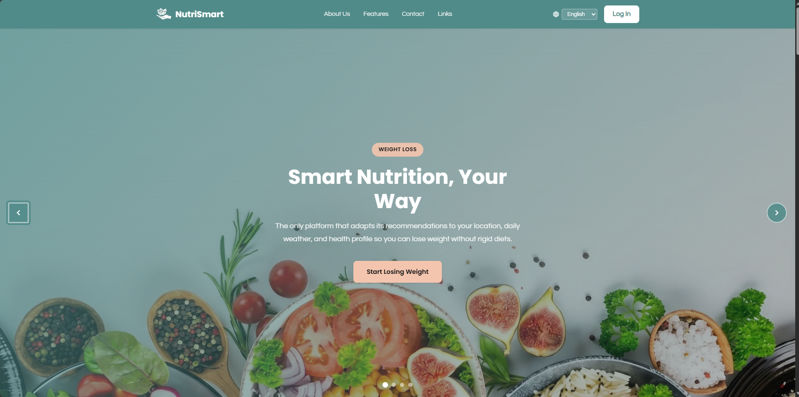

**Main Features Section y enlace a subpágina completa**
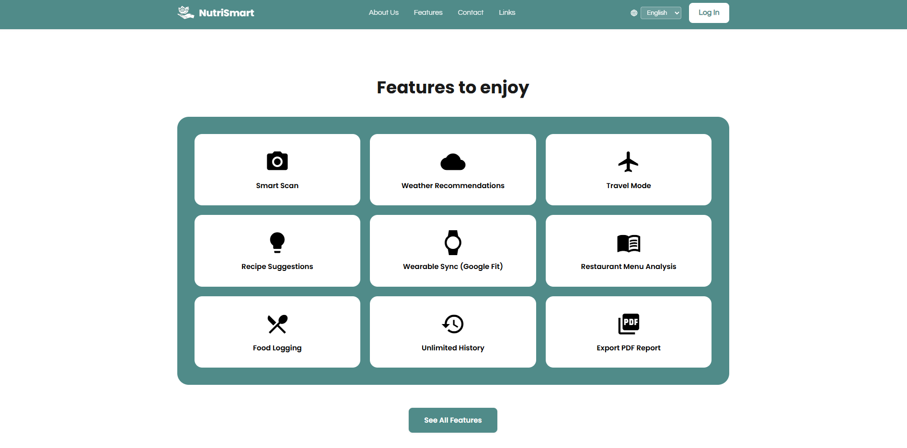

**Subscription Plans Comparison Table**
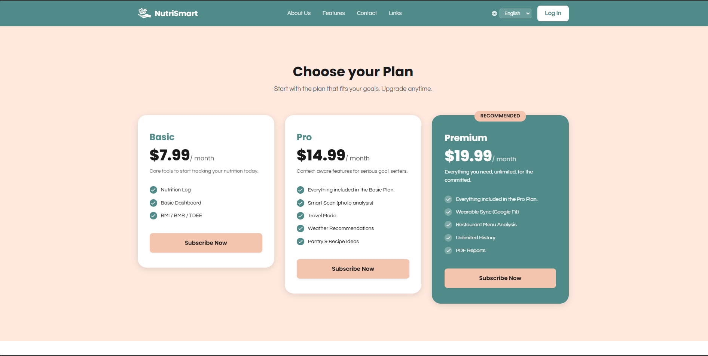

**About Us**
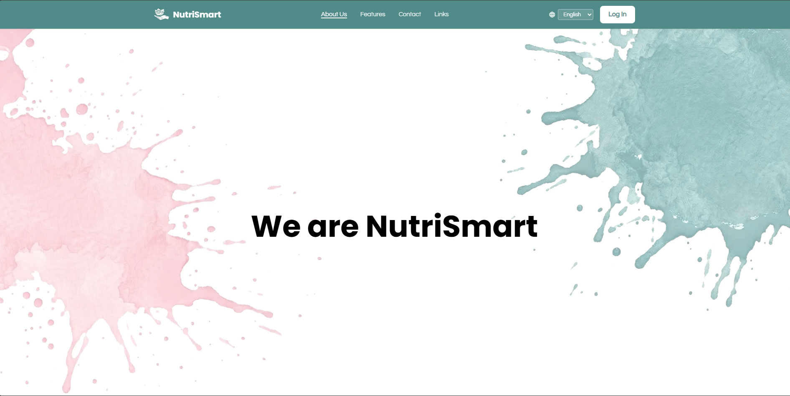

**FAQ accordion**
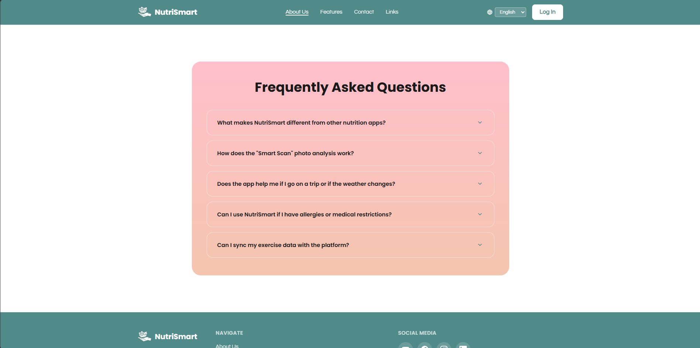

**Contact page con formulario y validación**
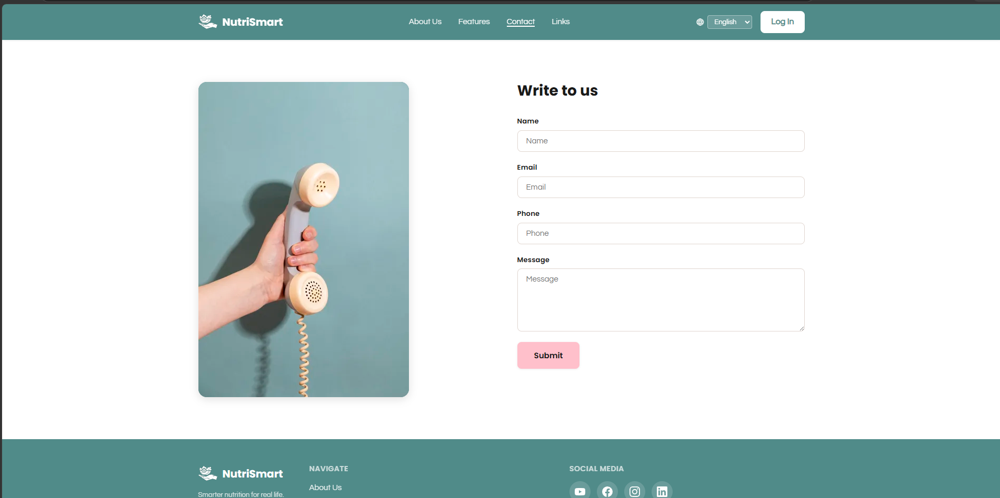

**Terms and Conditions subpage**
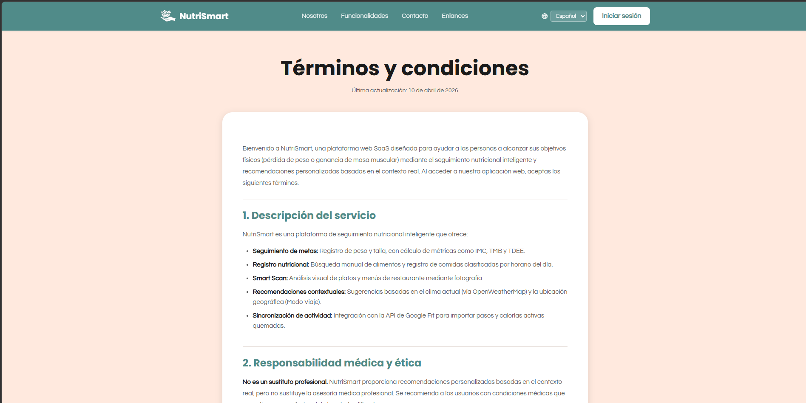

**Footer con redes sociales, selector de idioma y enlace legal**
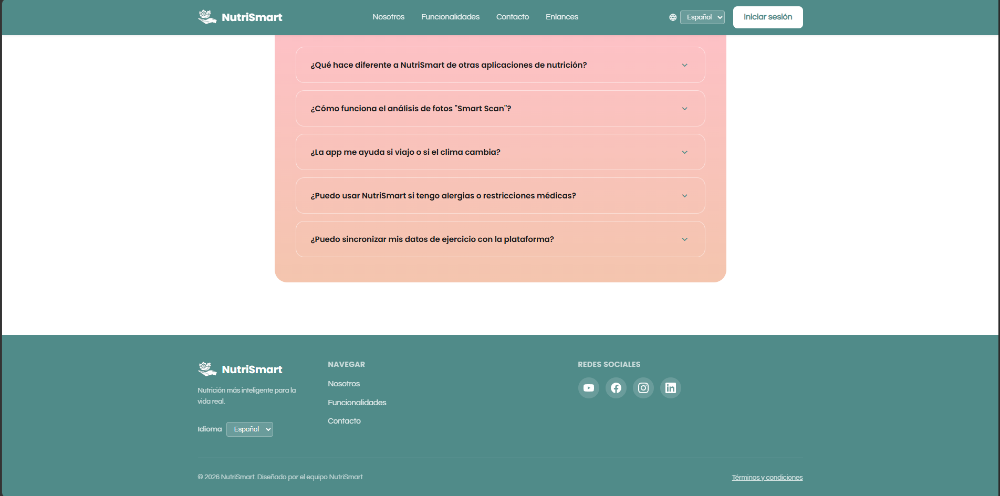

**Cambio de idioma activo**
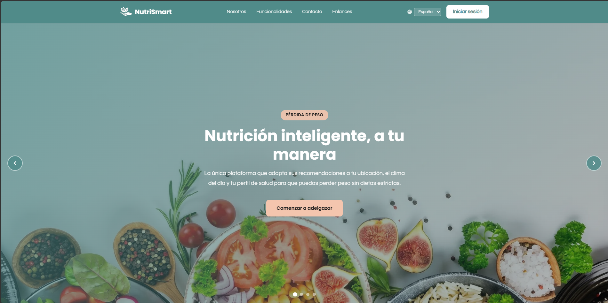

El video de demostración del Sprint 1 ilustra la navegación completa por todas las secciones de la Landing Page, el cambio de idioma entre inglés y español, la validación del formulario de contacto y el acceso al punto de entrada de la aplicación web desde la página de inicio.

**URL del video de demostración del Sprint 1:** [Video review sprint](https://upcedupe-my.sharepoint.com/:v:/g/personal/u202417857_upc_edu_pe/IQAsVc-ygqmaQqOPRh7NVn1jAYeQxZXoJBe2kHvxwLfq17c?nav=eyJyZWZlcnJhbEluZm8iOnsicmVmZXJyYWxBcHAiOiJPbmVEcml2ZUZvckJ1c2luZXNzIiwicmVmZXJyYWxBcHBQbGF0Zm9ybSI6IldlYiIsInJlZmVycmFsTW9kZSI6InZpZXciLCJyZWZlcnJhbFZpZXciOiJNeUZpbGVzTGlua0NvcHkifX0&e=8FcM6m)

#### 5.2.1.6. Services Documentation Evidence for Sprint Review

El Sprint 1 tuvo como único alcance la implementación del sitio web estático (Landing Page) de NutriSmart. En esta iteración no se desarrollaron ni desplegaron Web Services, endpoints RESTful ni ningún componente de backend. Por ello, no existe documentación de servicios con OpenAPI que reportar en este sprint.

#### 5.2.1.7. Software Deployment Evidence for Sprint Review

Durante este sprint se realizó el despliegue de la landing page de NutriSmart en GitHub Pages. El proceso abarcó la configuración del repositorio remoto, la integración del flujo Gitflow con la rama `main` como fuente de despliegue, y la habilitación del servicio de hosting estático de GitHub. A continuación se describen los pasos realizados.

##### Creación del repositorio en GitHub

Se creó el repositorio público `nutrismart-website` bajo la organización `upc-pre-202610-1asi0729-17952-devteam` en GitHub. Este repositorio centraliza todo el código fuente de la landing page y sirve como base para el despliegue continuo.

##### Configuración de ramas bajo Gitflow

Se estableció la estructura de ramas siguiendo Gitflow:

- `main` > rama de producción (fuente de despliegue)
- `develop` > rama de integración
- `feature/*` > ramas de desarrollo por funcionalidad

Todo el trabajo fue integrado mediante Pull Requests desde las ramas `feature/*` hacia `develop`, y finalmente desde `develop` hacia `main` como parte del release `v1.0.0`.

##### Merge a main y creación del tag de release

Una vez completadas todas las features del sprint, se realizó el merge de `develop` a `main` mediante un Pull Request en GitHub, etiquetando el commit resultante como `v1.0.0`.

##### Configuración de GitHub Pages

Para habilitar el despliegue se siguieron los pasos:

1. Ingresar al repositorio en GitHub
2. Ir a **Settings** > **Pages**
3. En la sección **Build and deployment**, seleccionar:
   - **Source:** Deploy from a branch
   - **Branch:** `main`
   - **Folder:** `/ (root)`
4. Hacer click en **Save**

GitHub Pages procesó el contenido de la rama `main` y generó automáticamente la URL de despliegue.

##### URL de despliegue

La landing page quedó disponible públicamente en: [Landing Page](https://upc-pre-202610-1asi0729-17952-devteam.github.io/nutrismart-website/)

#### 5.2.1.8. Team Collaboration Insights during Sprint

Durante el Sprint, todos los miembros del equipo participaron activamente en las actividades de implementación, tal como se refleja en los analíticos de colaboración de GitHub. Como se puede observar en la gráfica de contribuciones, los integrantes Nevatrix, xJoelFMRx, olenkisha14, Emy127 y Brandon1677 realizaron commits de manera constante. Cada miembro aportó al desarrollo del Sprint.

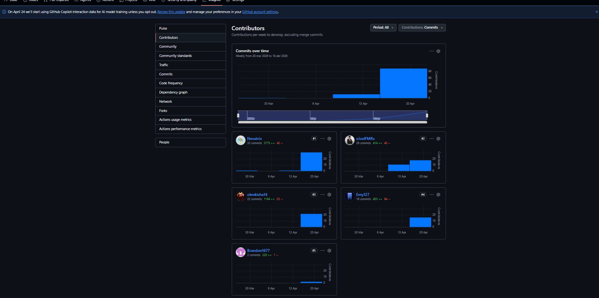

### 5.2.2. Sprint 2

#### 5.2.2.1. Sprint Planning 2

<table>
  <tr>
    <th colspan="2">Sprint #</th>
    <th colspan="2">Sprint 2</th>
  </tr>
  <tr>
    <th colspan="4">Sprint Planning Background</th>
  </tr>
  <tr>
    <td colspan="2">Date</td>
    <td colspan="2">2026-04-24</td>
  </tr>
  <tr>
    <td colspan="2">Time</td>
    <td colspan="2">07:00 PM (GMT-5)</td>
  </tr>
  <tr>
    <td colspan="2">Location</td>
    <td colspan="2">Reunión virtual vía Microsoft Teams</td>
  </tr>
  <tr>
    <td colspan="2">Prepared By</td>
    <td colspan="2">Villarreal Bazan, Angel Martin</td>
  </tr>
  <tr>
    <td colspan="2">Attendees (to planning meeting)</td>
    <td colspan="2">Del Aguila Del Aguila, Olenka Priscilla / Espinoza Cruz, Angela Milagros / Mora Rivera, Joel Fernando / Soto Palacios, Brandon Wilder / Villarreal Bazan, Angel Martin</td>
  </tr>
  <tr>
    <th colspan="4">Sprint 1 Review Summary</th>
  </tr>
  <tr>
    <td colspan="4">En el Sprint 1 se entregó la Landing Page de NutriSmart en su totalidad: Hero con carrusel de tres diapositivas, sección de funciones principales con subpágina completa, tabla comparativa de planes, módulo de internacionalización en_US / es_419 con persistencia de sesión, subpágina About Us, acordeón de preguntas frecuentes, formulario de contacto con validación del lado cliente, acceso persistente al login desde todas las páginas, sección de redes sociales y subpágina de Términos y Condiciones. El sitio fue desplegado exitosamente en GitHub Pages. Las 10 User Stories comprometidas (US-LP01–US-LP10) fueron completadas al 100%, con un total de 15 Story Points entregados.</td>
  </tr>
  <tr>
    <th colspan="4">Sprint 1 Retrospective Summary</th>
  </tr>
  <tr>
    <td colspan="4">El equipo identificó como fortaleza la distribución clara de responsabilidades mediante la tabla LACX y la disciplina en el uso de Conventional Commits y GitFlow. Como área de mejora se identificó la necesidad de establecer un mock compartido desde el inicio del sprint para que todos los miembros trabajen sobre los mismos datos de prueba desde el primer día. Para el Sprint 2 se acordó: (1) crear el archivo <code>auth.mock.ts</code> con un usuario autenticado completamente poblado antes de iniciar cualquier tarea de implementación, (2) mantener reuniones de sincronización dos veces por semana para detectar bloqueos en la integración entre bounded contexts, y (3) establecer la rama <code>develop</code> como única fuente de integración antes de hacer merge a <code>main</code>.</td>
  </tr>
  <tr>
    <th colspan="4">Sprint Goal &amp; User Stories</th>
  </tr>
  <tr>
    <td colspan="2">Sprint 2 Goal</td>
    <td colspan="2">Our focus is on delivering the complete authenticated frontend of the NutriSmart web application, covering the IAM, Behavioral Consistency, Nutrition Tracking, Metabolic Adaptation, Restaurant Intelligence, Smart Recommendation, Subscriptions, and Analytics bounded contexts. We believe it delivers a functional and navigable experience that allows users to register, complete onboarding, log their daily nutrition, monitor their behavioral adherence status through the four states (ON_TRACK, AT_RISK, DROPPED, RECOVERED), receive contextual recommendations, scan food plates and restaurant menus, manage their pantry, track their body metrics with activity-based caloric adjustments via manual activity logging, and manage their subscription plan. This will be confirmed when a user can complete the full registration and onboarding flow, interact with all primary views of each bounded context using json-server mock data, observe all behavioral adherence states transitioning correctly in the dashboard, and navigate between all authenticated views without broken routes or accessibility violations.</td>
  </tr>
  <tr>
    <td colspan="2">Sprint 2 Velocity</td>
    <td colspan="2">116 Story Points</td>
  </tr>
  <tr>
    <td colspan="2">Sum of Story Points</td>
    <td colspan="2">116 Story Points</td>
  </tr>
</table>

#### 5.2.2.2. Aspect Leaders and Collaborators

El Sprint 2 abarca la construcción del frontend completo de la aplicación web autenticada de NutriSmart, siguiendo la arquitectura DDD por bounded context (`domain / application / infrastructure / presentation`). Los aspectos identificados para organizar el liderazgo y la colaboración son los siguientes:
 
**IAM:** Comprende el flujo completo de autenticación (registro con emisión de `AccountCreated`, login con `SessionStarted`, recuperación de contraseña), el onboarding de 5 pasos con Angular CDK Stepper que emite `OnboardingCompleted` y `MetabolicTargetSet`, el cierre de sesión con `SessionTerminated`, los route guards, y la vista de Perfil & Configuración con sub-paneles de datos personales, restricciones dietéticas, nivel de actividad y configuración de notificaciones por tipo de evento conductual.
 
**Behavioral Consistency & Analytics:** Comprende el dashboard principal con los cuatro estados de adherencia conductual (`ON_TRACK`, `AT_RISK`, `DROPPED`, `RECOVERED`) y sus respectivos banners reactivos vinculados a `BehavioralDropDetected`, `NutritionalAbandonmentRisk` y `ConsistencyRecovered`, el widget de racha con milestones en 7/14/21/30 días, la vista de Analytics con gráficos de historial calórico y línea de tiempo de adherencia, y la exportación de reporte PDF para usuarios Premium.
 
**Nutrition Tracking:** Comprende la búsqueda de alimentos con debounce y badges `NutritionalRiskLevel`, el Daily Log con balance diario en tiempo real y emisión de `MealRecorded` / `DailyGoalExceeded` / `DailyGoalMet`, los modales `AddFood` y `RestrictedItemBlocked`, el estado `MealSkipped` visible en cada sección de comida, los widgets de monitoreo de déficit (WEIGHT_LOSS) y proteína/superávit (MUSCLE_GAIN), el historial y análisis semanal de macros por segmento, el panel de detalle de comida por ítem.
 
**Restaurant Intelligence & Smart Scan:** Comprende la vista de selección de modo de escaneo con verificación de plan, el flujo de análisis de plato con `MealPhotoAnalyzed` y edición de ítems antes de confirmar como `MealRecord`, el escaneo de menú con `RestaurantMealAnalyzed`, la sección de platos restringidos con `RestrictedDishFlagged`, el ranking compatible con `CompatibleDishesRanked` y acción de registro directo desde la lista, y la vista de Despensa con gestión de ingredientes y sugerencias de recetas ordenadas por el macro más deficitario del día.
 
**Smart Recommendation & Metabolic Adaptation:** Comprende la vista de Recomendaciones con banner climático, tarjeta preventiva (`PreventiveRecommendationGenerated`) para AT_RISK, tarjeta de intervención (`InterventionRecommendationGenerated`) para DROPPED, tarjeta de ajuste de estrategia (`StrategyAdjustmentSuggested`), tarjeta `BestDishRecommended` con justificación de macros, y panel de Modo Viaje. También comprende la vista Body Progress con métricas BMI/BMR/TDEE, gráfico de evolución de peso, configuración de peso objetivo, sección de composición corporal para MUSCLE_GAIN, banners de `StagnationDetected` y `StrategyMismatchDetected`, y el registro manual de actividad física con estimación MET y emisión de `CaloricTargetAdjusted`.
 
| Team Member (Last Name, First Name) | GitHub Username | IAM | Behavioral Consistency & Analytics | Nutrition Tracking | Restaurant Intelligence & Smart Scan | Smart Recommendation & Metabolic Adaptation |
|-------------------------------------|-----------------|:----------------:|:-----------------------------------:|:-----------------------------------:|:-------------------------------------:|:--------------------------------------------:|
| Del Aguila Del Aguila, Olenka Priscilla | olenkisha_14 | C | C | C | L | C |
| Espinoza Cruz, Angela Milagros | Emy127 | C | C | C | C | L |
| Mora Rivera, Joel Fernando | xJoelFMRx | C | C | L | C | C |
| Soto Palacios, Brandon Wilder | Brandon1677 | C | L | C | C | C |
| Villarreal Bazan, Angel Martin | nevatrix | L | C | C | C | C |
 
#### 5.2.2.3. Sprint Backlog 2

El Sprint 2 tiene como objetivo entregar el frontend completo de la aplicación web autenticada de NutriSmart. El desarrollo cubre los bounded contexts de IAM (EP06), Behavioral Consistency (EP01), Nutrition Tracking (EP02), Metabolic Adaptation (EP03), Restaurant Intelligence (EP04), Smart Recommendation (EP05), Subscriptions (EP07), y Analytics & Reporting (EP08), siguiendo la arquitectura DDD por bounded context. Los servicios de backend se simulan mediante `json-server`. La actividad física se implementa como registro manual: el usuario especifica tipo y duración, el sistema estima calorías quemadas por tabla MET y las deduce del balance calórico diario emitiendo `CaloricTargetAdjusted`, sin depender de un dispositivo wearable externo.
 
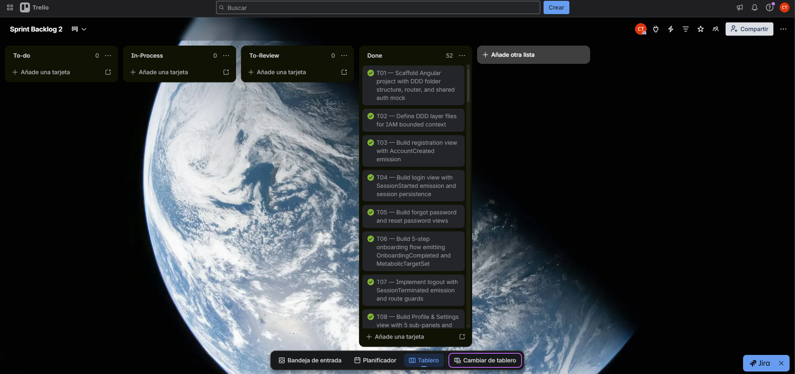
 
URL del Board (Trello):
 
| US ID | US Title | Task ID | Task Title | Description | Est. (h) | Assigned To | Status |
|-------|----------|---------|------------|-------------|----------|-------------|--------|
| US38 | Create an Account to Gain Access to a Nutritional Plan Calibrated to My Body | T01 | Scaffold Angular project with DDD folder structure, router, and shared auth mock | Initialize the Angular project following the bounded-context folder structure (`iam/`, `behavioral-consistency/`, `nutrition-tracking/`, `metabolic-adaptation/`, `restaurant-intelligence/`, `smart-recommendation/`, `analytics/`, `subscriptions/`, `shared/`). Configure Angular Router with public and protected route groups. Integrate Angular Material with NutriSmart custom theme (#508B89). Configure `HttpClient` with `BaseApi` and `BaseApiEndpoint`. Configure `json-server` with `db.json` fixtures covering all Sprint 2 domain entities. Create `auth.mock.ts` with a fully populated authenticated user (goalType, restrictions, weight, height, plan, adherenceStatus) for use by all team members from day 1. | 5 | Villarreal Bazan, Angel Martin | Done |
| US38 | Create an Account to Gain Access to a Nutritional Plan Calibrated to My Body | T02 | Define DDD layer files for IAM bounded context | Create the `UserCredentials` and `UserProfile` domain entities. Create the `IamApi` infrastructure class extending `BaseApi` with `register()`, `login()`, `logout()`, `forgotPassword()`, and `resetPassword()` methods. Create the `IamAssembler` and the `IamStore` Angular service using Signals. | 3 | Villarreal Bazan, Angel Martin | Done |
| US38 | Create an Account to Gain Access to a Nutritional Plan Calibrated to My Body | T03 | Build registration view with AccountCreated emission | Implement the `/auth/register` view with Angular Reactive Forms for first name, last name, email, password (min 8 characters), and terms acceptance checkbox. On valid submit, call `IamStore.register()` mock, emit `AccountCreated`, and redirect to onboarding. Display Angular Material form field errors for duplicate email (409) and weak password. Apply `aria-required` and `aria-invalid` to all fields. | 4 | Villarreal Bazan, Angel Martin | Done |
| US39 | Resume My Nutritional Plan and Adherence Progress From Any Session | T04 | Build login view with SessionStarted emission and session persistence | Implement the `/auth/login` view with Angular Reactive Forms for email and password. On valid submit, call `IamStore.login()` mock, store the JWT in `localStorage`, emit `SessionStarted`, and redirect to `/dashboard` showing the current `AdherenceStatus`. Display a generic invalid credentials Angular Material error after 1 failed attempt. After 5 consecutive failures, display a lockout Angular Material Banner. | 4 | Villarreal Bazan, Angel Martin | Done |
| US40 | Recover Access to My Account and Nutritional History After Forgetting the Password | T05 | Build forgot password and reset password views | Implement the `/auth/forgot-password` view with a neutral confirmation message regardless of whether the email is registered. Implement the `/auth/reset-password` view with new password and confirm password inputs with cross-field validation. On success, redirect to `/auth/login` with a Snackbar confirmation. | 3 | Villarreal Bazan, Angel Martin | Done |
| US19 | Complete Onboarding to Generate a Nutritional Plan Calibrated to My Actual Metabolism | T06 | Build 5-step onboarding flow emitting OnboardingCompleted and MetabolicTargetSet | Implement the `/onboarding` multi-step flow using Angular CDK Stepper with 5 steps: (1) Goal — WEIGHT_LOSS or MUSCLE_GAIN cards; (2) Physical data — weight, height, birthdate, biological sex, activity level; (3) Dietary restrictions and medical conditions — tag-based multi-select; (4) Targets preview — BMI, BMR, TDEE, daily caloric target, macro distribution bars; (5) Plan selection — Basic, Pro, Premium cards. Block submission if weight, height, or biological sex are missing. On confirm, emit `OnboardingCompleted` and `MetabolicTargetSet`, then redirect to `/dashboard`. | 8 | Villarreal Bazan, Angel Martin | Done |
| US42 | Terminate the Session to Prevent Unauthorized Access to Personal Health Data | T07 | Implement logout with SessionTerminated emission and route guards | Implement the logout action that clears the JWT from `localStorage`, emits `SessionTerminated`, and redirects to `/auth/login`. Implement an Angular `AuthGuard` that redirects unauthenticated users to `/auth/login` for all protected routes. | 2 | Villarreal Bazan, Angel Martin | Done |
| US41 | Keep Nutritional Recommendations Accurate by Updating Physical Conditions and Restrictions | T08 | Build Profile & Settings view with 5 sub-panels and MetabolicTargetsRecalculated on activity update | Create the `ProfileSettings` domain entity. Extend `IamApi` with `getProfile()`, `updateProfile()`, `updateRestrictions()`, `updateGoal()`, and `updateNotificationSettings()`. Implement the `/profile` view with 5 panels: Personal information, Physical details and goals (goal toggle emits `MetabolicTargetsRecalculated` on save), Dietary restrictions with 6 notification toggles (meal skip, behavioral drop, abandonment risk, recovery, streak milestones, strategy adjustment), Language, and Security and privacy. | 7 | Villarreal Bazan, Angel Martin | Done |
| US01 | Maintain Daily Nutritional Adherence | T09 | Define DDD layer files for Behavioral Consistency bounded context | Create the `BehavioralProgress`, `AdherenceState`, and `StreakRecord` domain entities. Create the `BehavioralApi` extending `BaseApi` with `getAdherenceStatus()`, `getStreakStatus()`, and `getAdherenceHistory()`. Create `BehavioralAssembler` and `BehavioralStore` using Signals. | 3 | Soto Palacios, Brandon Wilder | Done |
| US01 | Maintain Daily Nutritional Adherence | T10 | Build Dashboard ON_TRACK state with all metric widgets | Implement the `/dashboard` view with greeting, 3 metric cards (calories consumed vs target, calories remaining, net balance), Today's log panel with 4 meal rows (Breakfast/Lunch/Snack/Dinner), Daily macros SVG donut chart with 3 macro progress bars, and Active Streak card with 7 weekly dots. Apply `aria-live="polite"` to all metric cards. | 6 | Soto Palacios, Brandon Wilder | Done |
| US02 | Receive Early Warning Before Abandoning the Plan | T11 | Build Dashboard AT_RISK state triggered by BehavioralDropDetected | Extend the `/dashboard` to display AT_RISK when `AdherenceStatus` is `AT_RISK` (3 consecutive misses). Show an orange warning banner with a See suggestion → link to `/recommendations`, missed window badges on affected meal rows, orange progress bars, orange streak card, and an ⚠ AT_RISK header badge. Toggled via demo bar button. | 3 | Soto Palacios, Brandon Wilder | Done |
| US03 | Prevent Nutritional Abandonment Through Intervention | T12 | Build Dashboard DROPPED state triggered by NutritionalAbandonmentRisk | Extend the `/dashboard` to display DROPPED when `AdherenceStatus` is `DROPPED` (7 days inactive after AT_RISK). Show a red intervention banner with a See reactivation plan → button, replace meal rows with a centered empty state block, set all metric cards to zero, and show a red streak card. Toggled via demo bar button. | 3 | Soto Palacios, Brandon Wilder | Done |
| US04 | Recover Nutritional Consistency After a Drop | T13 | Build Dashboard RECOVERED state triggered by ConsistencyRecovered | Extend the `/dashboard` to display RECOVERED when `AdherenceStatus` is `RECOVERED`. Show a green recovery banner, green streak card with count 1 and `ConsistencyRecovered` ✓ label, and a green ↩ RECOVERED · Day 1 header badge. Toggled via demo bar button. | 2 | Soto Palacios, Brandon Wilder | Done |
| US05 | Celebrate Consistency Milestones to Reinforce Habits | T14 | Build streak milestone widget with StreakMilestoneReached notification | Extend the Active Streak card to display a milestone badge at 7, 14, 21, and 30 days. Show an Angular Material Snackbar congratulating the user on each milestone. | 2 | Soto Palacios, Brandon Wilder | Done |
| US48 | Get a Complete Picture of My Nutritional and Behavioral State at a Glance | T15 | Define DDD layer files for Analytics bounded context and build Analytics view | Create `DailySummary`, `WeeklyHistory`, and `AdherenceHistory` domain entities. Create `AnalyticsApi` with `getDailySummary()`, `getWeeklyHistory()`, `getMonthlyHistory()`, `getAdherenceHistory()`, and `exportPdfReport()`. Create `AnalyticsStore` using Signals. Implement the `/analytics` view with 3-period toggle (7/30/90 days), 4 metric cards, daily calories bar chart (over-goal bars in red, on-target in teal), Avg Macros panel, weight evolution line chart, and for the 30-day period an Adherence History timeline showing ON_TRACK/AT_RISK/DROPPED/RECOVERED days in distinct colors. | 6 | Soto Palacios, Brandon Wilder | Done |
| US49 | Export Objective Evidence of Nutritional Compliance | T16 | Build PDF export button with Premium entitlement check | Implement the Export to PDF button in `/analytics`. For Premium users call `AnalyticsStore.exportPdfReport()` and trigger file download. For Basic/Pro users disable the button and show a tooltip indicating PDF Reports require a Premium plan. | 2 | Soto Palacios, Brandon Wilder | Done |
| US07 | Block Incompatible Foods Automatically to Eliminate Nutritional Risk | T17 | Define DDD layer files for Nutrition Tracking bounded context | Create `FoodItem`, `MealRecord`, and `DailyIntake` domain entities with invariants: `DailyIntake` cannot exceed the caloric limit without emitting `DailyGoalExceeded`; a `MealRecord` with a restricted ingredient must emit `RestrictedItemBlocked`. Create `NutritionApi` with `searchFoods()`, `createMealEntry()`, `getDailyLog()`, `updateMealEntry()`, `deleteMealEntry()`, and `getDailyBalance()`. Create `NutritionAssembler` and `NutritionStore` using Signals. | 3 | Mora Rivera, Joel Fernando | Done |
| US08 | Find Accurate Nutritional Data to Make Informed Food Decisions | T18 | Build food search with debounce, restriction flags, and NutritionalRiskLevel badges | Implement the food search panel within the Daily Log view with an Angular Material Input applying 400ms `debounceTime`. Display results with food name, serving size, and kcal. Flag restricted items with a ⚠ Restriction chip and the corresponding `NutritionalRiskLevel` (LOW / MEDIUM / HIGH) badge. Show empty state with a manual entry option. | 4 | Mora Rivera, Joel Fernando | Done |
| US09 | Log a Meal to Maintain an Accurate Daily Intake Record and Validate Macro Progress | T19 | Build Daily Log view with meal expansion panels, summary bar, and MealRecorded / DailyGoalExceeded states | Implement the `/nutrition/log` view with a date navigator, 5-column summary bar, and 4 Angular Material Expansion Panel meal sections. Each section shows logged items with name, quantity, macros, kcal, and remove button. Display a daily balance right panel with goal, consumed, active calories, and remaining. When a new entry causes total calories to exceed target by more than 10%, show a red Angular Material Alert identifying `DailyGoalExceeded` and the exact kcal exceeded. When all windows are logged within ±10%, show a green Angular Material Alert identifying `DailyGoalMet`. | 5 | Mora Rivera, Joel Fernando | Done |
| US07 | Block Incompatible Foods Automatically to Eliminate Nutritional Risk | T20 | Build Add Food modal with macro preview and RestrictedItemBlocked modal | Implement the Add Food Angular Material Dialog with quantity input that scales macros in real time, meal type selector, 4-cell macro preview grid, and Confirm/Cancel buttons. Implement the `RestrictedItemBlocked` Angular Material Dialog with a red top border, food name in red, conflicting restriction and `NutritionalRiskLevel`, and an Understood button. The blocked modal opens instead of the add modal when the food contains a restricted ingredient. | 4 | Mora Rivera, Joel Fernando | Done |
| US10 | Detect Meal Skips Automatically to Prevent Silent Adherence Losses | T21 | Build MealSkipped state in Daily Log meal sections | Extend each meal section to display a Missed window · `MealSkipped` orange Angular Material Chip badge in the section header when the meal window closes without any logged entry. Replace the items list with a gray italic empty state text. Activate via the MealSkipped demo state button. | 2 | Mora Rivera, Joel Fernando | Done |
| US15 | Prevent Exceeding the Caloric Deficit Limit Before It Counts as a Behavioral Miss | T22 | Build real-time caloric deficit monitoring widget for WEIGHT_LOSS users | Implement the caloric deficit widget within `/nutrition/log` for WEIGHT_LOSS users, showing remaining calories before the deficit limit with a color-coded status chip (on track / approaching limit / exceeded). Update reactively via `NutritionStore` Signals on every `MealRecorded`. | 2 | Mora Rivera, Joel Fernando | Done |
| US16 | Ensure Muscle Growth Conditions Are Met Through Daily Protein and Surplus Tracking | T23 | Build protein and caloric surplus tracker widget for MUSCLE_GAIN users | Implement the protein tracker widget within `/nutrition/log` for MUSCLE_GAIN users, showing consumed protein vs target as an Angular Material Progress Bar and an Angular Material Banner warning when protein falls below 2.0g/kg. Update reactively via Signals. | 2 | Mora Rivera, Joel Fernando | Done |
| US14 | Identify Weekly Eating Patterns That Are Sabotaging Fat Loss Consistency | T24 | Build weekly and monthly nutritional history view with deficit pattern detection | Implement the `/nutrition/history` view with a weekly summary (daily calorie total vs deficit target, days where limit was exceeded flagged in red, weekly macro averages) and monthly summary (caloric average, days within target, weekdays with highest rate of `DailyGoalExceeded`). Provide a period selector. | 3 | Mora Rivera, Joel Fernando | Done |
| US17 | Detect Recurring Macro Imbalances That Are Eroding Fat Loss Progress Over the Week | T25 | Build weekly macro analysis view for WEIGHT_LOSS users | Implement the `/nutrition/macro-analysis` view for WEIGHT_LOSS users displaying each day's caloric total against the deficit target, average daily deviation in kcal, and macro distribution breakdown flagging any day where fat or carbohydrate intake deviates more than 15% from the recommended distribution correlated with `DailyGoalExceeded` events. | 3 | Mora Rivera, Joel Fernando | Done |
| US18 | Identify Protein and Surplus Gaps That Are Blocking Weekly Muscle Synthesis | T26 | Build weekly protein and surplus analysis view for MUSCLE_GAIN users | Implement the `/nutrition/macro-analysis` view for MUSCLE_GAIN users showing protein consumed per day, days below the minimum target, overall weekly protein compliance as a percentage, and a surplus stability report identifying days where the surplus dropped below zero. | 3 | Mora Rivera, Joel Fernando | Done |
| US13 | Identify Which Specific Foods Are Breaking My Macro Balance | T27 | Build meal nutritional detail panel with per-item macro contribution | Implement the meal detail panel for a selected meal category displaying each food item with name, quantity, calories, protein, carbohydrates, and fat. Display a consolidated summary showing whether the meal alone exceeded its recommended time-slot allocation. | 2 | Mora Rivera, Joel Fernando | Done |
| US43 | Subscribe to a Plan to Unlock the Domain Features Required to Achieve My Nutritional Goals | T28 | Define DDD layer files for Subscriptions and build subscription view | Create `Subscription` and `BillingRecord` domain entities. Create `SubscriptionsApi` with `getActivePlan()`, `upgradePlan()`, `downgradePlan()`, `cancelPlan()`, and `getBillingHistory()`. Create `SubscriptionsStore` using Signals. Implement the `/subscription` view with an active plan banner, a 3-card plan comparison section (Basic, Pro, Premium), and a Payment history Angular Material Table with date, plan, amount, status badge, and PDF receipt button. | 6 | Mora Rivera, Joel Fernando | Done |
| US44 | Upgrade the Plan to Unlock Features That Remove the Barriers Preventing Full Adherence | T29 | Build upgrade confirmation dialog with BenefitsEnabled emission | Implement the Upgrade Angular Material Dialog showing newly unlocked features with green badges (e.g. Smart Scan for Pro, Restaurant Menu Analysis and Wearable Sync for Premium), prorated charge detail, Stripe card input placeholder, and a Confirm upgrade · `SubscriptionActivated → BenefitsEnabled` button. | 2 | Mora Rivera, Joel Fernando | Done |
| US45 | Downgrade the Plan Without Losing Paid Access Until the Current Billing Period Ends | T30 | Build downgrade confirmation dialog with BenefitsDisabled scheduling | Implement the Downgrade Angular Material Dialog showing features that will be lost in red, the effective date at the end of the billing cycle (access preserved until then), and a Confirm downgrade button that schedules `BenefitsDisabled`. | 2 | Mora Rivera, Joel Fernando | Done |
| US28 | Analyze a Restaurant Menu to Eliminate Nutritional Uncertainty When Eating Out | T31 | Define DDD layer files for Restaurant Intelligence bounded context | Create `MenuAnalysis`, `DishEstimate`, and `RankedDish` domain entities. Create `RestaurantApi` with `scanMenu()`, `getRankedDishes()`, and `logSelectedDish()`. Create `RestaurantAssembler` and `RestaurantStore` using Signals. | 3 | Del Aguila Del Aguila, Olenka Priscilla | Done |
| US12 | Reduce Logging Friction by Photographing a Meal Instead of Searching Item by Item | T32 | Define DDD layer files for Smart Scan and build scan mode selection view | Create `ScanResult` and `ScannedFoodItem` domain entities. Create `SmartScanApi` with `scanFoodPlate()` and `confirmPlateScan()`. Create `SmartScanStore` using Signals. Implement the `/smart-scan` landing view with two Angular Material Cards: Scan food dish (teal, Pro/Premium) and Scan restaurant menu (Premium only, with upgrade badge). Apply plan entitlement check from `IamStore`. | 4 | Del Aguila Del Aguila, Olenka Priscilla | Done |
| US12 | Reduce Logging Friction by Photographing a Meal Instead of Searching Item by Item | T33 | Build plate scan analyzing state and MealPhotoAnalyzed result view with MealRecord confirmation | Implement the plate scan processing state with animated spinner and Analyzing your meal... text. Implement the scan result view with an editable food items list (name, quantity input in grams, kcal, macros), total estimated kcal, a meal type selector, and a Confirm and log · `MealRecorded` → teal button that stores each item and triggers daily macro validation. Implement the invalid image state with Log manually → link. | 5 | Del Aguila Del Aguila, Olenka Priscilla | Done |
| US28 | Analyze a Restaurant Menu to Eliminate Nutritional Uncertainty When Eating Out | T34 | Build restaurant menu scan view with RestaurantMealAnalyzed result | Implement the `/smart-scan/menu` view with photo upload, call `RestaurantStore.scanMenu()` mock on upload, emit `RestaurantMealAnalyzed`, and display identified dishes with name, estimated calories, protein, carbohydrates, and fat. Block access for Basic and Pro users with a plan upgrade prompt. Implement unreadable image state. | 4 | Del Aguila Del Aguila, Olenka Priscilla | Done |
| US29 | Automatically Remove Unsafe Dishes From Consideration to Protect Nutritional Safety at Restaurants | T35 | Build RestrictedDishFlagged section in menu scan results | Extend the menu scan result view to display a collapsible. Restricted dishes section (red border) listing each dish that emitted `RestrictedDishFlagged`, the specific restriction triggered, and a visual indicator excluding it from the compatibility ranking. | 3 | Del Aguila Del Aguila, Olenka Priscilla | Done |
| US30 | Get an Instant Best-Dish Recommendation to Make the Optimal Choice at a Restaurant Without Calculation | T36 | Build CompatibleDishesRanked view with best dish card and log-from-ranking action | Implement the ranked dishes view with a Best match card (teal border, Best match badge, dish name, macro-based justification identifying which daily macro deficit the dish addresses and by how many grams, Log this dish → button that creates a `MealRecord` and emits `MealRecorded`) and a ranked alternatives list. Sort by lowest caloric density for WEIGHT_LOSS and by highest protein for MUSCLE_GAIN. | 4 | Del Aguila Del Aguila, Olenka Priscilla | Done |
| US37 | Convert Available Pantry Ingredients Into a Meal That Covers My Most Critical Macro Deficit | T37 | Define DDD layer files for Pantry and build pantry view with recipe suggestions sorted by macro deficit | Create `PantryItem` and `RecipeSuggestion` domain entities. Create `PantryApi` with `getPantryItems()`, `addPantryItem()`, `deletePantryItem()`, and `getRecipeSuggestions()`. Create `PantryStore` using Signals. Implement the `/pantry` view with ingredient list (name, category, remove button) and an Add ingredient search input. Right panel shows recipe suggestion cards with recipe name, kcal, ingredients list, macro badges, and goal-type badge, sorted by the most deficient macro (protein for MUSCLE_GAIN, lowest caloric density for WEIGHT_LOSS). Unconditionally exclude recipes containing restricted ingredients. Display empty pantry state with prompt. | 6 | Del Aguila Del Aguila, Olenka Priscilla | Done |
| US35 | Receive Meal Suggestions That Match the Weather So My Body Gets What It Needs in Each Climate | T38 | Define DDD layer files for Smart Recommendation and build recommendations view with weather banner | Create `RecommendationSession`, `WeatherContext`, and `TravelContext` domain entities. Create `RecommendationsApi` with `getWeatherRecommendations()`, `activateTravelMode()`, `deactivateTravelMode()`, `getPreventiveRecommendation()`, `getInterventionRecommendation()`, and `getStrategyAdjustment()`. Create `RecommendationsStore` using Signals. Implement the `/recommendations` view with a weather context banner and 3 recommendation Angular Material Cards with food name, description tags, kcal, protein badge, weather badge, and + Add to log button. Implement cold weather state (blue banner) and hot weather state (orange banner) toggled via demo bar. | 5 | Espinoza Cruz, Angela Milagros | Done |
| US31 | Receive a Simple Meal Suggestion That Makes Returning to Consistency Easy After a Drop | T39 | Build AT_RISK preventive card with PreventiveRecommendationGenerated | Extend `/recommendations` to prepend an orange-bordered Angular Material Card when `AdherenceStatus` is `AT_RISK`, showing ⚠ Adherence alert badge, a meal suggestion fitting the remaining daily macros with minimal preparation effort, `PreventiveRecommendationGenerated` event label, and an orange Log this now → button. | 3 | Espinoza Cruz, Angela Milagros | Done |
| US32 | Get a Graduated Return Plan After Abandonment That Does Not Overwhelm Me With the Full Routine Immediately | T40 | Build DROPPED intervention card with InterventionRecommendationGenerated | Extend `/recommendations` to prepend a red-bordered Angular Material Card when `AdherenceStatus` is `DROPPED`, showing. Reactivation plan badge, simplified targets with reduced kcal for days 1–3 and progressive increase from day 4, `InterventionRecommendationGenerated` event label, and a red Accept simplified plan → button. | 2 | Espinoza Cruz, Angela Milagros | Done |
| US33 | Automatically Adjust My Nutritional Strategy When My Body Has Adapted and Progress Has Stalled | T41 | Build strategy adjustment card with StrategyAdjustmentSuggested and MetabolicTargetsRecalculated | Extend `/recommendations` to display a teal-bordered Angular Material Card when `StagnationDetected` is emitted, showing the proposed new caloric target and macro distribution, `StrategyAdjustmentSuggested` event label, and an Apply new strategy button that calls `RecommendationsStore.getStrategyAdjustment()` mock and emits `MetabolicTargetsRecalculated`. | 2 | Espinoza Cruz, Angela Milagros | Done |
| US36 | Stay on Track Nutritionally When Traveling Without Knowing the Local Cuisine | T42 | Build Travel Mode panel with auto-detection and local dish recommendations | Extend `/recommendations` with a Travel Mode Angular Material Slide Toggle, a detected city badge from geolocation mock, and a manual city input with confirm button. When active, replace weather recommendations with local dish cards (dish name, local cuisine tags, kcal, protein badge, Local badge, + Add to log button). Implement unrecognized city fallback. | 4 | Espinoza Cruz, Angela Milagros | Done |
| US34 | Receive a Justified Best-Dish Recommendation That Confirms My Order Is the Right Nutritional Choice | T43 | Build BestDishRecommended card with macro-based justification | Extend `/recommendations` to display a `BestDishRecommended` card sourced from `RestaurantStore` when a prior menu scan exists, showing the top-ranked dish with a justification that identifies which daily macro deficit the dish addresses most effectively and by how many grams. The card links to the full ranked dishes view. | 2 | Espinoza Cruz, Angela Milagros | Done |
| US19 | Complete Onboarding to Generate a Nutritional Plan Calibrated to My Actual Metabolism | T44 | Define DDD layer files for Metabolic Adaptation bounded context | Create `NutritionPlan`, `BodyMetric`, and `BodyComposition` domain entities with invariants: `NutritionPlan` cannot have a caloric target without defined physiological restrictions. Create `MetabolicApi` with `logWeight()`, `updateHeight()`, `getMetricsHistory()`, `setTargetWeight()`, `getMetabolicTargets()`, `updateBodyComposition()`, `logActivity()`, and `getActivityHistory()`. Create `MetabolicAssembler` and `MetabolicStore` using Signals. | 3 | Espinoza Cruz, Angela Milagros | Done |
| US22 | Understand the Metabolic Basis of My Nutritional Targets So I Can Make Informed Adjustments | T45 | Build Body Progress view with BMI/BMR/TDEE metric cards and MetabolicTargetsRecalculated on weight update | Implement the `/body-progress` view with Update height and + Log weight buttons. Display 4 metric cards (current weight with timestamp, BMI with WHO category badge, BMR in kcal/day, TDEE in kcal/day). On weight save, call `MetabolicStore.logWeight()` mock and emit `MetabolicTargetsRecalculated`. Display a 14-day staleness Angular Material Banner warning. | 5 | Espinoza Cruz, Angela Milagros | Done |
| US20 | Update Body Metrics So the Nutritional Plan Does Not Become Outdated as My Body Changes | T46 | Build weight evolution chart with period toggle, goal reference line, and log history table | Implement the weight evolution line chart within `/body-progress` with a 3-period Angular Material Button Toggle (7/30/90 days). Include a dashed pink goal weight reference line. Display a Log History Angular Material Table with the last 3 entries (date, weight, change from previous) and a View all → link. | 3 | Espinoza Cruz, Angela Milagros | Done |
| US26 | Set a Target Weight to Make Progress Measurable and Give the System a Reference for Projection | T47 | Build target weight configuration dialog with projected achievement date | Implement the target weight Angular Material Dialog with a kg input (rejects values ≥ current weight for WEIGHT_LOSS), a projected achievement date calculated from the current deficit rate in `NutritionPlan`, and Save/Cancel buttons. | 2 | Espinoza Cruz, Angela Milagros | Done |
| US27 | Verify That Weight Gain Is Muscle and Not Fat to Protect the Quality of the Bulk | T48 | Build body composition section for MUSCLE_GAIN users with StrategyAdjustmentSuggested on fat excess | Extend `/body-progress` to show a Body Composition section for MUSCLE_GAIN users displaying estimated body fat percentage, lean mass, and fat mass in kg using the U.S. Navy formula from waist and neck inputs. Display a red Angular Material Banner and emit `StrategyAdjustmentSuggested` when body fat increase exceeds 1.5% over the last two weeks. | 4 | Espinoza Cruz, Angela Milagros | Done |
| US23 | Keep My Caloric Capacity Accurate on Training Days Without Manual Recalculation | T49 | Build activity log view with MET-based calorie estimation and CaloricTargetAdjusted emission | Implement the `/activity` view with an Angular Reactive Forms entry form containing an Angular Material Select for activity type (Running, Cycling, Swimming, Weight Training, Walking, HIIT, Yoga, Other) and a duration input in minutes with positive non-zero validation. On submit, call `MetabolicStore.logActivity()` mock, estimate calories burned using a MET lookup table and user body weight, emit `CaloricTargetAdjusted` with the new net daily target, and display the deduction in a Snackbar. Update the Active calories row in the `/nutrition/log` daily balance panel reactively via Signals. Display a log history Angular Material Table with the last 5 entries (date, activity type, duration, kcal burned) and a remove button per row. Apply `aria-live="polite"` to the balance update region. | 5 | Espinoza Cruz, Angela Milagros | Done |
| US06 | Detect Strategy Mismatch to Protect Adherence | T50 | Build StrategyMismatchDetected and GradualAdjustmentSuggested banners in Body Progress | Extend `/body-progress` to display a purple Angular Material Banner when `StrategyMismatchDetected` is emitted (adherence rate below 60% after `MetabolicTargetsRecalculated`), showing the proposed softer intermediate target from `GradualAdjustmentSuggested` and an Apply gradual plan button. When adherence rate is ≥ 60%, display a green `StrategyConsistencyConfirmed` badge confirming the new targets apply directly. | 2 | Espinoza Cruz, Angela Milagros | Done |
| US25 | Force a Strategy Recalibration When My Body Has Stopped Responding to the Current Plan | T51 | Build StagnationDetected indicator in Body Progress view | Extend `/body-progress` to display a teal Angular Material Banner when `StagnationDetected` is emitted (14 days without measurable physical progress), showing the days without progress and a Go to strategy adjustment → link to the strategy card in `/recommendations`. | 2 | Espinoza Cruz, Angela Milagros | Done |
| — | Cross-cutting | T52 | Integrate ngx-translate into all Sprint 2 views and apply ARIA attributes globally | Add `en.json` and `es.json` entries for all static text in all Sprint 2 views. Wire the language selector via `LanguageSwitcher`. Apply `translate` pipe to all template text. Audit all views and apply ARIA attributes: `aria-label` on icon-only buttons, `aria-required` and `aria-invalid` on form fields, `aria-live="polite"` on dynamic metric cards and nutrition totals, `role="alert"` on error messages, `aria-expanded` on Angular Material Expansion Panels. Verify full keyboard navigation. | 4 | Villarreal Bazan, Angel Martin | Done |

#### 5.2.2.4. Development Evidence for Sprint Review

Durante este sprint, el equipo completó la implementación del frontend completo de la aplicación web autenticada de NutriSmart. El desarrollo cubrió los bounded contexts de IAM, Behavioral Consistency, Nutrition Tracking, Subscriptions, Restaurant Intelligence, Smart Scan, Pantry, Smart Recommendation y Metabolic Adaptation, incluyendo el módulo de registro manual de actividad física con emisión de `CaloricTargetAdjusted`. Todo el trabajo fue gestionado mediante GitFlow, con ramas `feature/` individuales por bounded context fusionadas en `develop` y liberadas en `main` como versión `2.0.0`.

| Repository | Branch | Commit Id | Commit Message | Commit Message Body | Committed on |
|---|---|---|---|---|---|
| upc-pre-202610-1asi0729-17952-devteam/nutrismart-webapp | feature/set-up | `a3f8c12` | feat: scaffold angular project with ddd folder structure | — | 2026-05-07 |
| upc-pre-202610-1asi0729-17952-devteam/nutrismart-webapp | feature/set-up | `b7d1e45` | chore: configure json-server with db.json fixtures | — | 2026-05-07 |
| upc-pre-202610-1asi0729-17952-devteam/nutrismart-webapp | feature/set-up | `c2a9f78` | chore: add shared auth mock with fully populated user | — | 2026-05-07 |
| upc-pre-202610-1asi0729-17952-devteam/nutrismart-webapp | feature/iam | `d5e3b21` | feat(iam): add user-credentials and user-profile domain entities | — | 2026-05-07 |
| upc-pre-202610-1asi0729-17952-devteam/nutrismart-webapp | feature/iam | `e8c6d54` | feat(iam): add iam-api and iam-store with signals | — | 2026-05-07 |
| upc-pre-202610-1asi0729-17952-devteam/nutrismart-webapp | feature/iam | `f1a4e87` | feat(iam): add registration view with account-created emission | — | 2026-05-07 |
| upc-pre-202610-1asi0729-17952-devteam/nutrismart-webapp | feature/iam | `g9b2c30` | feat(iam): add login view with session-started emission | — | 2026-05-07 |
| upc-pre-202610-1asi0729-17952-devteam/nutrismart-webapp | feature/iam | `h4d7f63` | feat(iam): add forgot and reset password views | — | 2026-05-08 |
| upc-pre-202610-1asi0729-17952-devteam/nutrismart-webapp | feature/iam | `i6e1a96` | feat(iam): add 5-step onboarding with onboarding-completed and metabolic-target-set | — | 2026-05-08 |
| upc-pre-202610-1asi0729-17952-devteam/nutrismart-webapp | feature/iam | `j3f8b29` | feat(iam): add auth guard and session-terminated on logout | — | 2026-05-08 |
| upc-pre-202610-1asi0729-17952-devteam/nutrismart-webapp | feature/iam | `k7c5d62` | feat(iam): add profile settings view with 5 sub-panels | — | 2026-05-08 |
| upc-pre-202610-1asi0729-17952-devteam/nutrismart-webapp | feature/behavioral-consistency | `l2a9e95` | feat(behavioral): add behavioral-progress and adherence-state domain entities | — | 2026-05-08 |
| upc-pre-202610-1asi0729-17952-devteam/nutrismart-webapp | feature/behavioral-consistency | `m8b3f28` | feat(behavioral): add behavioral-api and behavioral-store | — | 2026-05-08 |
| upc-pre-202610-1asi0729-17952-devteam/nutrismart-webapp | feature/behavioral-consistency | `n5c7a61` | feat(behavioral): add dashboard on-track state | — | 2026-05-08 |
| upc-pre-202610-1asi0729-17952-devteam/nutrismart-webapp | feature/behavioral-consistency | `o1d4e94` | feat(behavioral): add dashboard at-risk state with behavioral-drop-detected banner | — | 2026-05-08 |
| upc-pre-202610-1asi0729-17952-devteam/nutrismart-webapp | feature/behavioral-consistency | `p9e2b27` | feat(behavioral): add dashboard dropped state with nutritional-abandonment-risk banner | — | 2026-05-09 |
| upc-pre-202610-1asi0729-17952-devteam/nutrismart-webapp | feature/behavioral-consistency | `q4f6c60` | feat(behavioral): add dashboard recovered state with consistency-recovered banner | — | 2026-05-09 |
| upc-pre-202610-1asi0729-17952-devteam/nutrismart-webapp | feature/behavioral-consistency | `r6a1d93` | feat(behavioral): add streak milestone widget with streak-milestone-reached notification | — | 2026-05-09 |
| upc-pre-202610-1asi0729-17952-devteam/nutrismart-webapp | feature/analytics | `s2b8e26` | feat(analytics): add analytics-api and analytics-store | — | 2026-05-09 |
| upc-pre-202610-1asi0729-17952-devteam/nutrismart-webapp | feature/analytics | `t7c5f59` | feat(analytics): add analytics view with period selector and charts | — | 2026-05-09 |
| upc-pre-202610-1asi0729-17952-devteam/nutrismart-webapp | feature/analytics | `u3d9a92` | feat(analytics): add adherence history timeline for 30-day period | — | 2026-05-09 |
| upc-pre-202610-1asi0729-17952-devteam/nutrismart-webapp | feature/analytics | `v8e4b25` | feat(analytics): add pdf export with premium entitlement check | — | 2026-05-09 |
| upc-pre-202610-1asi0729-17952-devteam/nutrismart-webapp | feature/nutrition-tracking | `w1f2c58` | feat(nutrition-tracking): add food-item meal-record and daily-intake domain entities | — | 2026-05-09 |
| upc-pre-202610-1asi0729-17952-devteam/nutrismart-webapp | feature/nutrition-tracking | `x5a7d91` | feat(nutrition-tracking): add nutrition-api and nutrition-store | — | 2026-05-09 |
| upc-pre-202610-1asi0729-17952-devteam/nutrismart-webapp | feature/nutrition-tracking | `y9b3e24` | feat(nutrition-tracking): add food search with nutritional-risk-level flags | — | 2026-05-10 |
| upc-pre-202610-1asi0729-17952-devteam/nutrismart-webapp | feature/nutrition-tracking | `z4c8f57` | feat(nutrition-tracking): add daily log view with meal expansion panels | — | 2026-05-10 |
| upc-pre-202610-1asi0729-17952-devteam/nutrismart-webapp | feature/nutrition-tracking | `a7d5a90` | feat(nutrition-tracking): add add-food modal and restricted-item-blocked modal | — | 2026-05-10 |
| upc-pre-202610-1asi0729-17952-devteam/nutrismart-webapp | feature/nutrition-tracking | `b2e1b23` | feat(nutrition-tracking): add meal-skipped daily-goal-exceeded and daily-goal-met states | — | 2026-05-10 |
| upc-pre-202610-1asi0729-17952-devteam/nutrismart-webapp | feature/nutrition-tracking | `c6f9c56` | feat(nutrition-tracking): add caloric deficit widget for weight-loss users | — | 2026-05-10 |
| upc-pre-202610-1asi0729-17952-devteam/nutrismart-webapp | feature/nutrition-tracking | `d1a4d89` | feat(nutrition-tracking): add protein and surplus tracker for muscle-gain users | — | 2026-05-10 |
| upc-pre-202610-1asi0729-17952-devteam/nutrismart-webapp | feature/nutrition-tracking | `e8b2e22` | feat(nutrition-tracking): add weekly history and macro analysis views | — | 2026-05-10 |
| upc-pre-202610-1asi0729-17952-devteam/nutrismart-webapp | feature/nutrition-tracking | `f3c7f55` | feat(nutrition-tracking): add meal detail panel with per-item macro contribution | — | 2026-05-10 |
| upc-pre-202610-1asi0729-17952-devteam/nutrismart-webapp | feature/subscriptions | `g9d5a88` | feat(subscriptions): add subscription and billing-record domain entities | — | 2026-05-10 |
| upc-pre-202610-1asi0729-17952-devteam/nutrismart-webapp | feature/subscriptions | `h4e3b21` | feat(subscriptions): add subscriptions-api and subscriptions-store | — | 2026-05-10 |
| upc-pre-202610-1asi0729-17952-devteam/nutrismart-webapp | feature/subscriptions | `i7f1c54` | feat(subscriptions): add subscription view with plan comparison cards | — | 2026-05-10 |
| upc-pre-202610-1asi0729-17952-devteam/nutrismart-webapp | feature/subscriptions | `j2a8d87` | feat(subscriptions): add upgrade dialog with benefits-enabled emission | — | 2026-05-11 |
| upc-pre-202610-1asi0729-17952-devteam/nutrismart-webapp | feature/subscriptions | `k6b6e20` | feat(subscriptions): add downgrade dialog with benefits-disabled scheduling | — | 2026-05-11 |
| upc-pre-202610-1asi0729-17952-devteam/nutrismart-webapp | feature/restaurant-intelligence | `l1c4f53` | feat(restaurant): add menu-analysis and ranked-dish domain entities | — | 2026-05-11 |
| upc-pre-202610-1asi0729-17952-devteam/nutrismart-webapp | feature/restaurant-intelligence | `m5d2a86` | feat(restaurant): add restaurant-api and restaurant-store | — | 2026-05-11 |
| upc-pre-202610-1asi0729-17952-devteam/nutrismart-webapp | feature/restaurant-intelligence | `n9e9b19` | feat(restaurant): add menu scan view with restaurant-meal-analyzed result | — | 2026-05-11 |
| upc-pre-202610-1asi0729-17952-devteam/nutrismart-webapp | feature/restaurant-intelligence | `o3f7c52` | feat(restaurant): add restricted-dish-flagged section | — | 2026-05-11 |
| upc-pre-202610-1asi0729-17952-devteam/nutrismart-webapp | feature/restaurant-intelligence | `p8a5d85` | feat(restaurant): add compatible-dishes-ranked view with log-from-ranking action | — | 2026-05-11 |
| upc-pre-202610-1asi0729-17952-devteam/nutrismart-webapp | feature/smart-scan | `q2b3e18` | feat(smart-scan): add scan-result domain entities and smart-scan-api | — | 2026-05-11 |
| upc-pre-202610-1asi0729-17952-devteam/nutrismart-webapp | feature/smart-scan | `r7c1f51` | feat(smart-scan): add scan mode selection view with plan entitlement check | — | 2026-05-11 |
| upc-pre-202610-1asi0729-17952-devteam/nutrismart-webapp | feature/smart-scan | `s4d8a84` | feat(smart-scan): add plate scan result view with meal-recorded confirmation | — | 2026-05-11 |
| upc-pre-202610-1asi0729-17952-devteam/nutrismart-webapp | feature/smart-recommendation | `t6e6b17` | feat(recommendations): add recommendation-session and travel-context domain entities | — | 2026-05-11 |
| upc-pre-202610-1asi0729-17952-devteam/nutrismart-webapp | feature/smart-recommendation | `u1f4c50` | feat(recommendations): add recommendations-api and recommendations-store | — | 2026-05-11 |
| upc-pre-202610-1asi0729-17952-devteam/nutrismart-webapp | feature/smart-recommendation | `v5a2d83` | feat(recommendations): add recommendations view with weather context banner | — | 2026-05-11 |
| upc-pre-202610-1asi0729-17952-devteam/nutrismart-webapp | feature/smart-recommendation | `w9b9e16` | feat(recommendations): add at-risk preventive card with preventive-recommendation-generated | — | 2026-05-11 |
| upc-pre-202610-1asi0729-17952-devteam/nutrismart-webapp | feature/smart-recommendation | `x3c7f49` | feat(recommendations): add dropped intervention card with intervention-recommendation-generated | — | 2026-05-11 |
| upc-pre-202610-1asi0729-17952-devteam/nutrismart-webapp | feature/smart-recommendation | `y8d5a82` | feat(recommendations): add strategy-adjustment-suggested card | — | 2026-05-11 |
| upc-pre-202610-1asi0729-17952-devteam/nutrismart-webapp | feature/smart-recommendation | `z2e3b15` | feat(recommendations): add travel mode panel with local dish suggestions | — | 2026-05-11 |
| upc-pre-202610-1asi0729-17952-devteam/nutrismart-webapp | feature/smart-recommendation | `a7f1c48` | feat(recommendations): add best-dish-recommended card with macro justification | — | 2026-05-11 |
| upc-pre-202610-1asi0729-17952-devteam/nutrismart-webapp | feature/smart-recommendation | `b4a8d81` | feat(pantry): add pantry domain entities and pantry-api | — | 2026-05-11 |
| upc-pre-202610-1asi0729-17952-devteam/nutrismart-webapp | feature/smart-recommendation | `c9b6e14` | feat(pantry): add pantry view with ingredient list and recipe suggestions | — | 2026-05-11 |
| upc-pre-202610-1asi0729-17952-devteam/nutrismart-webapp | feature/metabolic-adaptation | `d1c4f47` | feat(metabolic): add nutrition-plan body-metric and body-composition domain entities | — | 2026-05-11 |
| upc-pre-202610-1asi0729-17952-devteam/nutrismart-webapp | feature/metabolic-adaptation | `e6d2a80` | feat(metabolic): add metabolic-api and metabolic-store | — | 2026-05-11 |
| upc-pre-202610-1asi0729-17952-devteam/nutrismart-webapp | feature/metabolic-adaptation | `f3e9b13` | feat(metabolic): add body progress view with bmi bmr tdee metric cards | — | 2026-05-11 |
| upc-pre-202610-1asi0729-17952-devteam/nutrismart-webapp | feature/metabolic-adaptation | `g8f7c46` | feat(metabolic): add weight evolution chart with goal reference line | — | 2026-05-11 |
| upc-pre-202610-1asi0729-17952-devteam/nutrismart-webapp | feature/metabolic-adaptation | `h2a5d79` | feat(metabolic): add target weight dialog with projected achievement date | — | 2026-05-11 |
| upc-pre-202610-1asi0729-17952-devteam/nutrismart-webapp | feature/metabolic-adaptation | `i7b3e12` | feat(metabolic): add body composition section with strategy-adjustment-suggested on fat excess | — | 2026-05-11 |
| upc-pre-202610-1asi0729-17952-devteam/nutrismart-webapp | feature/metabolic-adaptation | `j4c1f45` | feat(metabolic): add activity log view with met-based calorie estimation | — | 2026-05-11 |
| upc-pre-202610-1asi0729-17952-devteam/nutrismart-webapp | feature/metabolic-adaptation | `k9d8a78` | feat(metabolic): emit caloric-target-adjusted and wire to daily log balance | — | 2026-05-11 |
| upc-pre-202610-1asi0729-17952-devteam/nutrismart-webapp | feature/metabolic-adaptation | `l5e6b11` | feat(metabolic): add stagnation-detected and strategy-mismatch-detected banners | — | 2026-05-11 |

#### 5.2.2.5. Execution Evidence for Sprint Review

Durante el Sprint 2, el equipo completó la implementación del frontend completo de la aplicación web autenticada de NutriSmart, cubriendo los bounded contexts de IAM, Behavioral Consistency, Nutrition Tracking, Subscriptions, Restaurant Intelligence, Smart Scan, Pantry, Smart Recommendation y Metabolic Adaptation. La aplicación consume una capa de servicios mock mediante `json-server`, presenta navegación completa entre todas las vistas autenticadas, formularios validados con Angular Reactive Forms, internacionalización activa mediante `ngx-translate`, estado reactivo gestionado con Angular Signals, y atributos ARIA en todos los componentes interactivos. El módulo de actividad física registra manualmente tipo y duración, estima calorías quemadas por tabla MET, emite `CaloricTargetAdjusted`, y actualiza el balance calórico del Daily Log en tiempo real.
 
A continuación se presentan screenshots de las principales vistas implementadas durante el sprint.
 **Registro, login y onboarding**

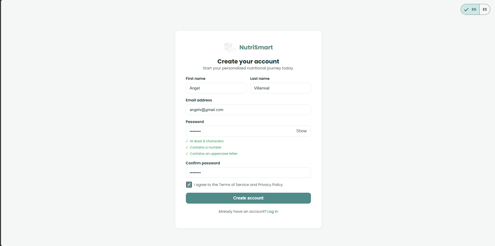
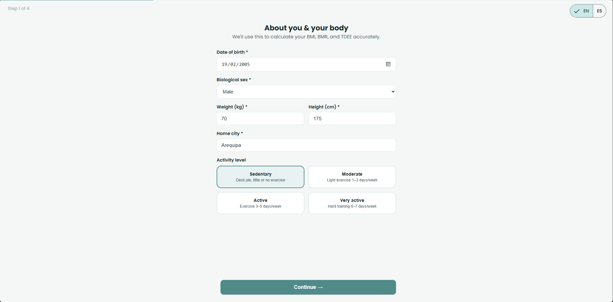
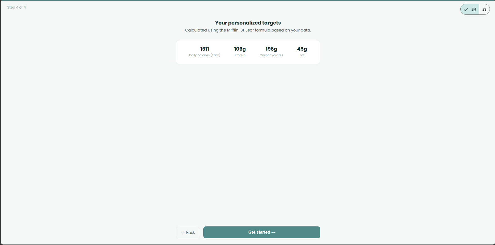

**Dashboard**

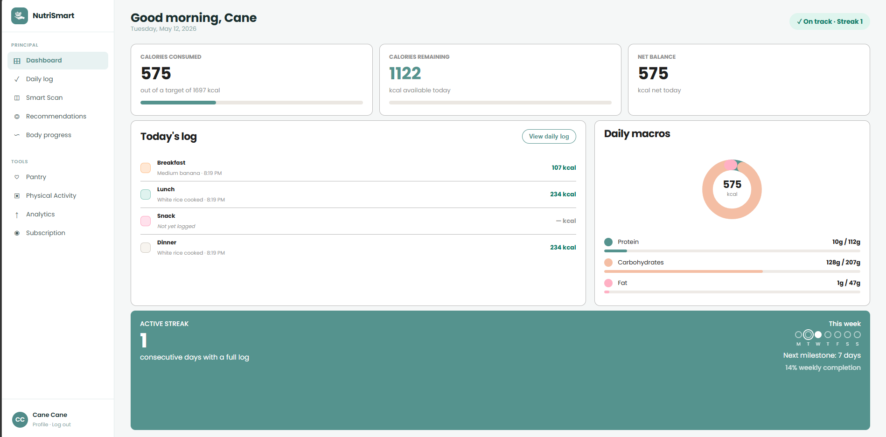

**Nutrition Tracking — Daily Log, análisis semanal y bloqueo de restricciones**

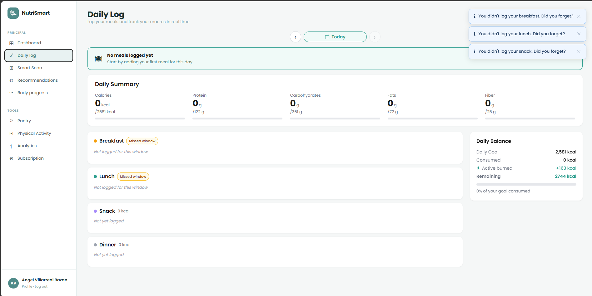
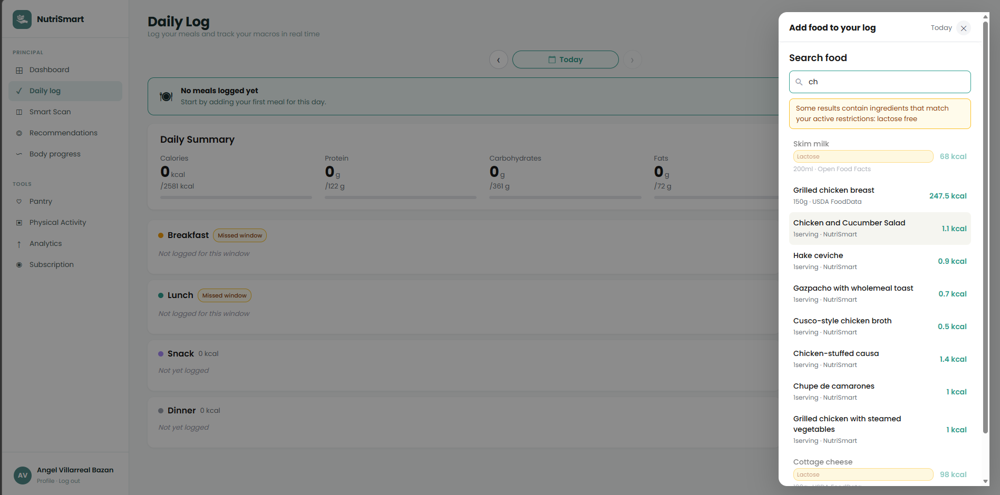
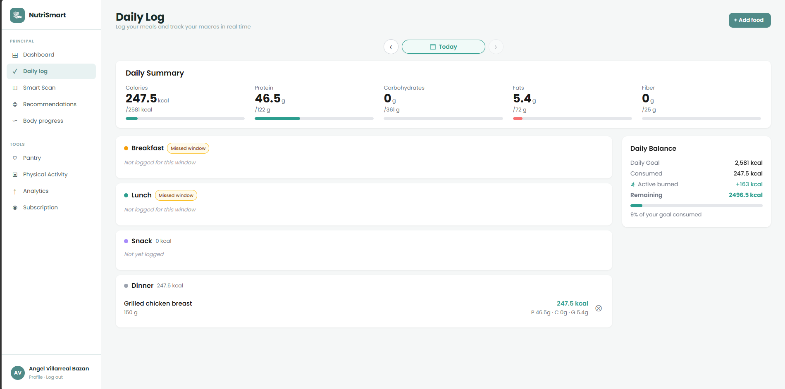
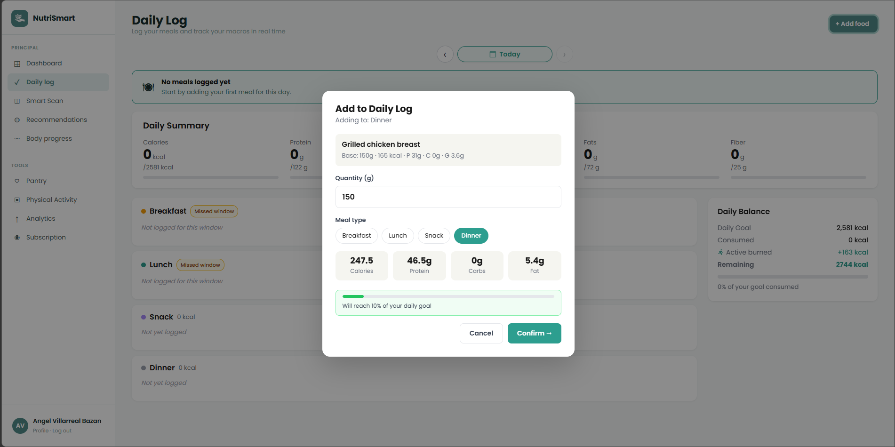

**Restaurant Intelligence y Smart Scan**

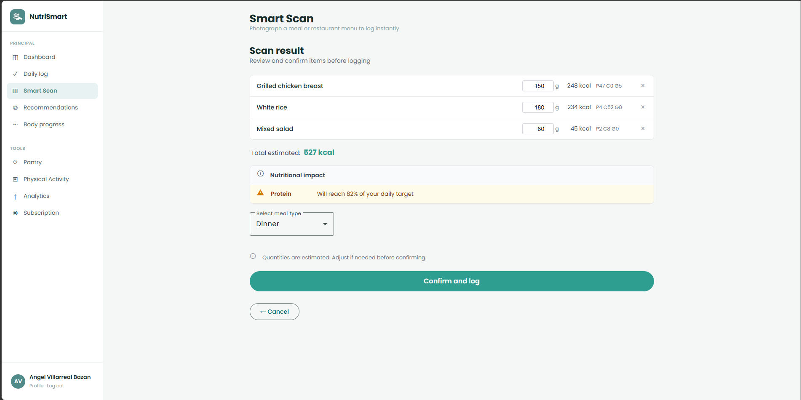
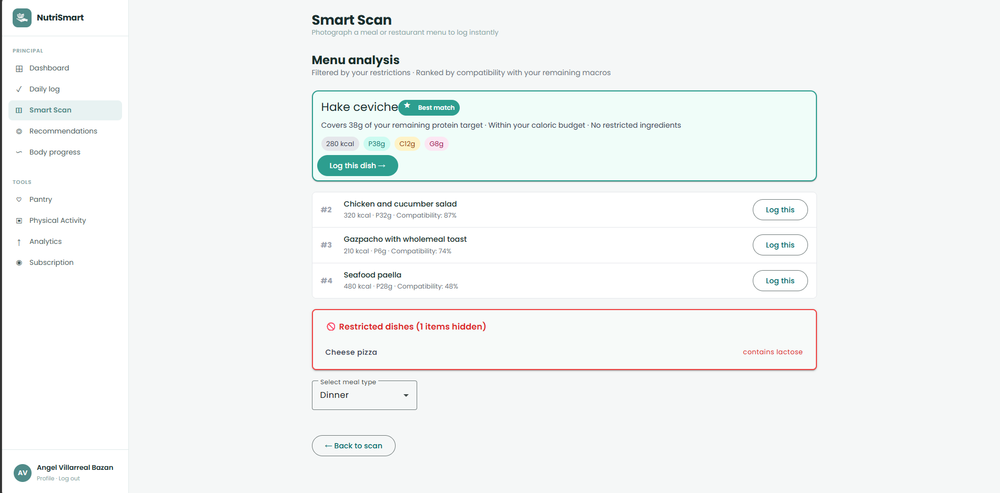

**Smart Recommendation y Pantry**

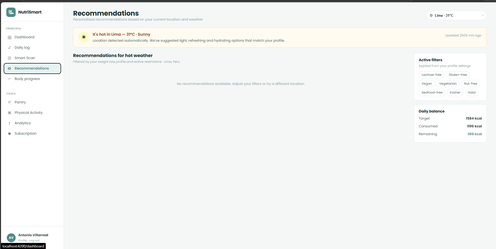
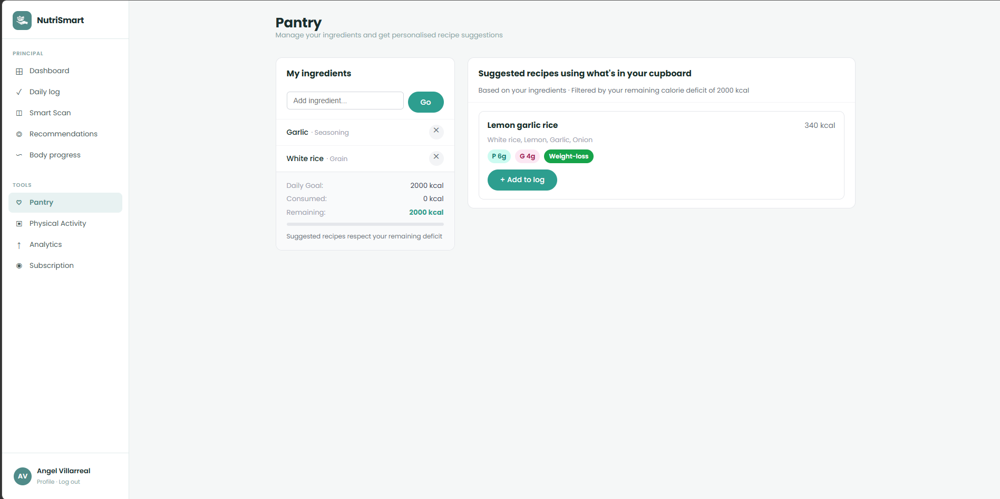

**Metabolic Adaptation y actividad física**

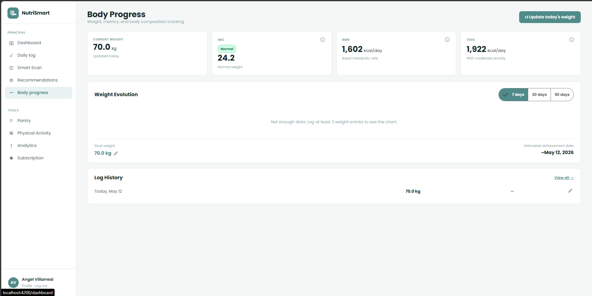

**Analytics y Suscripciones**

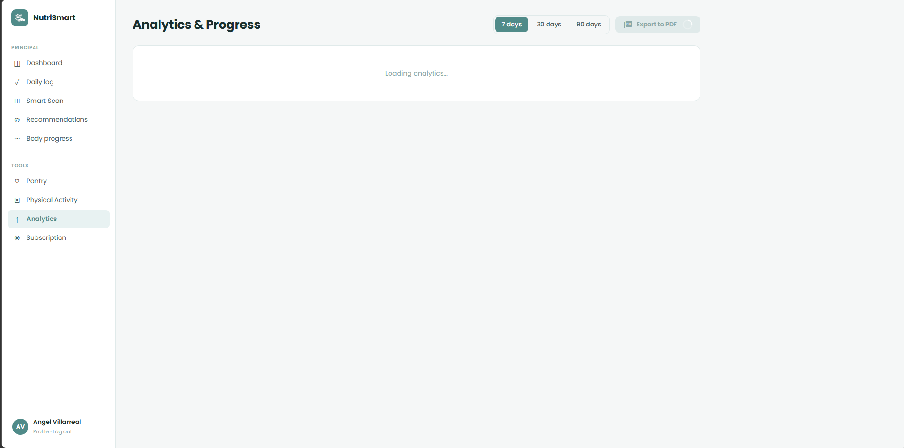
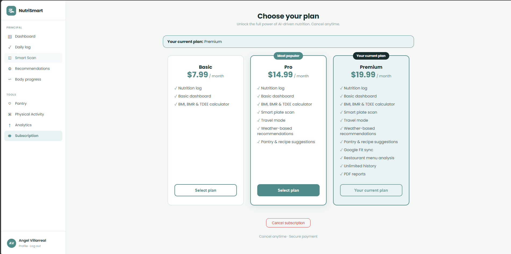
 
El video de demostración del Sprint 2 ilustra la navegación completa por todos los bounded contexts, la transición entre los cuatro estados de adherencia conductual del dashboard, el flujo de escaneo de plato y menú de restaurante con selección y log del plato compatible, el registro manual de actividad física con deducción en tiempo real en el balance calórico, y la gestión de suscripciones con upgrade de plan.
 
**URL del video de demostración del Sprint 2:** [Video sprint 2](https://upcedupe-my.sharepoint.com/:v:/g/personal/u202417857_upc_edu_pe/IQDLiegjIZsTQq6qG8EwJNFBATiDuurOIn-XejaMJAToBnc?nav=eyJyZWZlcnJhbEluZm8iOnsicmVmZXJyYWxBcHAiOiJPbmVEcml2ZUZvckJ1c2luZXNzIiwicmVmZXJyYWxBcHBQbGF0Zm9ybSI6IldlYiIsInJlZmVycmFsTW9kZSI6InZpZXciLCJyZWZlcnJhbFZpZXciOiJNeUZpbGVzTGlua0NvcHkifX0&e=vafcFN)

#### 5.2.2.6. Services Documentation Evidence for Sprint Review

El Sprint 2 tuvo como alcance exclusivo la construcción del frontend de la aplicación web autenticada. Todos los datos son servidos mediante una capa mock con `json-server` a partir del archivo `db.json`, sin conexión a endpoints reales de backend. Por esta razón, no se generó documentación OpenAPI ni se desplegaron Web Services durante esta iteración.
 
La especificación completa de los endpoints RESTful que el frontend consumirá en producción se encuentra documentada en las Technical Stories TS01–TS10 del Product Backlog del Capítulo III. Su implementación está planificada para el Sprint 3 dentro del repositorio `nutrismart-platform`, cubriendo: IAM y sesiones (TS01, TS02), Behavioral Consistency (TS04), Nutrition Tracking con validación de restricciones (TS03), Metabolic Adaptation con wearable sync (TS05), Restaurant Intelligence (TS06), Smart Recommendation con pantry (TS07), Analytics & Reporting con exportación PDF (TS08), Subscriptions (TS09), y Smart Scan con health check (TS10).

#### 5.2.2.7. Software Deployment Evidence for Sprint Review

Durante este sprint se realizó el despliegue de la aplicación web autenticada de NutriSmart en Coolify, utilizando el repositorio `nutrismart-webapp` como fuente de despliegue continuo y el dominio propio `app-smart.nutriproject.xyz` como punto de acceso público. A continuación se describen los pasos realizados.

##### Creación del repositorio en GitHub

Se creó el repositorio público `nutrismart-webapp` bajo la organización `upc-pre-202610-1asi0729-17952-devteam` en GitHub. Este repositorio centraliza el código fuente del frontend Angular y sirve como base para el despliegue continuo desde Coolify.

[Link del repositorio nutrismart-webapp](https://github.com/upc-pre-202610-1asi0729-17952-devteam/nutrismart-webapp)

##### Configuración de ramas bajo Gitflow

Se estableció la estructura de ramas siguiendo Gitflow:

- `main` → rama de producción (fuente de despliegue)
- `develop` → rama de integración
- `feature/*` → ramas de desarrollo por bounded context

Todo el trabajo fue integrado mediante Pull Requests desde las ramas `feature/*` hacia `develop`, y finalmente desde `develop` hacia `main` como parte del release `v2.0.0`.

##### Merge a main y creación del tag de release

Una vez completadas todas las features del sprint, se realizó el merge de `develop` a `main` mediante un Pull Request en GitHub, etiquetando el commit resultante como `v2.0.0`.

##### Configuración del despliegue en Coolify

Para habilitar el despliegue continuo desde el repositorio se siguieron los pasos:

1. Ingresar al panel de administración de Coolify
2. Crear una nueva aplicación seleccionando **GitHub** como fuente
3. Conectar el repositorio `nutrismart-webapp` de la organización `upc-pre-202610-1asi0729-17952-devteam`
4. Configurar los parámetros de build:
   - **Build command:** `npm run build`
   - **Output directory:** `dist/nutrismart-webapp`
   - **Branch:** `main`
5. Asignar el dominio personalizado `app-smart.nutriproject.xyz` en la sección **Domains**
6. Guardar la configuración y ejecutar el primer despliegue manual

Coolify procesó el contenido de la rama `main`, ejecutó el build de Angular, y sirvió los artefactos estáticos generados bajo el dominio configurado.

##### URL de despliegue

La aplicación web quedó disponible públicamente en: [NutriSmart Web App](https://app-smart.nutriproject.xyz/)

#### 5.2.2.8. Team Collaboration Insights during Sprint

Durante el Sprint 2, todos los miembros del equipo participaron activamente en las actividades de implementación, tal como se refleja en los analíticos de colaboración de GitHub. Como se puede observar en la gráfica de contribuciones, los integrantes Nevatrix, xJoelFMRx, olenkisha14, Emy127 y Brandon1677 realizaron commits de manera constante a lo largo del sprint, cada uno liderando su bounded context asignado y colaborando en los aspectos transversales de i18n y accesibilidad.

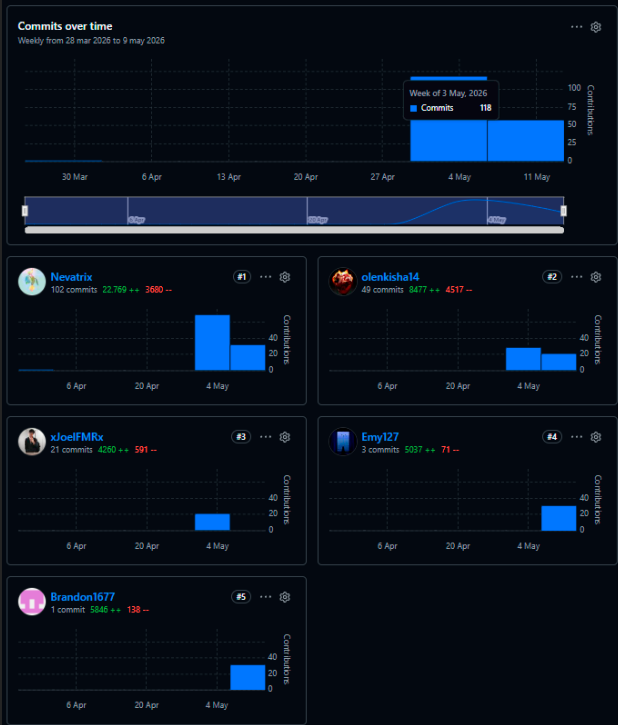

## 5.3. Validation Interviews

### 5.3.1. Diseño de Entrevistas

**Objetivo de la entrevista:**

Los objetivos son de validar la usabilidad, efectividad y claridad de NutriSmart, asimismo de asegurar que los flujos de usuario(User flows) sean intuitivos, prácticos y funcionales para los usuarios y su correcta interaccion con la plataforma.

#### Segmento 1: Pérdida de peso

##### Estructura:

**Preguntas de introducción:**

1. ¿Cuál es su nombre?
2. ¿Cuántos años tiene?
3. ¿A qué se dedica?

**Preguntas de validación de la plataforma web:**

#### Segmento 2: Ganancia de masa muscular

##### Estructura:

**Preguntas de introducción:**

1. ¿Cuál es su nombre?
2. ¿Cuántos años tiene?
3. ¿A qué se dedica?

**Preguntas de validación de la plataforma web:**

1. ¿Te resultó fácil e intuitivo registrarte, rellenar tus datos y crear tu perfil en la plataforma?

2. ¿Hubo algo confuso o que te tomó tiempo entender?

3. ¿Qué actividades planeabas realizar al ingresar a la plataforma?

4. ¿Cuál es tu opinión sobre la funcionalidad de registro nutricional?

5. ¿Te resultaron adecuadas las recomendaciones personalizadas ofrecidas por la plataforma?

6. ¿Cómo te sentiste al visualizar tu progreso corporal?

7. ¿Consideras útil y de sencilla visualización la información brindada en analítica?

8. ¿Tienes alguna sugerencia o recomendación para mejorar la plataforma y mejorar la experiencia a futuros usuarios?

9. ¿Recomendarías NutriSmart a tus familiares o amigos? ¿Por qué?

### 5.3.2. Registro de Entrevistas

#### Segmento 1: Pérdida de peso

##### Entrevista 1:

- Nombres y Apellidos: Jorge Del Aguila Vacalla
- Edad: 49 
- Ocupación: Administrador de empresas y jefe de garantías y taller
- Tiempo: 0:01 - 4:56
- Link: [Link de las entrevistas](https://upcedupe-my.sharepoint.com/:v:/g/personal/u202411669_upc_edu_pe/IQBWpfwIabIbTastqBaS_0gfAZZ2EhRrlW8BOVJAI1rZcuo?e=ZRy0a2&nav=eyJyZWZlcnJhbEluZm8iOnsicmVmZXJyYWxBcHAiOiJTdHJlYW1XZWJBcHAiLCJyZWZlcnJhbFZpZXciOiJTaGFyZURpYWxvZy1MaW5rIiwicmVmZXJyYWxBcHBQbGF0Zm9ybSI6IldlYiIsInJlZmVycmFsTW9kZSI6InZpZXcifSwicGxheWJhY2tPcHRpb25zIjp7InN0YXJ0VGltZUluU2Vjb25kcyI6MS42M319)
- Resumen: Jorge destacó el impacto visual de las imágenes y la variedad de verduras presentadas en la plataforma. Valoró significativamente la facilidad y practicidad del registro nutricional, así como la funcionalidad que le permite visualizar en detalle las calorías, proteínas, carbohidratos, grasas y fibras consumidas. Consideró que la analítica es útil y de fácil acceso para cualquier tipo de usuario. Sugirió mejoras específicas como la inclusión de videos de ejercicios básicos de bajo impacto y testimonios de usuarios que hayan logrado resultados. Finalmente, recomendaría la plataforma a sus conocidos debido a su practicidad y utilidad en el seguimiento del progreso de pérdida de peso.

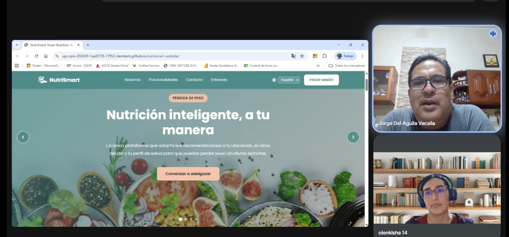

##### Entrevista 2:

- Nombres y Apellidos: Tatiana Mozombite Miranda
- Edad: 25 
- Ocupación: Estudiante de idiomas
- Tiempo: 4:57 - 9:13
- Link: [Link de las entrevistas](https://upcedupe-my.sharepoint.com/:v:/g/personal/u202411669_upc_edu_pe/IQBWpfwIabIbTastqBaS_0gfAZZ2EhRrlW8BOVJAI1rZcuo?e=vcmCTI&nav=eyJyZWZlcnJhbEluZm8iOnsicmVmZXJyYWxBcHAiOiJTdHJlYW1XZWJBcHAiLCJyZWZlcnJhbFZpZXciOiJTaGFyZURpYWxvZy1MaW5rIiwicmVmZXJyYWxBcHBQbGF0Zm9ybSI6IldlYiIsInJlZmVycmFsTW9kZSI6InZpZXcifSwicGxheWJhY2tPcHRpb25zIjp7InN0YXJ0VGltZUluU2Vjb25kcyI6Mjk3LjU3fX0%3D)
- Resumen: Tatiana encontró el procedimiento general intuitivo y fácil de entender. Aprecio las funcionalidades presentadas como Smart Scan y Nutricion Gobal, considerándolas útiles para su objetivo. Valoró los precios accesibles de los planes. Durante la configuración inicial, no presentó dificultades en la comprensión de datos personales ni restricciones alimentarias. Resaltó especialmente la sección de porcentajes de macronutrientes que le ayuda a identificar qué debería consumir. La visualización del progreso corporal le pareció motivadora y de utilidad para reforzar su meta. Recomendaría la plataforma a familiares y amigos por su innovación y facilidad para mantener una vida saludable en el día a día.

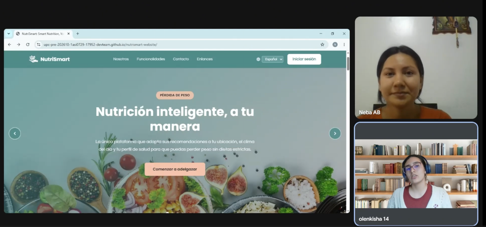

##### Entrevista 3:

- Nombres y Apellidos: Larisa Ramírez Del Aguila
- Edad: 19 
- Ocupación: Estudiante de Administración y Marketing
- Tiempo: 9:14 - 13:28
- Link: [Link de las entrevistas](https://upcedupe-my.sharepoint.com/:v:/g/personal/u202411669_upc_edu_pe/IQBWpfwIabIbTastqBaS_0gfAZZ2EhRrlW8BOVJAI1rZcuo?e=CmhPWz&nav=eyJyZWZlcnJhbEluZm8iOnsicmVmZXJyYWxBcHAiOiJTdHJlYW1XZWJBcHAiLCJyZWZlcnJhbFZpZXciOiJTaGFyZURpYWxvZy1MaW5rIiwicmVmZXJyYWxBcHBQbGF0Zm9ybSI6IldlYiIsInJlZmVycmFsTW9kZSI6InZpZXcifSwicGxheWJhY2tPcHRpb25zIjp7InN0YXJ0VGltZUluU2Vjb25kcyI6NTUyLjU1fX0%3D)
- Resumen: Larisa encontró la plataforma especialmente intuitiva y moderna, destacando la claridad en el flujo de registro e inicio de sesión. Se mostró entusiasmada con las recomendaciones personalizadas basadas en el clima y ubicación, considerándolas prácticas para su estilo de vida actual. Valoró la funcionalidad de agregar ingredientes disponibles en casa para recetas personalizadas, viéndola como una ventaja económica. El dashboard principal le pareció visualmente atractivo y fácil de interpretar para monitorear su progreso diario. Sugirió mejoras en la gamificación de objetivos y mayor variedad de contenido educativo sobre nutrición básica. Expresó su disposición a recomendar la plataforma a sus compañeras de universidad por su diseño amigable y funcionalidades adaptadas a jóvenes adultos con objetivos de bienestar.

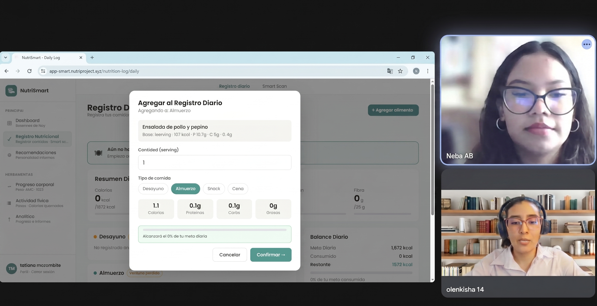

#### Segmento 2: Ganancia de masa muscular

##### Entrevista 1:

- Nombres y Apellidos: David Miguel Ramos Parihuamán
- Edad: 19
- Ocupación: Estudiante universitario
- Tiempo: 13:29 - 17:11
- Link: [Link de las entrevistas](https://upcedupe-my.sharepoint.com/:v:/g/personal/u202411669_upc_edu_pe/IQBWpfwIabIbTastqBaS_0gfAZZ2EhRrlW8BOVJAI1rZcuo?e=tQffZK&nav=eyJyZWZlcnJhbEluZm8iOnsicmVmZXJyYWxBcHAiOiJTdHJlYW1XZWJBcHAiLCJyZWZlcnJhbFZpZXciOiJTaGFyZURpYWxvZy1MaW5rIiwicmVmZXJyYWxBcHBQbGF0Zm9ybSI6IldlYiIsInJlZmVycmFsTW9kZSI6InZpZXcifSwicGxheWJhY2tPcHRpb25zIjp7InN0YXJ0VGltZUluU2Vjb25kcyI6ODA5LjA1fX0%3D)
- Resumen: David señalo la facilidad y semejanza que posee el registro e inicio de sesión con plataformas de su uso diario. Mostro interés por la funcionalidad de registro nutricional, las recomendaciones personalizadas y como lo ayudan en su progreso diario. Dio recomendaciones sobre la interfaz a fin de mejorar la experiencia para futuros usuarios.

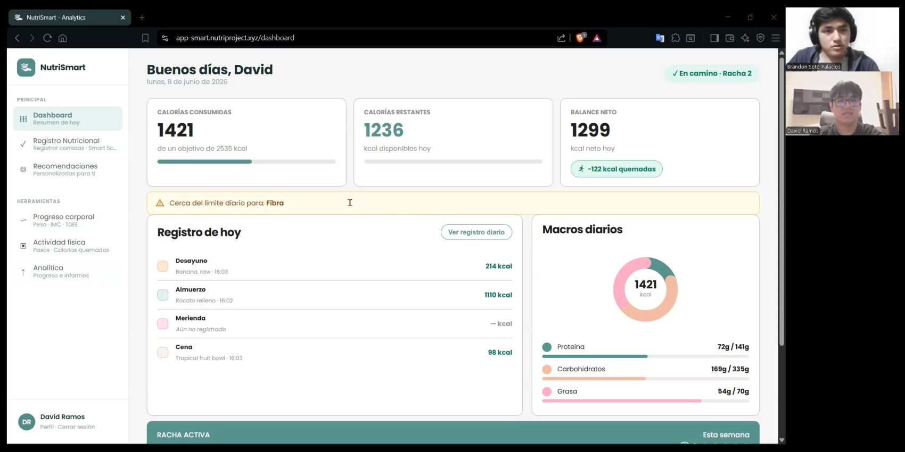

##### Entrevista 2:

- Nombres y Apellidos: Rando Lopez Mayta
- Edad: 22
- Ocupación: Estudiante universitario
- Tiempo: 17:12 - 21:50
- Link: [Link de las entrevistas](https://upcedupe-my.sharepoint.com/:v:/g/personal/u202411669_upc_edu_pe/IQBWpfwIabIbTastqBaS_0gfAZZ2EhRrlW8BOVJAI1rZcuo?e=T3aD5D&nav=eyJyZWZlcnJhbEluZm8iOnsicmVmZXJyYWxBcHAiOiJTdHJlYW1XZWJBcHAiLCJyZWZlcnJhbFZpZXciOiJTaGFyZURpYWxvZy1MaW5rIiwicmVmZXJyYWxBcHBQbGF0Zm9ybSI6IldlYiIsInJlZmVycmFsTW9kZSI6InZpZXcifSwicGxheWJhY2tPcHRpb25zIjp7InN0YXJ0VGltZUluU2Vjb25kcyI6MTAzMi40M319)
- Resumen: Rando menciona que le resulto fácil e intuitivo el registro e inicio de sesión a la plataforma. A pesar de un corto periodo de uso, señala que está encantado con las funcionalidades de registro nutricional y la visualización del progreso. Sugiere mayores opciones de personalización para las interfaces, y finaliza considerando que recomendaria la plataforma a todos sus conocidos.

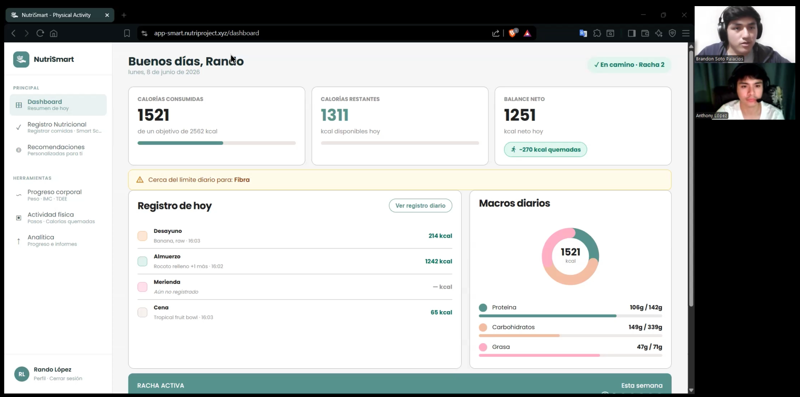

##### Entrevista 3:

- Nombres y Apellidos: Daphne Faustor
- Edad: 25
- Ocupación: Community Manager en el área de marketing (rubro gastronómico aeroportuario)
- Tiempo: 21:51 - 29:13
- Link: [Link de las entrevistas](https://upcedupe-my.sharepoint.com/:v:/g/personal/u202411669_upc_edu_pe/IQBWpfwIabIbTastqBaS_0gfAZZ2EhRrlW8BOVJAI1rZcuo?e=Cbgv8X&nav=eyJyZWZlcnJhbEluZm8iOnsicmVmZXJyYWxBcHAiOiJTdHJlYW1XZWJBcHAiLCJyZWZlcnJhbFZpZXciOiJTaGFyZURpYWxvZy1MaW5rIiwicmVmZXJyYWxBcHBQbGF0Zm9ybSI6IldlYiIsInJlZmVycmFsTW9kZSI6InZpZXcifSwicGxheWJhY2tPcHRpb25zIjp7InN0YXJ0VGltZUluU2Vjb25kcyI6MTMxMS41Nn19)
- Resumen: Daphne Faustor evaluó la plataforma con un objetivo enfocado en ganar masa muscular. Consideró que el registro es sumamente intuitivo y personalizado, y destacó como un gran acierto que el sistema calcule automáticamente las calorías y porciones diarias para evitar procesos tediosos. Asimismo, valoró positivamente las recomendaciones adaptadas al clima y la función de despensa por la practicidad que aportan al día a día, así como los paneles de analítica para monitorear su evolución. Finalmente, recomendó incorporar testimonios de usuarios para aumentar la motivación y afirmó que recomendaría la aplicación a amigos y familiares para concientizarlos sobre la importancia de comer en las proporciones correctas sin restricciones innecesarias.

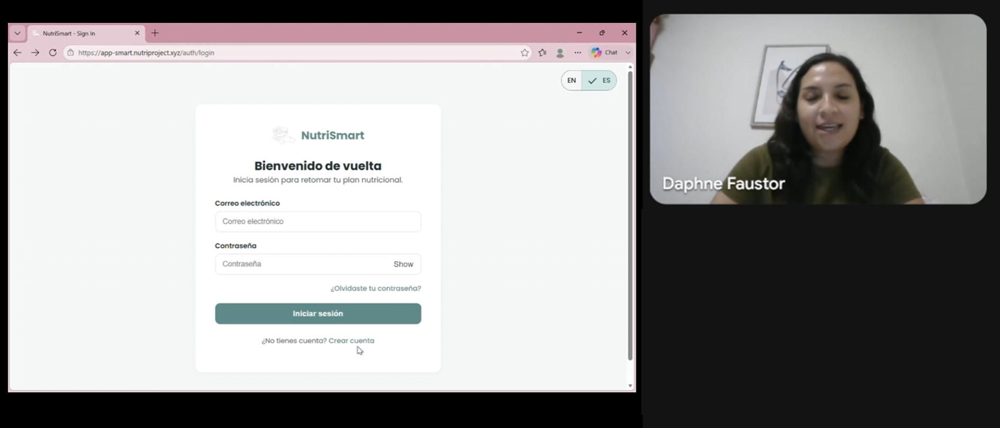

### 5.3.3. Evaluaciones según heurísticas

    <h2>UX Heuristics & Principles Evaluation</h2>
    <h3>Usability – Inclusive Design – Information Architecture</h3>

<strong>CARRERA:</strong> Ingeniería de Software

<strong>CURSO:</strong> Desarrollo de Aplicaciones Open Source

<strong>SECCIÓN:</strong> 17952

<strong>PROFESORES:</strong> Ivan Robles Fernández

<strong>CLIENTE(S):</strong> Angel Martin Villarreal Bazan, Angela Milagros Espinoza Cruz, Brandon Wilder Soto Palacios, Joel Fernando Mora Rivera, Olenka Priscilla Del Aguila Del Aguila

 

**SITE O APP A EVALUAR:**

NutriSmart

 

**TAREAS A EVALUAR:**

El alcance de esta evaluación incluye la revisión de las siguientes tareas:

<ol>
    <li>Registro de nuevo usuario</li>
    <li>Inicio de sesión</li>
    <li>Visualización de información en el dashboard</li>
    <li>Ingreso y guardado de alimentos en registro diario nutricional</li>
    <li>Visualización de recomendaciones personalizadas</li>
    <li>Visualización de seguimiento nutricional</li>
    <li>Registro y visualización del progreso corporal</li>
    <li>Registro y visualización de la actividad física</li>
    <li>Visualización de la información de analítica y progreso</li>
    <li>Modificación de datos personales del usuario</li> 
    <li>Internacionalización</li>
    <li>Cambio y/o recuperación de contraseña</li>

</ol>

 

No están incluidas en esta versión de la evaluación las siguientes tareas:
<ol>
    <li>Registro de alimentos mediante Smart Scan </li>
    <li>Sincronización con wearables</li>
    <li>Exportación a PDF de la analítica y progreso</li>
    <li>Proceso de pago de suscripción</li>
    <li>Eliminación de cuenta</li>
</ol>

 

**ESCALA DE SEVERIDAD:**

Los errores serán puntuados tomando en cuenta la siguiente escala de severidad

<table>
    <tr>
        <th style="border: 1px solid #dddddd; padding: 8px; text-align: center;">Nivel</th>
        <th style="border: 1px solid #dddddd; padding: 8px; text-align: center;">Descripción</th>
    </tr>
    <tr>
        <td style="border: 1px solid #dddddd; padding: 8px; text-align: center;">1</td>
        <td style="border: 1px solid #dddddd; padding: 8px; text-align: justify;">Problema superficial: puede ser fácilmente superador por el usuario ó ocurre con muy poco frecuencia. No necesita ser arreglado a no ser que exista disponibilidad de tiempo.</td>
    </tr>
    <tr>
        <td style="border: 1px solid #dddddd; padding: 8px; text-align: center;">2</td>
        <td style="border: 1px solid #dddddd; padding: 8px; text-align: justify;">Problema menor: puede ocurrir un poco más frecuentemente o es un poco más difícil de superar para el usuario. Se le debería asignar una prioridad baja resolverlo de cara al siguiente reléase</td>
    </tr>
    <tr>
        <td style="border: 1px solid #dddddd; padding: 8px; text-align: center;">3</td>
        <td style="border: 1px solid #dddddd; padding: 8px; text-align: justify;">Problema mayor: ocurre frecuentemente o los usuarios no son capaces de resolverlos. Es importante que sean corregidos y se les debe asignar una prioridad alta.</td>
    </tr>
    <tr>
        <td style="border: 1px solid #dddddd; padding: 8px; text-align: center;">4</td>
        <td style="border: 1px solid #dddddd; padding: 8px; text-align: justify;">Problema muy grave: un error de gran impacto que impide al usuario continuar con el uso dela herramienta. Es imperativo que sea corregido antes del lanzamiento.</td>
    </tr>
</table>

 

**TABLA RESUMEN:**

 

<table>
    <tr>
        <th style="border: 1px solid #dddddd; padding: 8px; text-align: center;">#</th>
        <th style="border: 1px solid #dddddd; padding: 8px; text-align: center;">Problema</th>
        <th style="border: 1px solid #dddddd; padding: 8px; text-align: center;">Escala de severidad</th>
        <th style="border: 1px solid #dddddd; padding: 8px; text-align: center;">Heurística/Principio violada(o)</th>
    </tr>
    <tr>
        <td style="border: 1px solid #dddddd; padding: 8px; text-align: center;">1</td>
        <td style="border: 1px solid #dddddd; padding: 8px; text-align: justify;">Visualización de Registro diario y Smart scan</td>
        <td style="border: 1px solid #dddddd; padding: 8px; text-align: center;">1</td>
        <td style="border: 1px solid #dddddd; padding: 8px; text-align: justify;">Usability: Consistency and Standards</td> 
    </tr>
    <tr>
        <td style="border: 1px solid #dddddd; padding: 8px; text-align: center;">2</td>
        <td style="border: 1px solid #dddddd; padding: 8px; text-align: justify;">Visualización de Feed y Despensa</td>
        <td style="border: 1px solid #dddddd; padding: 8px; text-align: center;">1</td>
        <td style="border: 1px solid #dddddd; padding: 8px; text-align: justify;">Usability: Consistency and Standards</td>
    </tr>
    <tr>
        <td style="border: 1px solid #dddddd; padding: 8px; text-align: center;">3</td>
        <td style="border: 1px solid #dddddd; padding: 8px; text-align: justify;">Falta de actualización dinámica de clima</td>
        <td style="border: 1px solid #dddddd; padding: 8px; text-align: center;">2</td>
        <td style="border: 1px solid #dddddd; padding: 8px; text-align: justify;">Usability: Visibility of System Status</td>
    </tr>
    <tr>
        <td style="border: 1px solid #dddddd; padding: 8px; text-align: center;">4</td>
        <td style="border: 1px solid #dddddd; padding: 8px; text-align: justify;">Olvido y recuperación de contraseña no completamente funcional</td>
        <td style="border: 1px solid #dddddd; padding: 8px; text-align: center;">3</td>
        <td style="border: 1px solid #dddddd; padding: 8px; text-align: justify;">Usability: Error Diagnosis & Recovery</td>
    </tr>
</table>

 

**DESCRIPCIÓN DE PROBLEMAS:**

#### Problema #1: Visualización de Registro diario y Smart scan
- Severidad: 1
- Heurística violada: Usability: Consistency and Standards
- Problema: La navegación entre las secciones de "Registro Diario" y "Smart Scan" puede llegar a generar una inconsistencia visual o fricción menor, esto debido a su ubicación en la parte superior, que puede rompar la coherencia del patrón de navegación definido.

- Recomendación: Debido a la severidad que representa este problema, no es necesario cambios relevantes, ya que es parte de percepciones de los usuarios y sus gustos en interfaces. Aunque se recomienda, para seguir con una coherencia de navegación, mover los botones de las secciones a la sidebar izquierda para una mejor fluidez en la navegación.

#### Problema #2: Visualización de Feed y Despensa
- Severidad: 1
- Heurística violada: Usability: Consistency and Standards
- Problema: La navegación interna de "Recomendaciones" posee una incosistencia menor, al momento de necesitar cambiar entre secciones de "Feed" y "Despensa". 

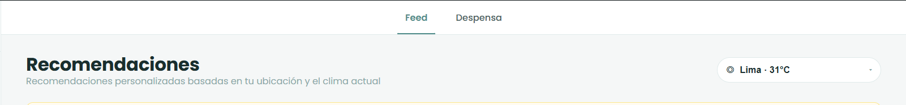

- Recomendación: Aunque representa un problema de menor importancia, se recomienda implementar el cambio al sidebar izquierdo para mantener un diseño de navegación y jerarquía de UI, y asimismo conservar coherencia con "Registro Nutricional", en cuyo caso se hallan efectuado cambios.

#### Problema #3: Falta de actualización de clima
- Severidad: 2
- Heurística violada: Usability: Visibility of System Status
- Problema: Se observa que en "Recomendaciones" la información presentada por la función demo de clima es estática y general, puede llegar a generar ciertas dudas y problemas de personalización para los usuarios.

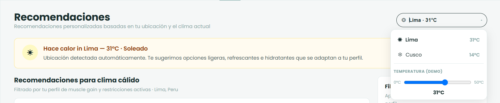

- Recomendación: Como este problema representa una severidad menor, esto sumado a su estatus de función en desarrollo y prueba, se recomienda su mejora progresiva mediante implementaciones de lectura de datos en tiempo real de clima para evitar afectar a los usuarios en versiones posteriores.

#### Problema #4: Olvido y recuperación de contraseña no completamente funcional
- Severidad: 3
- Heurística violada: Usability: Error Diagnosis & Recovery
- Problema: La opción de recuperación de contraseña en caso de olvido aún no se implementó de manera total, lo que puede generar problemas de acceso a para los usuarios.

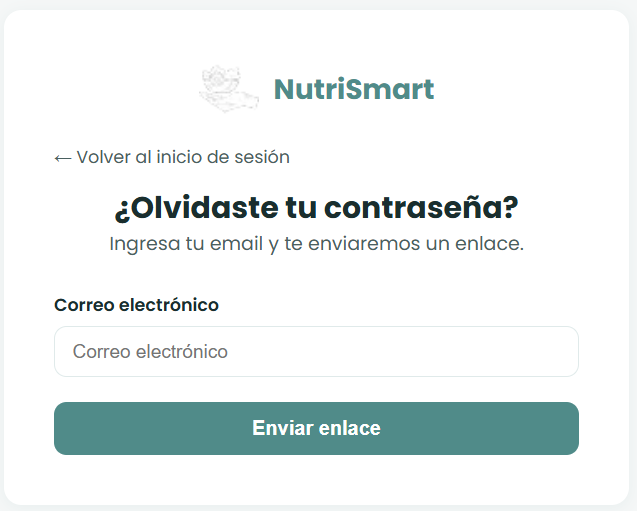

- Recomendación: Debido a la importancia de esta funcionalidad, se recomienda enfocar en continuar con la culminación exitosa del proceso de restauración de contraseñas para los usuarios. A fin de garantizar el acceso sin problemas hacia la plataforma.

## 5.4. Video About-the-Product

### Descripción General

Esta sección presenta el Video About-the-Product, una herramienta de comunicación estratégica diseñada para dos públicos objetivo principales. En primer lugar, se dirige a los visitantes del Landing Page que desean conocer sobre el modelo de negocio y las características principales de la solución de software NutriSmart. En segundo lugar, se enfoca en los usuarios de la aplicación web que buscan comprender cómo realizar tareas específicas relacionadas con los procesos soportados por la plataforma.

El tono de comunicación utilizado es consistente con la identidad del producto: motivacional, directo y cercano, buscando transmitir confianza y facilidad de uso.

---

### Video

**Captura del Video:**

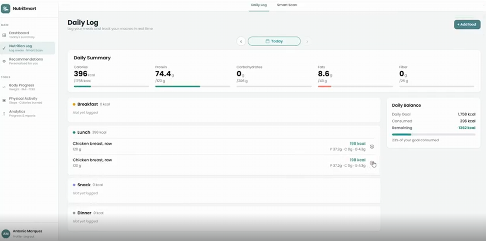

---

### Información del Video

| Atributo | Contenido |
|----------|-----------|
| **Duración** | 2:20 minutos |
| **Microsoft Stream** | https://upcedupe-my.sharepoint.com/:v:/g/personal/u202417857_upc_edu_pe/IQBZsJjpaxFpSIn7Vna2BKZDAWDoPUpVPvQbJ1kLrhkd3f0 |

---

### Resumen del Video

El video inicia con un problema relatable para la audiencia: la dificultad de mantener una alimentación saludable sin saber qué comer ni cómo medir el progreso. Inmediatamente presenta a NutriSmart como la solución que transforma objetivos nutricionales en planes concretos y personalizados desde el primer día.

La propuesta de valor se desarrolla de manera progresiva, mostrando cómo el usuario puede configurar su perfil en minutos y acceder a funcionalidades clave. El proceso de registro de alimentos es presentado como simple e inmediato, destacando que NutriSmart calcula automáticamente calorías y macronutrientes en tiempo real, permitiendo correcciones sobre la marcha.

Se enfatizan las recomendaciones inteligentes basadas en la ubicación y disponibilidad de ingredientes, eliminando la incertidumbre sobre si un alimento encaja en el plan nutritivo. El video también muestra la integración con actividad física, el seguimiento del progreso corporal y un panel de analítica que visualiza la evolución a lo largo del tiempo.

Un elemento clave es la gamificación de la consistencia, presentando al usuario como alguien que puede fallar sin culpa, simplemente retomando el camino con datos reales. El cierre refuerza el llamado a la acción con un mensaje inspirador: "Empieza gratis, define tu objetivo y deja que los datos te guíen. Porque comer bien no debería ser un misterio." La marca termina con su tagline: "NutriSmart: Tu nutrición, con inteligencia."

---

### Testimonios de Usuarios

El video incluye dos testimonios de usuarios reales que participaron en las entrevistas de validación, proporcionando credibilidad y validación del impacto real del producto:

> "Empecé a usar NutriSmart hace dos meses con el objetivo de bajar 8 kilos. Lo que más me sorprendió fue que no me decía solo 'come menos', sino exactamente qué comer cada día. Perdí 5 kilos y por primera vez entiendo mi alimentación."
>
> **David R., usuario NutriSmart, segmento pérdida de peso**

> "Entreno hace años pero siempre fallaba en la nutrición. Con NutriSmart empecé a darle seguimiento real a mis proteínas y en 6 semanas noté una diferencia visible en músculo. Es la herramienta que me faltaba."
>
> **Jorge D. A., usuario NutriSmart, segmento ganancia muscular**