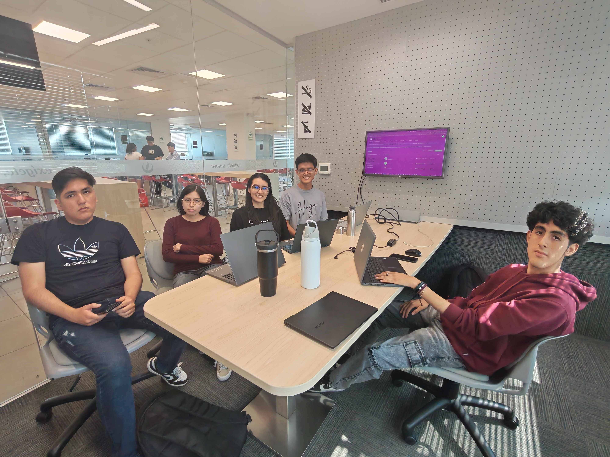

# Conclusiones
 
## Conclusiones y Recomendaciones
 
### Conclusiones
 
#### Sobre los Problem Statements y los resultados obtenidos
 
El primero de los Problem Statements planteaba el registro manual de calorías como una carga que genera frustración y abandono temprano. Esta hipótesis quedó ampliamente validada durante el proceso de investigación: ninguno de los seis entrevistados realizaba un conteo calórico preciso en su vida diaria, todos operaban con estimaciones visuales o reglas heurísticas propias, precisamente porque el costo cognitivo del registro exacto superaba el beneficio percibido. El Smart Scan de NutriSmart dejó de ser un concepto de diseño para convertirse en funcionalidad implementada y desplegada en producción: en el frontend Angular (Sprint 2) el usuario fotografía su plato, y en el backend Spring Boot (Sprint 3) el endpoint `POST /api/v1/nutrition-log/smart-scan/plate` procesa la imagen mediante el adaptador de IA (DeepSeek/Gemini) y devuelve los ítems detectados con sus macronutrientes estimados, que luego se confirman como `MealRecord`. La solución reduce la fricción del registro al punto en que el usuario solo necesita tomar una foto para obtener datos nutricionales, lo que representa una transformación sustancial respecto al proceso manual tradicional.
 
El segundo Problem Statement señalaba que las aplicaciones existentes ignoran factores contextuales como la ubicación y el clima, generando desconexión entre el plan nutricional y la realidad del usuario. El análisis de entrevistas confirmó que este es uno de los quiebres más frecuentes: los usuarios fallan consistentemente fuera del hogar, no dentro de él. David y Rando, del segmento de ganancia muscular, identificaron los viajes como el detonante principal de abandono, y Daniela mencionó que el invierno incrementa sus antojos y que una guía contextual sería de gran utilidad. El Bounded Context de Smart Recommendation fue implementado y desplegado con integración real a OpenWeatherMap y el manejo de contexto de viaje (Travel Mode): los endpoints de recomendaciones y `POST /weather-snapshots/sync` entregan tarjetas de comida adaptadas al clima y a la ubicación del usuario. Esto confirma que la capacidad no solo es técnicamente implementable, sino que ya opera de extremo a extremo con una experiencia de usuario intuitiva y accesible.
 
El tercer Problem Statement abordaba la dificultad de analizar menús en restaurantes como fuente de decisiones alimenticias incompatibles con los objetivos del usuario. Esta problemática fue transversal a ambos segmentos: todos los entrevistados coincidieron en que comer fuera de casa es el contexto de mayor riesgo nutricional. La funcionalidad de Restaurant Intelligence quedó implementada con el endpoint `POST /api/v1/restaurant-intelligence/menu-scan` (análisis con IA DeepSeek y ranking de platos por compatibilidad con las restricciones y metas del usuario) y consolidada en el Sprint 4 mediante una arquitectura orientada a eventos de dominio (`MenuPhotoProcessed`, `RestrictedDishFlagged`, `CompatibleDishesRanked`). Constituye la respuesta más diferenciadora de NutriSmart frente a sus competidores directos como MyFitnessPal, Fitia y Cronometer, ninguno de los cuales ofrece esta capacidad de forma integrada con el perfil metabólico del usuario en tiempo real.
 
El cuarto Problem Statement planteaba la fragmentación de información entre herramientas de salud y plataformas de dieta como obstáculo para la visión del progreso real. Los entrevistados del segmento de ganancia muscular, particularmente Daphne y Rando, ya utilizaban wearables pero sin integración efectiva con su seguimiento nutricional. El Bounded Context de Metabolic Adaptation cierra esta brecha: en el Sprint 4 se implementó la sincronización real con Google Health mediante conexión OAuth (`POST /api/v1/wearable-connections`), que importa actividad, pasos, peso corporal y porcentaje de grasa, actualiza el campo `active` del balance calórico diario y emite el ajuste `CaloricTargetAdjusted`, eliminando la necesidad de recalcular manualmente el objetivo tras cada sesión de entrenamiento.
 
---
 
#### Sobre los Assumptions y el comportamiento real de los segmentos
 
Los Business Assumptions establecieron que los usuarios tienen necesidad de automatizar el seguimiento de dieta y ejercicio porque el registro manual genera alta tasa de abandono. Esta suposición se confirmó de manera contundente: los seis entrevistados exhibieron, sin excepción, comportamientos de abandono o simplificación extrema del registro en contextos de alta carga cognitiva o ruptura de rutina. El assumption fue conservador, ya que la realidad mostró que el abandono no es gradual sino abrupto y situacional, especialmente en el segmento de ganancia muscular.
 
El assumption que proyectaba que los usuarios iniciales serían jóvenes y adultos con metas de composición corporal y acceso a smartphones resultó preciso. Sin embargo, las entrevistas revelaron un matiz importante: el segmento de pérdida de peso abarca perfiles de mayor edad (Evelyn, 54 años, y Jorge, 49 años) con condiciones médicas preexistentes como niveles elevados de azúcar o SOP, lo que amplía la propuesta de valor de NutriSmart más allá del usuario fitness joven y demanda que la plataforma modele condiciones fisiológicas específicas, no solo objetivos estéticos. La implementación respondió parcialmente a este matiz: el flujo de onboarding ya captura restricciones dietéticas y condiciones médicas, y el bloqueo automático de alimentos incompatibles (`RestrictedItemBlocked`) opera sobre ese perfil; el soporte de alertas específicas por condición fisiológica queda planteado como evolución en el roadmap de mediano plazo.
 
El User Assumption que anticipaba que el quiebre nutricional ocurre fuera del hogar fue uno de los más sólidamente validados por el trabajo de campo. El análisis de entrevistas y la User Task Matrix revelaron que la tarea "decidir qué comer fuera de casa" es de alta frecuencia e importancia para ambos segmentos, mientras que el entorno doméstico representa un contexto controlado donde los usuarios mantienen mayor consistencia. Este hallazgo orientó correctamente el énfasis arquitectónico en el Restaurant Intelligence Context y las Smart Recommendations con datos geográficos.
 
El assumption sobre la reducción del tiempo de registro también fue validado positivamente. Los User Outcomes esperados, es decir, menos minutos dedicados a corroborar información nutricional, se materializan en el onboarding ya implementado de NutriSmart, que consolida en un único flujo de cinco pasos los datos de peso, talla, meta, alergias y condición médica —emitiendo `OnboardingCompleted` y `MetabolicTargetSet`—, y en el Smart Scan operativo que elimina la búsqueda manual de alimentos en bases de datos.
 
---
 
#### Sobre los Hypothesis Statements y los criterios de éxito
 
La primera hipótesis afirmaba que implementar análisis de alimentos por fotografía reduciría la tasa de abandono durante los primeros 30 días en al menos un 30% respecto a usuarios que solo usan búsqueda de texto. Las entrevistas del segmento de pérdida de peso confirman cualitativamente la dirección de esta hipótesis: Evelyn calificó la función de análisis fotográfico como una herramienta de apoyo de gran valor para su control riguroso diario, y Jorge indicó que la usaría y la recomendaría a su círculo cercano si resultaba efectiva. Con el Smart Scan ya implementado y desplegado en producción, la capacidad que sostiene la hipótesis está disponible de extremo a extremo; lo que resta para validar cuantitativamente el umbral del 30% es acumular una cohorte de usuarios reales y contrastar su retención frente al método de búsqueda de texto, tarea que debe priorizarse en el roadmap inmediato post-lanzamiento.
 
La segunda hipótesis planteaba que las sugerencias basadas en ubicación y clima permitirían que los usuarios mantuvieran su meta nutricional incluso al comer fuera de casa. El criterio de éxito, consistente en que el porcentaje de días en que se cumple el objetivo calórico fuera de casa sea comparable al de los días en casa, es ambicioso pero fundado en evidencia cualitativa sólida: cuatro de los seis entrevistados validaron esta funcionalidad como una solución directa a un problema real que experimentan frecuentemente. La integración con OpenWeatherMap y el contexto de viaje en el Bounded Context de Smart Recommendation ya está implementada y desplegada, por lo que la plataforma cuenta ahora con la instrumentación operativa para medir este indicador; su comprobación depende únicamente de disponer de un volumen de operación real que permita comparar ambos escenarios.
 
La tercera hipótesis sostenía que el escaneo de menús físicos reduciría al menos un 40% los excesos calóricos o déficits de proteína en comidas fuera de casa. Este es el criterio de éxito más específico y medible del proceso Lean UX. El Restaurant Intelligence Context, con su capacidad —ya implementada y desplegada— de filtrar platos por restricciones y rankear opciones compatibles con el perfil del usuario, provee la instrumentación técnica necesaria para rastrear este indicador. Su validación dependerá de contar con una masa crítica de usuarios que utilicen el escaneo de menú con regularidad, lo que refuerza la importancia de seguir reduciendo la fricción de activación de esta funcionalidad ya construida.
 
La cuarta hipótesis afirmaba que la sincronización con relojes inteligentes reduciría la desviación calórica diaria a menos del 10% respecto al objetivo en días de actividad física intensa. El caso de Daphne, usuaria de Apple Watch con entrenamiento de cinco a seis días semanales, es el perfil de referencia para esta hipótesis. Su necesidad de mantener los objetivos en funcionamiento automático valida tanto la dirección de la hipótesis como el evento `CaloricTargetAdjusted` del Bounded Context de Metabolic Adaptation, ya implementado. Con la sincronización con Google Health operativa en el plan Premium (Sprint 4) y el módulo de Analytics & Reporting desplegado, el criterio del 10% de desviación es medible de forma inmediata sobre datos reales de actividad; la cobertura de Apple Watch y Samsung Health queda pendiente en el roadmap para ampliar el universo de dispositivos.
 
---
 
#### Sobre los criterios de éxito del Lean UX
 
El criterio de negocio que proyectaba un crecimiento sostenido en la tasa de usuarios registrados mensualmente, validado por el valor de las recomendaciones personalizadas, encuentra sustento en el tamaño del mercado identificado: aproximadamente 3,87 millones de usuarios mensuales de aplicaciones de fitness y nutrición en Perú, de los cuales una proporción significativa no está satisfecha con las soluciones actuales dado el gap entre el 49% de peruanos que sigue algún tipo de restricción alimenticia y la penetración real de estas aplicaciones. El diferencial contextual y de personalización de NutriSmart, que abarca gastronomía local, clima y condiciones médicas, representa una propuesta de valor no atendida que puede traducirse en captación de usuarios insatisfechos con MyFitnessPal o Fitia.
 
El criterio de reducir el porcentaje de usuarios que abandonan sus regímenes nutricionales es el más directamente alineado con los hallazgos de campo. El patrón de abandono abrupto y situacional identificado en ambos segmentos sugiere que NutriSmart debe enfocar sus métricas de retención no en el uso diario promedio, sino en la recuperación del usuario tras episodios de ruptura de rutina: el Bounded Context de Behavioral Consistency, con su sistema de rachas y detección de caídas conductuales (estados ON_TRACK/AT_RISK/DROPPED/RECOVERED y planes de recuperación), fue implementado y desplegado para actuar exactamente en esos momentos críticos.
 
El criterio de conversión a planes superiores, proyectando más del 10% de usuarios que migran del plan básico a planes de mayor beneficio, depende directamente de que las funcionalidades Premium y Pro demuestren valor tangible antes de que el usuario alcance el límite del plan básico. El Smart Scan en planes Pro y la sincronización con Google Health en Premium son las funcionalidades con mayor potencial de conversión según las preferencias expresadas por los entrevistados, especialmente en el segmento de ganancia muscular. Además, el Sprint 4 incorporó el procesamiento real de pagos con Stripe (`POST /api/v1/payments/charge`, que publica `SubscriptionActivated` solo tras la confirmación del cobro), de modo que la conversión entre planes dejó de ser un flujo simulado y hoy puede ejecutarse y medirse sobre transacciones efectivas.
 
---
 
### Recomendaciones

 **Roadmap de producto a corto plazo (0–3 meses post-lanzamiento)**
 
La prioridad inmediata debe ser la instrumentación de métricas de retención temprana. El criterio de éxito de la primera hipótesis, es decir, la reducción del 30% en abandono durante los primeros 30 días, solo puede medirse si desde el día uno se registran los eventos de sesión, los métodos de registro utilizados (fotográfico vs. manual) y las fechas de último acceso por cohorte de usuario. Se recomienda implementar un pipeline de analítica de comportamiento desde el sprint de lanzamiento, no como una fase posterior.
 
La base de datos de alimentos debe ampliarse con gastronomía peruana antes del lanzamiento público. Las entrevistas evidenciaron que los competidores globales como MyFitnessPal presentan fricción precisamente por la ausencia de platos locales. Incorporar los alimentos y preparaciones más frecuentes de la dieta urbana peruana, como menús de restaurante, comida criolla y preparaciones universitarias, es una condición necesaria para que el Smart Scan y el Restaurant Intelligence Context funcionen con precisión en el mercado objetivo.
 
Se recomienda completar el flujo de recuperación activa para usuarios que no registran actividad durante 48 horas consecutivas. El patrón de abandono abrupto identificado en ambos segmentos indica que la ventana de intervención es corta: si el sistema no actúa en los primeros dos días de inactividad, la probabilidad de recuperación cae drásticamente. El Behavioral Consistency Context ya detecta y expone estos estados (AT_RISK, DROPPED) y genera recomendaciones preventivas y planes de intervención; lo que resta por incorporar al roadmap es el canal de reenganche proactivo —notificaciones push— que dispare esas sugerencias contextuales sin depender de que el usuario abra la aplicación por iniciativa propia.
 
**Roadmap de producto a mediano plazo (3–9 meses)**
 
La integración con Apple Watch y Samsung Health debe incorporarse al roadmap de la versión Premium. La sincronización con Google Health ya está implementada y desplegada como fuente de datos de actividad y métricas corporales; sin embargo, Daphne, el perfil de referencia del segmento de ganancia muscular, usa Apple Watch. Dado que este dispositivo tiene alta penetración entre los usuarios de mayor poder adquisitivo del segmento fitness urbano, su ausencia en la integración puede ser una barrera de conversión al plan Premium. La arquitectura orientada a puertos del proveedor de sincronización (`GoogleHealthSyncProvider` sobre un puerto de sync) facilita añadir nuevos proveedores sin alterar el dominio.
 
Se recomienda desarrollar una funcionalidad de detección y soporte para condiciones fisiológicas específicas como el Síndrome de Ovario Poliquístico (SOP), la resistencia a la insulina y la diabetes tipo 2. El caso de Daniela evidenció que existe un perfil de usuario donde la condición médica genera ciclos de ansiedad alimentaria que ninguna app de conteo calórico puede resolver sin modelar ese comportamiento específico. Incorporar alertas preventivas y recomendaciones adaptadas a estas condiciones ampliaría significativamente la propuesta de valor de NutriSmart y la diferenciaría de todos sus competidores actuales.
 
La expansión del módulo de Analytics & Reporting hacia reportes compartibles con profesionales de salud, como nutricionistas y médicos, debe considerarse como una funcionalidad de alto valor para el segmento de pérdida de peso de mayor edad. El módulo ya cuenta con exportación de reporte en PDF restringida al plan Premium; el siguiente paso es evolucionar ese entregable hacia un formato clínicamente legible y un mecanismo de compartición directa con el profesional. Evelyn ya contaba con asesoría de un nutricionista, por lo que esta integración convertiría a NutriSmart en un complemento de la atención médica, no solo en una app de consumo personal.
 
**Roadmap de producto a largo plazo (9–18 meses)**
 
El modelo de negocio SaaS debe explorar una oferta orientada a entrenadores personales y nutricionistas independientes. NutriSmart puede posicionarse como un soporte digital para los profesionales que operan en entornos como gimnasios, centros de nutrición y clínicas de salud preventiva, sin necesidad de integrarse institucionalmente con ellos. Una versión de la plataforma que permita a entrenadores y nutricionistas hacer seguimiento del progreso nutricional de sus clientes desde NutriSmart complementaría las rutinas y planes que estos profesionales ya diseñan, generando un canal de distribución orgánico y un flujo de ingresos recurrente con menor costo de adquisición que el canal directo al consumidor.
 
Finalmente, se recomienda evaluar la incorporación de modelos de lenguaje para ofrecer orientación nutricional conversacional en tiempo real, especialmente en los momentos de toma de decisión en restaurantes. NutriSmart ya integra modelos de IA (DeepSeek) para el análisis de platos y menús, de modo que la base de proveedores de IA y sus puertos de aplicación ya existe en el backend; la evolución natural consiste en exponer esa capacidad como una interfaz de lenguaje natural dentro del flujo del Restaurant Intelligence Context, donde el usuario pueda consultar qué opciones del menú se ajustan a su perfil. La tendencia del mercado de aplicaciones de salud apunta hacia estas interfaces conversacionales como canal principal de interacción, y aprovecharlas posicionaría al producto como un asistente nutricional verdaderamente conversacional.
 
---
 
## Video About-The-Team

El video **About-The-Team** de NutriSmart resume el proceso de trabajo realizado por el equipo a lo largo del proyecto. Inicia con una reflexión grupal sobre el origen del problema: cómo ayudar a las personas a mantener una alimentación saludable de forma sostenida. A continuación, se desarrolla el proceso de diseño y arquitectura, mostrando cómo el equipo construyó un lenguaje común a través del EventStorming y definió los bounded contexts del sistema bajo un enfoque de Domain-Driven Design. Luego se documenta la etapa de implementación, abarcando el desarrollo del frontend en Angular y su posterior extensión al backend en Spring Boot, destacando la coherencia arquitectónica mantenida a lo largo de los sprints. El video concluye con el testimonio individual de cada integrante, donde cada uno describe las actividades realizadas, los outcomes logrados y las competencias comunicativas desarrolladas durante el proyecto.

### Pauta de Secuencias de Contenido

| Sección | Inicio (hh:mm:ss) |
|---|---|
| Introducción | 00:00:00 |
| Contexto del proyecto | 00:01:00 |
| Proceso de trabajo | 00:02:15 |
| Testimonio – Ángela Espinoza | 00:05:10 |
| Testimonio – Brandon Soto | 00:06:06 |
| Testimonio – Olenka Del Aguila | 00:07:05 |
| Testimonio – Joel Mora | 00:08:20 |
| Testimonio – Ángel Villarreal | 00:09:28 |
| Cierre | 00:10:28 |

### Cuadro Representativo

### URLs de Publicación

- **Microsoft Stream:** [Link Stream](https://upcedupe-my.sharepoint.com/:v:/g/personal/u202417857_upc_edu_pe/IQBZsJjpaxFpSIn7Vna2BKZDAWDoPUpVPvQbJ1kLrhkd3f0?nav=eyJyZWZlcnJhbEluZm8iOnsicmVmZXJyYWxBcHAiOiJPbmVEcml2ZUZvckJ1c2luZXNzIiwicmVmZXJyYWxBcHBQbGF0Zm9ybSI6IldlYiIsInJlZmVycmFsTW9kZSI6InZpZXciLCJyZWZlcnJhbFZpZXciOiJNeUZpbGVzTGlua0NvcHkifX0&e=J62esl)
  `https://upcedupe-my.sharepoint.com/:v:/g/personal/u202417857_upc_edu_pe/IQBZsJjpaxFpSIn7Vna2BKZDAWDoPUpVPvQbJ1kLrhkd3f0?nav=eyJyZWZlcnJhbEluZm8iOnsicmVmZXJyYWxBcHAiOiJPbmVEcml2ZUZvckJ1c2luZXNzIiwicmVmZXJyYWxBcHBQbGF0Zm9ybSI6IldlYiIsInJlZmVycmFsTW9kZSI6InZpZXciLCJyZWZlcnJhbFZpZXciOiJNeUZpbGVzTGlua0NvcHkifX0&e=J62esl`
  
- **YouTube:** [Link Youtube](https://www.youtube.com/watch?v=zSNGdlIPOXI)
  `https://www.youtube.com/watch?v=zSNGdlIPOXI`
